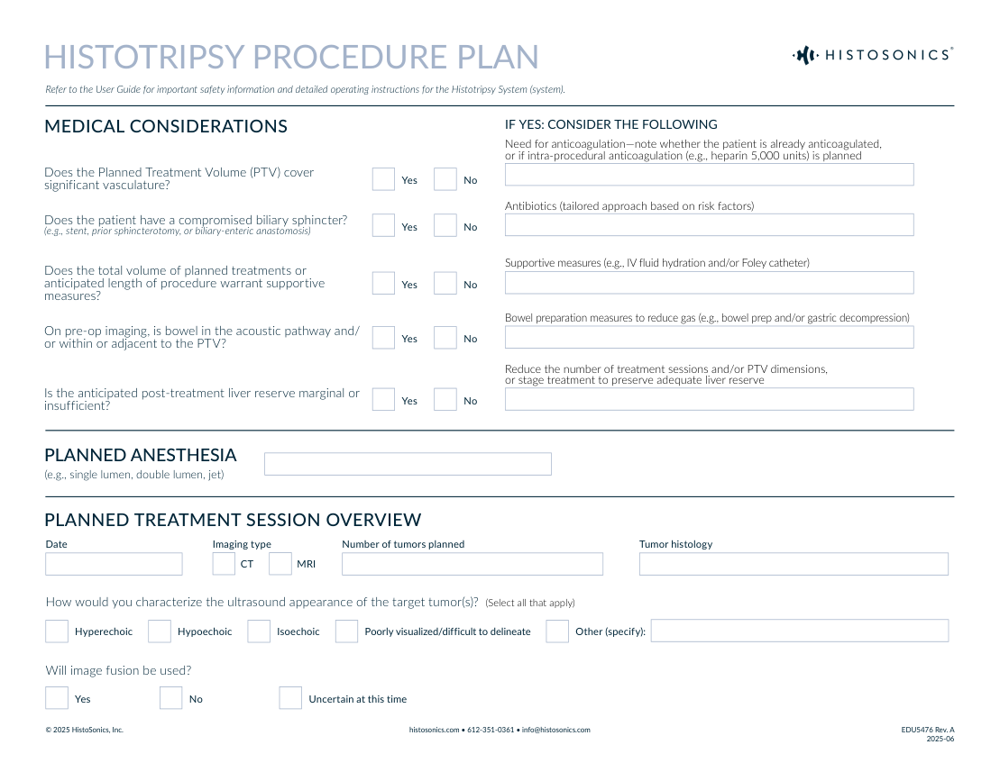
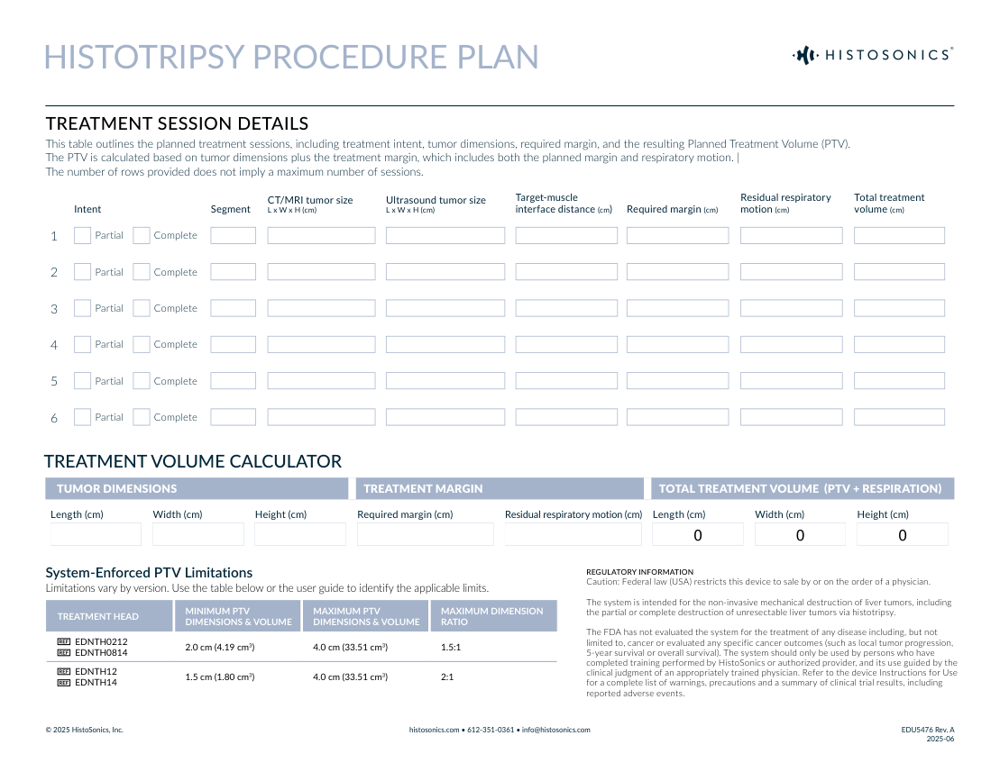

# Intervențional — Plan procedural pentru histotripsie (MCB)

## Documentul original MCB — Plan procedural pentru histotripsie

**Ghid procedural · 2 pagini · consultat la 2026-09-27.**

[Descarcă PDF-ul integral](../../assets/mcb-modalities/ir-plan-procedural-pentru-histotripsie-mcb/document.pdf) · [Sursa MCB](https://ref.mcbradiology.com/IR/Miscellaneous/Histotripsy%20Procedure%20Plan.pdf) · [Catalogul MCB pentru această modalitate](../mcb/index.md)

Instrucțiunile, valorile și ilustrațiile din documentul original sunt păstrate în **engleză**. Titlul și navigarea sunt în română.

### Pagina 1

{ loading=lazy }

### Pagina 2

{ loading=lazy }

## Textul documentului original

??? abstract "Pagina 1 — text în engleză"

    
HISTOTRIPSY PROCEDURE PLAN
    Refer to the User Guide for important safety information and detailed operating instructions for the Histotripsy System (system).
    MEDICAL CONSIDERATIONS
    IF YES: CONSIDER THE FOLLOWING
    Need for anticoagulation—note whether the patient is already anticoagulated,  
    or if intra-procedural anticoagulation (e.g., heparin 5,000 units) is planned
    Does the Planned Treatment Volume (PTV) cover 
    significant vasculature?
      Yes
      No
    Antibiotics (tailored approach based on risk factors)
    Does the patient have a compromised biliary sphincter?
    (e.g., stent, prior sphincterotomy, or biliary-enteric anastomosis)
      Yes
      No
    Supportive measures (e.g., IV fluid hydration and/or Foley catheter) 
    Does the total volume of planned treatments or 
    anticipated length of procedure warrant supportive 
    measures?
      Yes
      No
    Bowel preparation measures to reduce gas (e.g., bowel prep and/or gastric decompression)
    On pre-op imaging, is bowel in the acoustic pathway and/
    or within or adjacent to the PTV?
      Yes
      No
    Reduce the number of treatment sessions and/or PTV dimensions,  
    or stage treatment to preserve adequate liver reserve
    Is the anticipated post-treatment liver reserve marginal or 
    insufficient?
      Yes
      No
    PLANNED ANESTHESIA
    (e.g., single lumen, double lumen, jet)
    PLANNED TREATMENT SESSION OVERVIEW
    Date
    Imaging type
    Number of tumors planned
    Tumor histology
      CT      
      MRI
    How would you characterize the ultrasound appearance of the target tumor(s)?  (Select all that apply)
      Hyperechoic      
      Hypoechoic      
      Isoechoic      
      Poorly visualized/difficult to delineate      
      Other (specify):  
    Will image fusion be used?
      Yes 
     
     
     
     
     
      No    
      Uncertain at this time
    © 2025 HistoSonics, Inc.
    histosonics.com • 612-351-0361 • info@histosonics.com
    EDU5476 Rev. A
    2025-06
    

??? abstract "Pagina 2 — text în engleză"

    
HISTOTRIPSY PROCEDURE PLAN
    TREATMENT SESSION DETAILS
    This table outlines the planned treatment sessions, including treatment intent, tumor dimensions, required margin, and the resulting Planned Treatment Volume (PTV). 
    The PTV is calculated based on tumor dimensions plus the treatment margin, which includes both the planned margin and respiratory motion. | 
    The number of rows provided does not imply a maximum number of sessions.
    Intent 
    Segment
    CT/MRI tumor size 
    L x W x H (cm)
    Ultrasound tumor size 
    L x W x H (cm)
    Target-muscle 
    interface distance (cm)
    Required margin (cm)
    Residual respiratory 
    motion (cm)
    Total treatment 
    volume (cm)
    1
    Partial
    Complete
    2
    Partial
    Complete
    3
    Partial
    Complete
    4
    Partial
    Complete
    5
    Partial
    Complete
    6
    Partial
    Complete
    TREATMENT VOLUME CALCULATOR
    TUMOR DIMENSIONS
    TREATMENT MARGIN
    TOTAL TREATMENT VOLUME  (PTV + RESPIRATION)
    Length (cm)
    Width (cm)
    Height (cm)
    Required margin (cm)
    Residual respiratory motion (cm)
    Length (cm)
    Width (cm)
    Height (cm)
    0
    0
    0
    REGULATORY INFORMATION
    Caution: Federal law (USA) restricts this device to sale by or on the order of a physician. 
    System-Enforced PTV Limitations
    Limitations vary by version. Use the table below or the user guide to identify the applicable limits.
    The system is intended for the non-invasive mechanical destruction of liver tumors, including 
    the partial or complete destruction of unresectable liver tumors via histotripsy.  
    TREATMENT HEAD 
    MINIMUM PTV 
    DIMENSIONS &amp; VOLUME
    MAXIMUM PTV 
    DIMENSIONS &amp; VOLUME
    MAXIMUM DIMENSION 
    RATIO
      EDNTH0212 
      EDNTH0814
    2.0 cm (4.19 cm3)
    4.0 cm (33.51 cm3)
    1.5:1
      EDNTH12 
      EDNTH14
    1.5 cm (1.80 cm3)
    4.0 cm (33.51 cm3)
    2:1
    The FDA has not evaluated the system for the treatment of any disease including, but not 
    limited to, cancer or evaluated any specific cancer outcomes (such as local tumor progression, 
    5-year survival or overall survival). The system should only be used by persons who have 
    completed training performed by HistoSonics or authorized provider, and its use guided by the 
    clinical judgment of an appropriately trained physician. Refer to the device Instructions for Use 
    for a complete list of warnings, precautions and a summary of clinical trial results, including 
    reported adverse events.
    © 2025 HistoSonics, Inc.
    histosonics.com • 612-351-0361 • info@histosonics.com
    EDU5476 Rev. A
    2025-06
    

