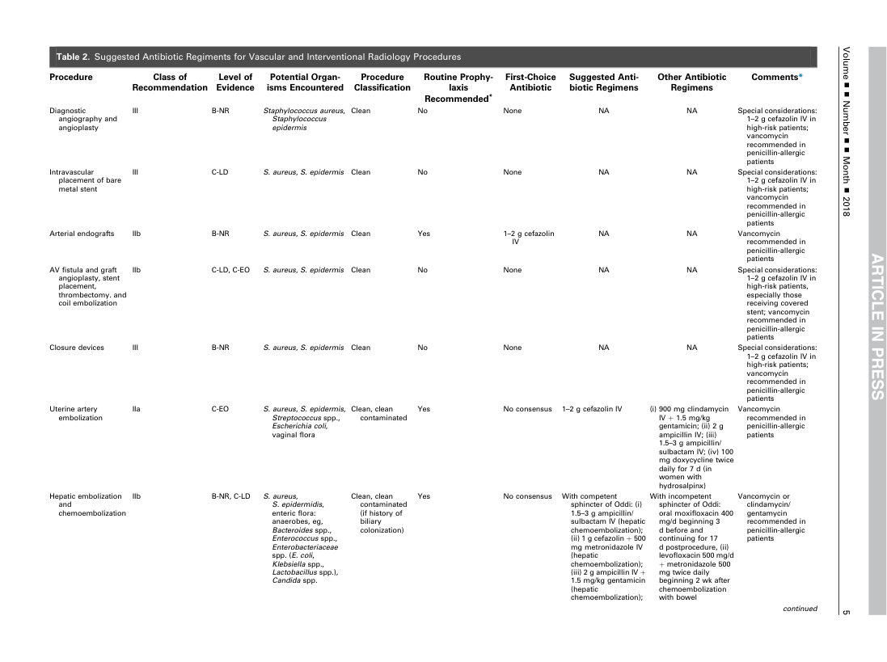
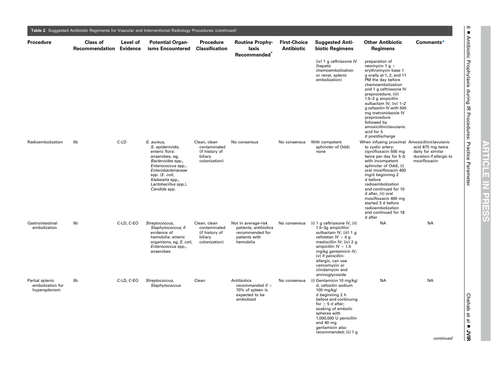
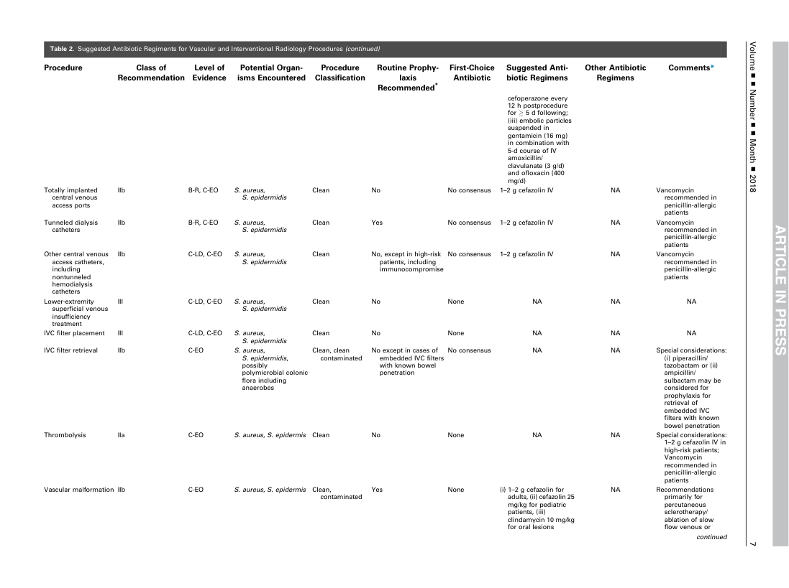
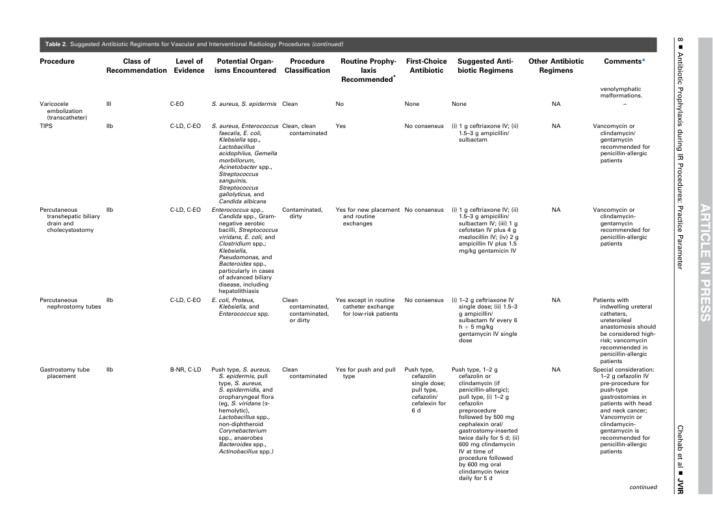
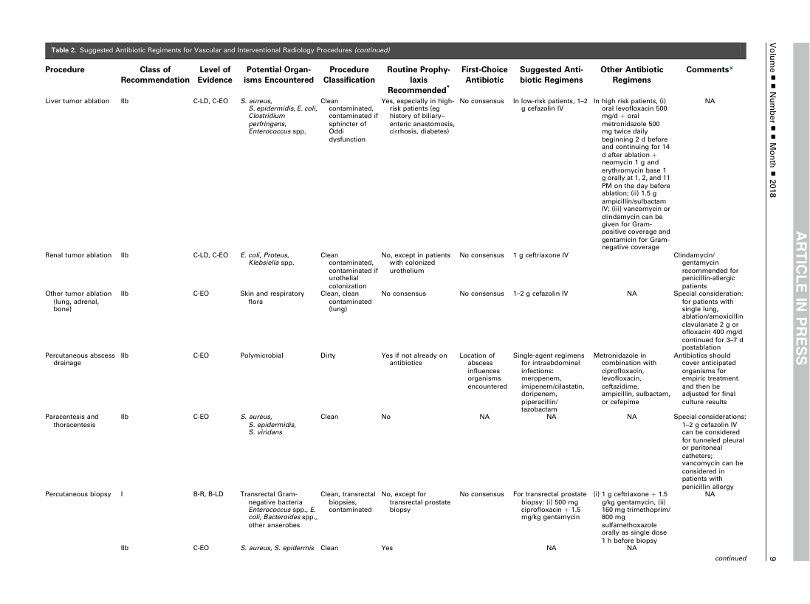
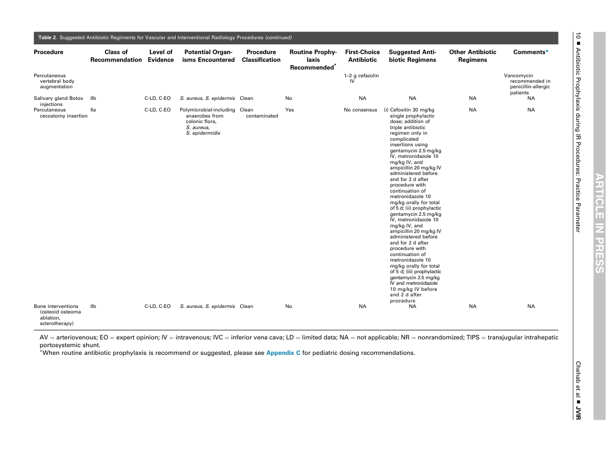

# Intervențional — Profilaxie antibiotică în intervențional (SIR 2018) (MCB)

## Documentul original MCB — Profilaxie antibiotică în intervențional (SIR 2018)

**Ghid procedural · 6 pagini · consultat la 2026-09-27.**

[Descarcă PDF-ul integral](../../assets/mcb-modalities/ir-profilaxie-antibiotica-in-interventional-sir-2018-mcb/document.pdf) · [Sursa MCB](https://ref.mcbradiology.com/IR/Miscellaneous/2018%20Antibiotic%20Prophylaxis%20Guidelines.pdf) · [Catalogul MCB pentru această modalitate](../mcb/index.md)

Instrucțiunile, valorile și ilustrațiile din documentul original sunt păstrate în **engleză**. Titlul și navigarea sunt în română.

### Pagina 1

{ loading=lazy }

### Pagina 2

{ loading=lazy }

### Pagina 3

{ loading=lazy }

### Pagina 4

{ loading=lazy }

### Pagina 5

{ loading=lazy }

### Pagina 6

{ loading=lazy }

## Textul documentului original

??? abstract "Pagina 1 — text în engleză"

    
Volume ▪▪Number ▪▪Month ▪2018
    5
    continued
    Vancomycin or
    clindamycin/
    gentamycin
    recommended in
    penicillin-allergic
    patients
    Vancomycin
    recommended in
    penicillin-allergic
    patients
    With incompetent
    sphincter of Oddi:
    oral moxifloxacin 400
    mg/d beginning 3
    d before and
    continuing for 17
    d postprocedure, (ii)
    levofloxacin 500 mg/d
    þ metronidazole 500
    mg twice daily
    beginning 2 wk after
    chemoembolization
    with bowel
    First-Choice
    Antibiotic
    Suggested Anti-
    biotic Regimens
    Other Antibiotic
    Regimens
    Comments*
    Yes
    No consensus
    With competent
    sphincter of Oddi: (i)
    1.5–3 g ampicillin/
    sulbactam IV (hepatic
    chemoembolization);
    (ii) 1 g cefazolin þ 500
    mg metronidazole IV
    (hepatic
    chemoembolization);
    (iii) 2 g ampicillin IV þ
    1.5 mg/kg gentamicin
    (hepatic
    chemoembolization);
    Clean, clean
    contaminated
    (if history of
    biliary
    colonization)
    Clean, clean
    contaminated
    Yes
    No consensus
    1–2 g cefazolin IV
    (i) 900 mg clindamycin
    IV þ 1.5 mg/kg
    gentamicin; (ii) 2 g
    ampicillin IV; (iii)
    1.5–3 g ampicillin/
    sulbactam IV; (iv) 100
    mg doxycycline twice
    daily for 7 d (in
    women with
    hydrosalpinx)
    III
    B-NR
    Staphylococcus aureus,
    Staphylococcus
    epidermis
    IIb
    B-NR, C-LD
    S. aureus,
    S. epidermidis,
    enteric flora:
    anaerobes, eg,
    Bacteroides spp.,
    Enterococcus spp.,
    Enterobacteriaceae
    spp. (E. coli,
    Klebsiella spp.,
    Lactobacillus spp.),
    Candida spp.
    Table 2. Suggested Antibiotic Regiments for Vascular and Interventional Radiology Procedures
    Diagnostic
    angiography and
    angioplasty
    Procedure
    Class of
    Recommendation
    Level of
    Evidence
    Potential Organ-
    isms Encountered
    Procedure
    Classification
    Routine Prophy-
    laxis
    Recommended*
    Clean
    No
    None
    NA
    NA
    Special considerations:
    1–2 g cefazolin IV in
    high-risk patients;
    vancomycin
    recommended in
    penicillin-allergic
    patients
    Intravascular
    placement of bare
    metal stent
    III
    C-LD
    S. aureus, S. epidermis
    Clean
    No
    None
    NA
    NA
    Special considerations:
    1–2 g cefazolin IV in
    high-risk patients;
    vancomycin
    recommended in
    penicillin-allergic
    patients
    Arterial endografts
    IIb
    B-NR
    S. aureus, S. epidermis
    Clean
    Yes
    1–2 g cefazolin
    IV
    NA
    NA
    Vancomycin
    recommended in
    penicillin-allergic
    patients
    AV fistula and graft
    angioplasty, stent
    placement,
    thrombectomy. and
    coil embolization
    Hepatic embolization
    and
    chemoembolization
    IIb
    C-LD, C-EO
    S. aureus, S. epidermis
    Clean
    No
    None
    NA
    NA
    Special considerations:
    1–2 g cefazolin IV in
    high-risk patients,
    especially those
    receiving covered
    stent; vancomycin
    recommended in
    penicillin-allergic
    patients
    Closure devices
    III
    B-NR
    S. aureus, S. epidermis
    Clean
    No
    None
    NA
    NA
    Special considerations:
    1–2 g cefazolin IV in
    high-risk patients;
    vancomycin
    recommended in
    penicillin-allergic
    patients
    Uterine artery
    embolization
    IIa
    C-EO
    S. aureus, S. epidermis,
    Streptococcus spp.,
    Escherichia coli,
    vaginal flora
    

??? abstract "Pagina 2 — text în engleză"

    
6 ▪Antibiotic Prophylaxis during IR Procedures: Practice Parameter
    Chehab et al ▪JVIR
    continued
    Amoxicillin/clavulanic
    acid 875 mg twice
    daily for similar
    duration if allergic to
    moxifloxacin
    NA
    NA
    NA
    NA
    When infusing proximal
    to cystic artery:
    ciprofloxacin 500 mg
    twice per day for 5 d;
    with incompetent
    sphincter of Oddi, (i)
    oral moxifloxacin 400
    mg/d beginning 2
    d before
    radioembolization
    and continued for 10
    d after, (ii) oral
    moxifloxacin 400 mg
    started 3 d before
    radioembolization
    and continued for 18
    d after
    (iv) 1 g ceftriaxone IV
    (hepatic
    chemoembolization
    or renal, splenic
    embolization)
    First-Choice
    Antibiotic
    Suggested Anti-
    biotic Regimens
    Other Antibiotic
    Regimens
    Comments*
    No consensus
    (i) 1 g ceftriaxone IV; (ii)
    1.5–3g ampicillin/
    sulbactam IV; (iii) 1 g
    cefotetan IV þ 4 g
    mezlocillin IV; (iv) 2 g
    ampicillin IV þ 1.5
    mg/kg gentamicin IV;
    (v) if penicillin-
    allergic, can use
    vancomycin or
    clindamycin and
    aminoglycoside
    No consensus
    (i) Gentamicin 10 mg/kg/
    d, cefoxitin sodium
    100 mg/kg/
    d beginning 2 h
    before and continuing
    for  5 d after;
    soaking of embolic
    spheres with
    1,000,000 U penicillin
    and 40 mg
    gentamicin also
    recommended; (ii) 1 g
    Not in average-risk
    patients; antibiotics
    recommended for
    patients with
    hemobilia
    No consensus
    No consensus
    With competent
    sphincter of Oddi:
    none
    Clean, clean
    contaminated
    (if history of
    biliary
    colonization)
    Clean, clean
    contaminated
    (if history of
    biliary
    colonization)
    IIb
    C-LD, C-EO
    Streptococcus,
    Staphylococcus
    Clean
    Antibiotics
    recommended if &gt;
    70% of spleen is
    expected to be
    embolized
    Table 2. Suggested Antibiotic Regiments for Vascular and Interventional Radiology Procedures (continued)
    Gastrointestinal
    embolization
    IIb
    C-LD, C-EO
    Streptococcus,
    Staphylococcus; if
    evidence of
    hemobilia: enteric
    organisms, eg, E. coli,
    Enterococcus spp.,
    anaerobes
    Partial splenic
    embolization for
    hypersplenism
    preparation of
    neomycin 1 g þ
    erythromycin base 1
    g orally at 1, 2, and 11
    PM the day before
    chemoembolization
    and 1 g ceftriaxone IV
    preprocedure; (iii)
    1.5–3 g ampicillin
    sulbactam IV; (iv) 1–2
    g cefazolin IV with 500
    mg metronidazole IV
    preprocedure
    followed by
    amoxicillin/clavulanic
    acid for 5
    d postdischarge
    Radioembolization
    IIb
    C-LD
    S. aureus,
    S. epidermidis,
    enteric flora:
    anaerobes, eg,
    Bacteroides spp.,
    Enterococcus spp.,
    Enterobacteriaceae
    spp. (E. coli,
    Klebsiella spp.,
    Lactobacillus spp.),
    Candida spp.
    Procedure
    Class of
    Recommendation
    Level of
    Evidence
    Potential Organ-
    isms Encountered
    Procedure
    Classification
    Routine Prophy-
    laxis
    Recommended*
    

??? abstract "Pagina 3 — text în engleză"

    
Volume ▪▪Number ▪▪Month ▪2018
    7
    continued
    NA
    Recommendations
    primarily for
    percutaneous
    sclerotherapy/
    ablation of slow
    flow venous or
    First-Choice
    Antibiotic
    Suggested Anti-
    biotic Regimens
    Other Antibiotic
    Regimens
    Comments*
    No consensus
    1–2 g cefazolin IV
    NA
    Vancomycin
    recommended in
    penicillin-allergic
    patients
    Clean, clean
    contaminated
    No except in cases of
    embedded IVC filters
    with known bowel
    penetration
    IIb
    C-LD, C-EO
    S. aureus,
    S. epidermidis
    Clean
    No, except in high-risk
    patients, including
    immunocompromise
    III
    C-LD, C-EO
    S. aureus,
    S. epidermidis
    Clean
    No
    None
    NA
    NA
    NA
    Table 2. Suggested Antibiotic Regiments for Vascular and Interventional Radiology Procedures (continued)
    cefoperazone every
    12 h postprocedure
    for  5 d following;
    (iii) embolic particles
    suspended in
    gentamicin (16 mg)
    in combination with
    5-d course of IV
    amoxicillin/
    clavulanate (3 g/d)
    and ofloxacin (400
    mg/d)
    Totally implanted
    central venous
    access ports
    IIb
    B-R, C-EO
    S. aureus,
    S. epidermidis
    Clean
    No
    No consensus
    1–2 g cefazolin IV
    NA
    Vancomycin
    recommended in
    penicillin-allergic
    patients
    Tunneled dialysis
    catheters
    IIb
    B-R, C-EO
    S. aureus,
    S. epidermidis
    Clean
    Yes
    No consensus
    1–2 g cefazolin IV
    NA
    Vancomycin
    recommended in
    penicillin-allergic
    patients
    Other central venous
    access catheters,
    including
    nontunneled
    hemodialysis
    catheters
    Lower-extremity
    superficial venous
    insufficiency
    treatment
    Procedure
    Class of
    Recommendation
    Level of
    Evidence
    Potential Organ-
    isms Encountered
    Procedure
    Classification
    Routine Prophy-
    laxis
    Recommended*
    IVC filter placement
    III
    C-LD, C-EO
    S. aureus,
    S. epidermidis
    Clean
    No
    None
    NA
    NA
    NA
    No consensus
    NA
    NA
    Special considerations:
    (i) piperacillin/
    tazobactam or (ii)
    ampicillin/
    sulbactam may be
    considered for
    prophylaxis for
    retrieval of
    embedded IVC
    filters with known
    bowel penetration
    Thrombolysis
    IIa
    C-EO
    S. aureus, S. epidermis
    Clean
    No
    None
    NA
    NA
    Special considerations:
    1–2 g cefazolin IV in
    high-risk patients;
    Vancomycin
    recommended in
    penicillin-allergic
    patients
    Vascular malformation IIb
    C-EO
    S. aureus, S. epidermis
    Clean,
    contaminated
    Yes
    None
    (i) 1–2 g cefazolin for
    adults, (ii) cefazolin 25
    mg/kg for pediatric
    patients, (iii)
    clindamycin 10 mg/kg
    for oral lesions
    IVC filter retrieval
    IIb
    C-EO
    S. aureus,
    S. epidermidis,
    possibly
    polymicrobial colonic
    flora including
    anaerobes
    

??? abstract "Pagina 4 — text în engleză"

    
8 ▪Antibiotic Prophylaxis during IR Procedures: Practice Parameter
    Chehab et al ▪JVIR
    continued
    NA
    Vancomycin or
    clindamycin-
    gentamycin
    recommended for
    penicillin-allergic
    patients
    NA
    Vancomycin or
    clindamycin/
    gentamycin
    recommended for
    penicillin-allergic
    patients
    NA
    Special consideration:
    1–2 g cefazolin IV
    pre-procedure for
    push-type
    gastrostomies in
    patients with head
    and neck cancer;
    Vancomycin or
    clindamycin-
    gentamycin is
    recommended for
    penicillin-allergic
    patients
    Push type, 1–2 g
    cefazolin or
    clindamycin (if
    penicillin-allergic);
    pull type, (i) 1–2 g
    cefazolin
    preprocedure
    followed by 500 mg
    cephalexin oral/
    gastrostomy-inserted
    twice daily for 5 d; (ii)
    600 mg clindamycin
    IV at time of
    procedure followed
    by 600 mg oral
    clindamycin twice
    daily for 5 d
    First-Choice
    Antibiotic
    Suggested Anti-
    biotic Regimens
    Other Antibiotic
    Regimens
    Comments*
    No consensus
    (i) 1 g ceftriaxone IV; (ii)
    1.5–3 g ampicillin/
    sulbactam IV; (iii) 1 g
    cefotetan IV plus 4 g
    mezlocillin IV; (iv) 2 g
    ampicillin IV plus 1.5
    mg/kg gentamicin IV
    No consensus
    (i) 1–2 g ceftriaxone IV
    single dose; (ii) 1.5–3
    g ampicillin/
    sulbactam IV every 6
    h þ 5 mg/kg
    gentamycin IV single
    dose
    Yes except in routine
    catheter exchange
    for low-risk patients
    Contaminated,
    dirty
    Yes for new placement
    and routine
    exchanges
    Clean, clean
    contaminated
    Yes
    No consensus
    (i) 1 g ceftriaxone IV; (ii)
    1.5–3 g ampicillin/
    sulbactam
    Clean
    contaminated
    Yes for push and pull
    type
    Push type,
    cefazolin
    single dose;
    pull type,
    cefazolin/
    cefalexin for
    6 d
    Clean
    contaminated,
    contaminated,
    or dirty
    IIb
    C-LD, C-EO
    Enterococcus spp.,
    Candida spp., Gram-
    negative aerobic
    bacilli, Streptococcus
    viridans, E. coli, and
    Clostridium spp.;
    Klebsiella,
    Pseudomonas, and
    Bacteroides spp.,
    particularly in cases
    of advanced biliary
    disease, including
    hepatolithiasis
    III
    C-EO
    S. aureus, S. epidermis
    Clean
    No
    None
    None
    NA
    –
    Table 2. Suggested Antibiotic Regiments for Vascular and Interventional Radiology Procedures (continued)
    Percutaneous
    nephrostomy tubes
    IIb
    C-LD, C-EO
    E. coli, Proteus,
    Klebsiella, and
    Enterococcus spp.
    Percutaneous
    transhepatic biliary
    drain and
    cholecystostomy
    venolymphatic
    malformations.
    Varicocele
    embolization
    (transcatheter)
    TIPS
    IIb
    C-LD, C-EO
    S. aureus, Enterococcus
    faecalis, E. coli,
    Klebsiella spp.,
    Lactobacillus
    acidophilus, Gemella
    morbillorum,
    Acinetobacter spp.,
    Streptococcus
    sanguinis,
    Streptococcus
    gallolyticus, and
    Candida albicans
    NA
    Patients with
    indwelling ureteral
    catheters,
    ureteroileal
    anastomosis should
    be considered high-
    risk; vancomycin
    recommended in
    penicillin-allergic
    patients
    Gastrostomy tube
    placement
    IIb
    B-NR, C-LD
    Push type, S. aureus,
    S. epidermis, pull
    type, S. aureus,
    S. epidermidis, and
    oropharyngeal flora
    (eg, S. viridans (a-
    hemolytic),
    Lactobacillus spp.,
    non-diphtheroid
    Corynebacterium
    spp., anaerobes
    Bacteroides spp.,
    Actinobacillus spp.)
    Procedure
    Class of
    Recommendation
    Level of
    Evidence
    Potential Organ-
    isms Encountered
    Procedure
    Classification
    Routine Prophy-
    laxis
    Recommended*
    

??? abstract "Pagina 5 — text în engleză"

    
Volume ▪▪Number ▪▪Month ▪2018
    9
    continued
    NA
    NA
    Antibiotics should
    cover anticipated
    organisms for
    empiric treatment
    and then be
    adjusted for final
    culture results
    (i) 1 g ceftriaxone þ 1.5
    g/kg gentamycin, (ii)
    160 mg trimethoprim/
    800 mg
    sulfamethoxazole
    orally as single dose
    1 h before biopsy
    Metronidazole in
    combination with
    ciprofloxacin,
    levofloxacin,
    ceftazidime,
    ampicillin, sulbactam,
    or cefepime
    Single-agent regimens
    for intraabdominal
    infections:
    meropenem,
    imipenem/cilastatin,
    doripenem,
    piperacillin/
    tazobactam
    First-Choice
    Antibiotic
    Suggested Anti-
    biotic Regimens
    Other Antibiotic
    Regimens
    Comments*
    No consensus
    For transrectal prostate
    biopsy: (i) 500 mg
    ciprofloxacin þ 1.5
    mg/kg gentamycin
    No consensus
    In low-risk patients, 1–2
    g cefazolin IV
    In high risk patients, (i)
    oral levofloxacin 500
    mg/d þ oral
    metronidazole 500
    mg twice daily
    beginning 2 d before
    and continuing for 14
    d after ablation þ
    neomycin 1 g and
    erythromycin base 1
    g orally at 1, 2, and 11
    PM on the day before
    ablation; (ii) 1.5 g
    ampicillin/sulbactam
    IV; (iii) vancomycin or
    clindamycin can be
    given for Gram-
    positive coverage and
    gentamicin for Gram-
    negative coverage
    No, except for
    transrectal prostate
    biopsy
    No, except in patients
    with colonized
    urothelium
    Yes, especially in high-
    risk patients (eg
    history of biliary–
    enteric anastomosis,
    cirrhosis, diabetes)
    Clean, transrectal
    biopsies,
    contaminated
    Clean
    contaminated,
    contaminated if
    sphincter of
    Oddi
    dysfunction
    IIb
    C-EO
    S. aureus, S. epidermis
    Clean
    Yes
    NA
    NA
    IIb
    C-EO
    Skin and respiratory
    flora
    Clean, clean
    contaminated
    (lung)
    Table 2. Suggested Antibiotic Regiments for Vascular and Interventional Radiology Procedures (continued)
    Paracentesis and
    thoracentesis
    IIb
    C-EO
    S. aureus,
    S. epidermidis,
    S. viridans
    Clean
    No
    NA
    NA
    NA
    Special considerations:
    1–2 g cefazolin IV
    can be considered
    for tunneled pleural
    or peritoneal
    catheters;
    vancomycin can be
    considered in
    patients with
    penicillin allergy
    Percutaneous biopsy
    I
    B-R, B-LD
    Transrectal Gram-
    negative bacteria
    Enterococcus spp., E.
    coli, Bacteroides spp.,
    other anaerobes
    No consensus
    No consensus
    1–2 g cefazolin IV
    NA
    Special consideration:
    for patients with
    single lung,
    ablation/amoxicillin
    clavulanate 2 g or
    ofloxacin 400 mg/d
    continued for 3–7 d
    postablation
    Percutaneous abscess
    drainage
    IIb
    C-EO
    Polymicrobial
    Dirty
    Yes if not already on
    antibiotics
    Location of
    abscess
    influences
    organisms
    encountered
    No consensus
    1 g ceftriaxone IV
    Clindamycin/
    gentamycin
    recommended for
    penicillin-allergic
    patients
    Other tumor ablation
    (lung, adrenal,
    bone)
    Renal tumor ablation
    IIb
    C-LD, C-EO
    E. coli, Proteus,
    Klebsiella spp.
    Clean
    contaminated,
    contaminated if
    urothelial
    colonization
    Procedure
    Class of
    Recommendation
    Level of
    Evidence
    Potential Organ-
    isms Encountered
    Procedure
    Classification
    Routine Prophy-
    laxis
    Recommended*
    Liver tumor ablation
    IIb
    C-LD, C-EO
    S. aureus,
    S. epidermidis, E. coli,
    Clostridium
    perfringens,
    Enterococcus spp.
    

??? abstract "Pagina 6 — text în engleză"

    
10 ▪Antibiotic Prophylaxis during IR Procedures: Practice Parameter
    Chehab et al ▪JVIR
    NA
    NA
    First-Choice
    Antibiotic
    Suggested Anti-
    biotic Regimens
    Other Antibiotic
    Regimens
    Comments*
    Clean
    contaminated
    Yes
    No consensus
    (i) Cefoxitin 30 mg/kg
    single prophylactic
    dose; addition of
    triple antibiotic
    regimen only in
    complicated
    insertions using
    gentamycin 2.5 mg/kg
    IV, metronidazole 10
    mg/kg IV, and
    ampicillin 20 mg/kg IV
    administered before
    and for 2 d after
    procedure with
    continuation of
    metronidazole 10
    mg/kg orally for total
    of 5 d; (ii) prophylactic
    gentamycin 2.5 mg/kg
    IV, metronidazole 10
    mg/kg IV, and
    ampicillin 20 mg/kg IV
    administered before
    and for 2 d after
    procedure with
    continuation of
    metronidazole 10
    mg/kg orally for total
    of 5 d; (iii) prophylactic
    gentamycin 2.5 mg/kg
    IV and metronidazole
    10 mg/kg IV before
    and 2 d after
    procedure
    IIb
    C-LD, C-EO
    S. aureus, S. epidermis
    Clean
    No
    NA
    NA
    NA
    NA
    AV ¼ arteriovenous; EO ¼ expert opinion; IV ¼ intravenous; IVC ¼ inferior vena cava; LD ¼ limited data; NA ¼ not applicable; NR ¼ nonrandomized; TIPS ¼ transjugular intrahepatic
    portosystemic shunt.
    *When routine antibiotic prophylaxis is recommend or suggested, please see Appendix C for pediatric dosing recommendations.
    Table 2. Suggested Antibiotic Regiments for Vascular and Interventional Radiology Procedures (continued)
    1–2 g cefazolin
    IV
    Vancomycin
    recommended in
    penicillin-allergic
    patients
    Salivary gland Botox
    injections
    IIb
    C-LD, C-EO
    S. aureus, S. epidermis
    Clean
    No
    NA
    NA
    NA
    NA
    Percutaneous
    cecostomy insertion
    IIa
    C-LD, C-EO
    Polymicrobial-including
    anaerobes from
    colonic flora,
    S. aureus,
    S. epidermidis
    Procedure
    Class of
    Recommendation
    Level of
    Evidence
    Potential Organ-
    isms Encountered
    Procedure
    Classification
    Routine Prophy-
    laxis
    Recommended*
    Percutaneous
    vertebral body
    augmentation
    Bone interventions
    (osteoid osteoma
    ablation,
    sclerotherapy)
    

