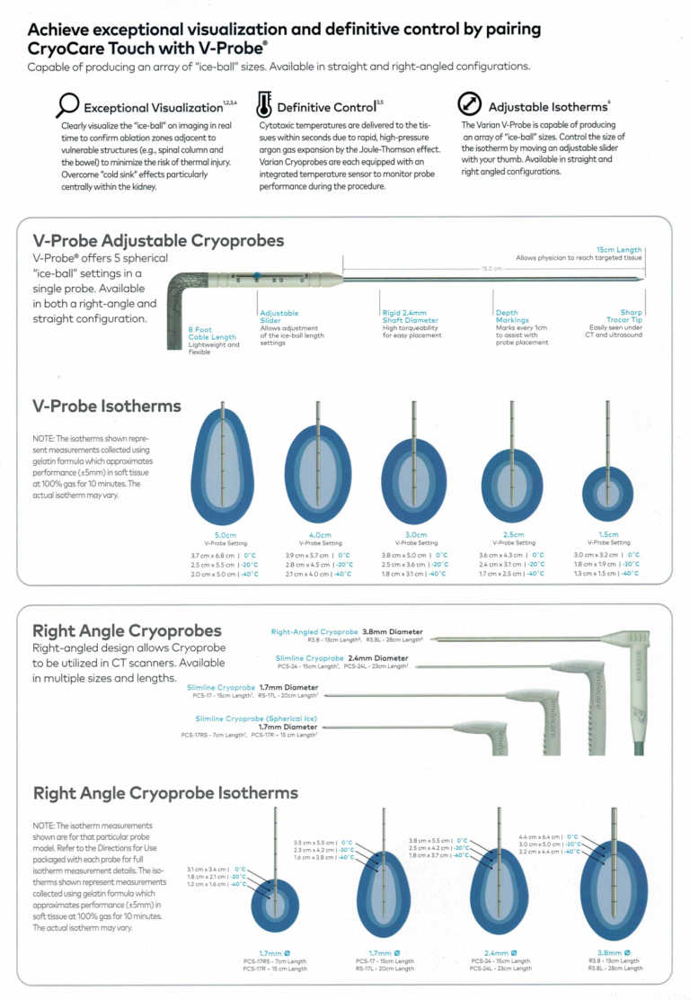
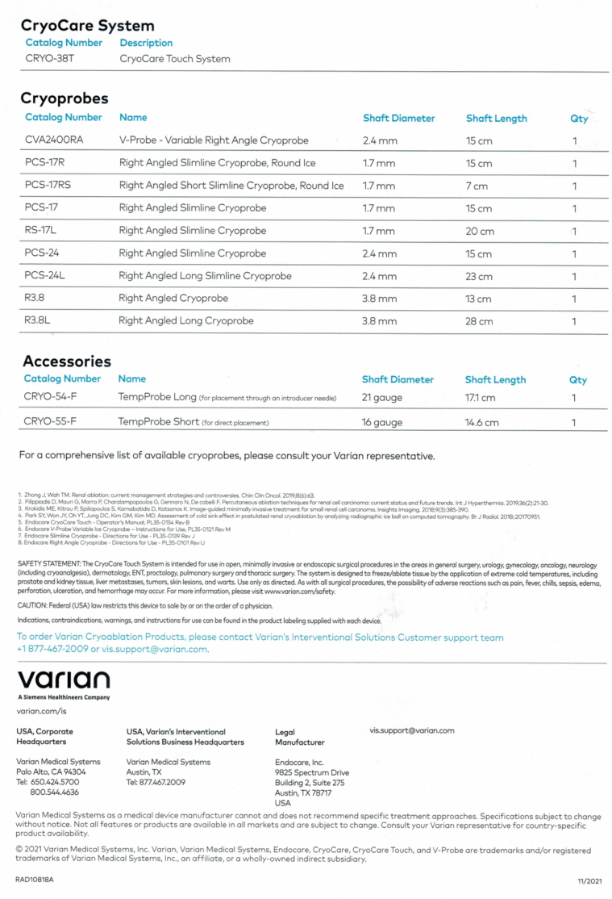

# Intervențional — Sonde pentru crioablație (MCB)

## Documentul original MCB — Sonde pentru crioablație

**Ghid procedural · 2 pagini · consultat la 2026-09-27.**

[Descarcă PDF-ul integral](../../assets/mcb-modalities/ir-sonde-pentru-crioablatie-mcb/document.pdf) · [Sursa MCB](https://ref.mcbradiology.com/IR/Miscellaneous/Cryo%20Probes.pdf) · [Catalogul MCB pentru această modalitate](../mcb/index.md)

Instrucțiunile, valorile și ilustrațiile din documentul original sunt păstrate în **engleză**. Titlul și navigarea sunt în română.

### Pagina 1

{ loading=lazy }

### Pagina 2

{ loading=lazy }

## Textul documentului original

Pagina 1: document scanat; conținutul se consultă în PDF-ul original.

Pagina 2: document scanat; conținutul se consultă în PDF-ul original.

