# Intervențional — Utilizarea sistemului de biopsie Bonopty (MCB)

## Documentul original MCB — Utilizarea sistemului de biopsie Bonopty

**Ghid procedural · 16 pagini · consultat la 2026-09-27.**

[Descarcă PDF-ul integral](../../assets/mcb-modalities/ir-utilizarea-sistemului-de-biopsie-bonopty-mcb/document.pdf) · [Sursa MCB](https://ref.mcbradiology.com/IR/Miscellaneous/Bonopty%20How%20To.pdf) · [Catalogul MCB pentru această modalitate](../mcb/index.md)

Instrucțiunile, valorile și ilustrațiile din documentul original sunt păstrate în **engleză**. Titlul și navigarea sunt în română.

### Pagina 1

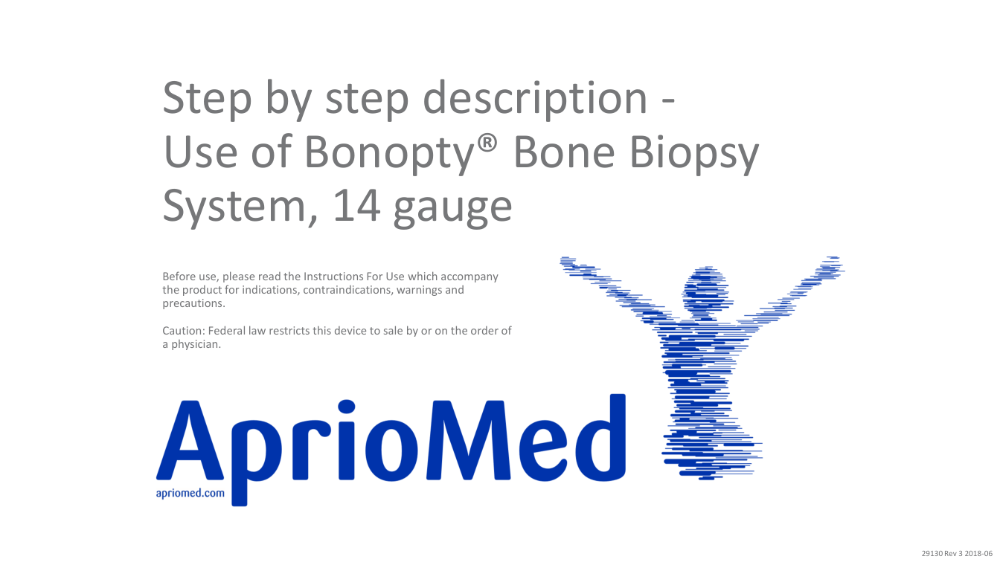{ loading=lazy }

### Pagina 2

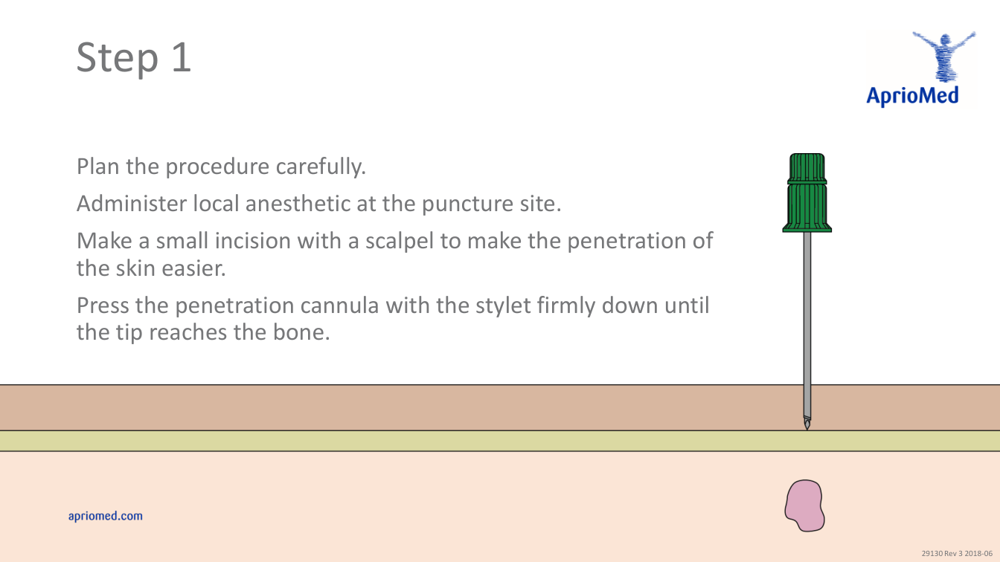{ loading=lazy }

### Pagina 3

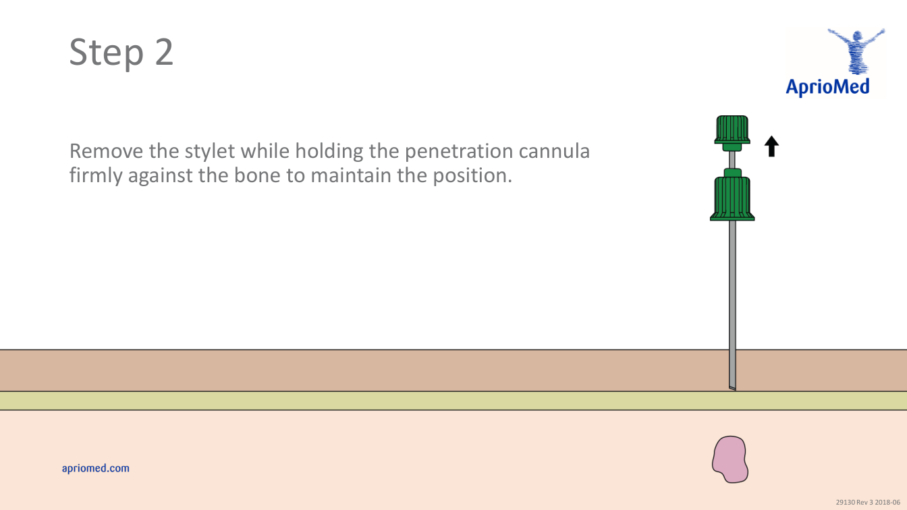{ loading=lazy }

### Pagina 4

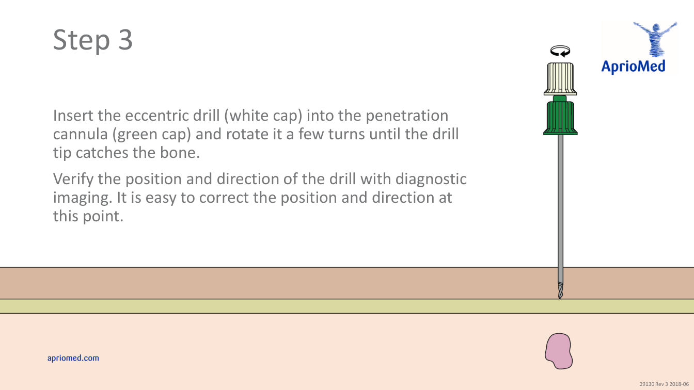{ loading=lazy }

### Pagina 5

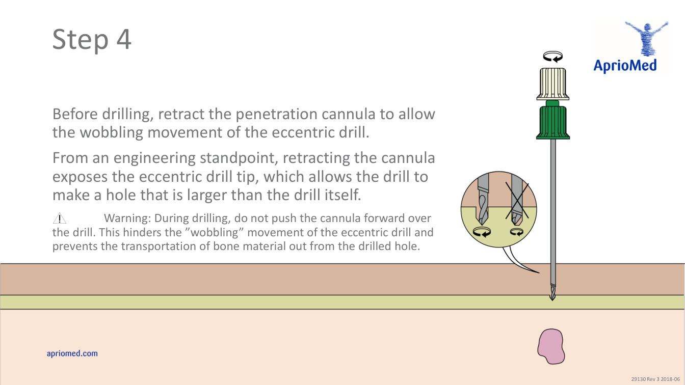{ loading=lazy }

### Pagina 6

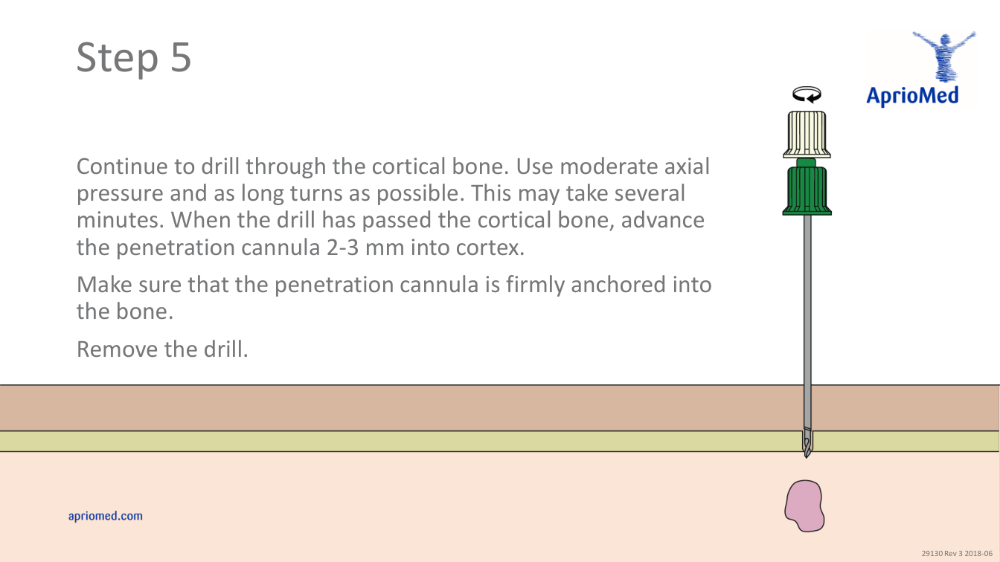{ loading=lazy }

### Pagina 7

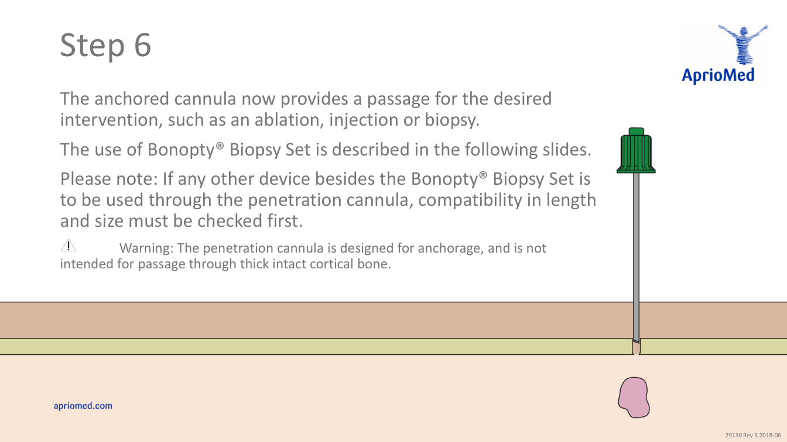{ loading=lazy }

### Pagina 8

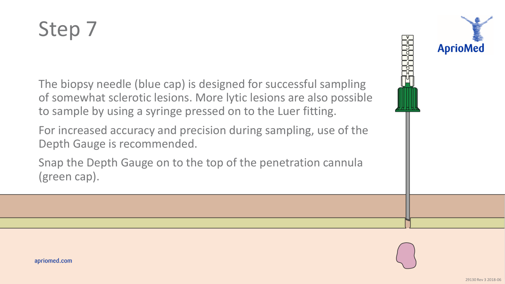{ loading=lazy }

### Pagina 9

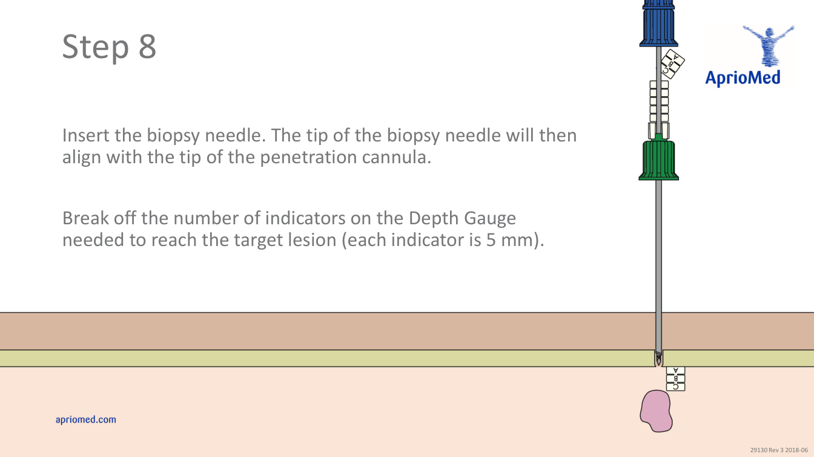{ loading=lazy }

### Pagina 10

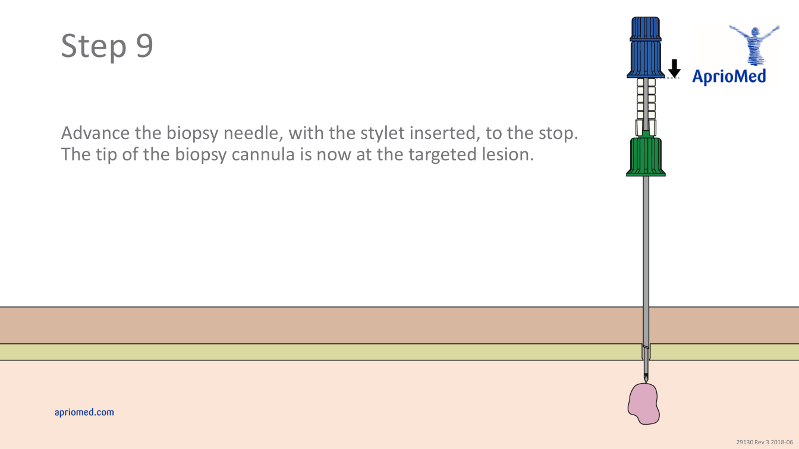{ loading=lazy }

### Pagina 11

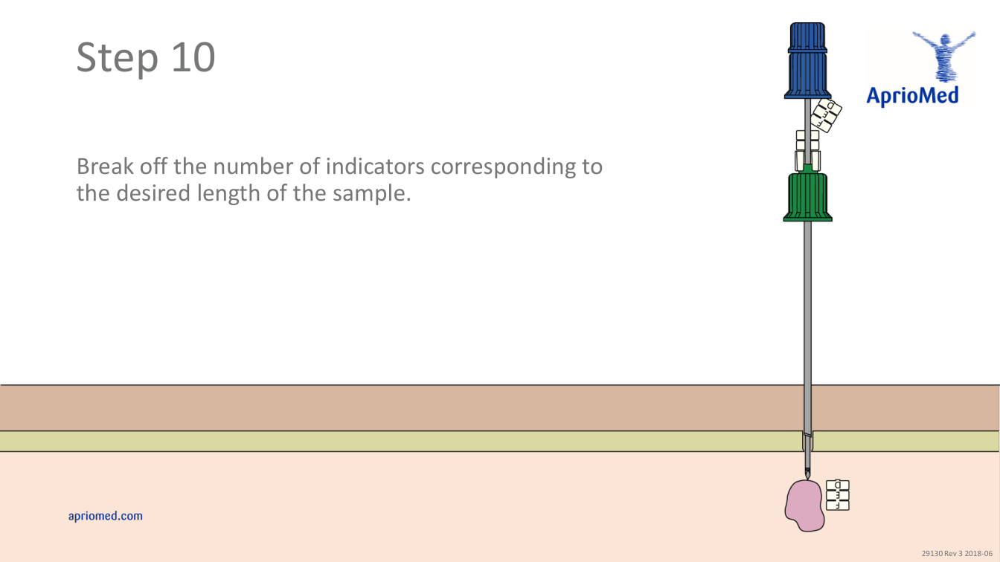{ loading=lazy }

### Pagina 12

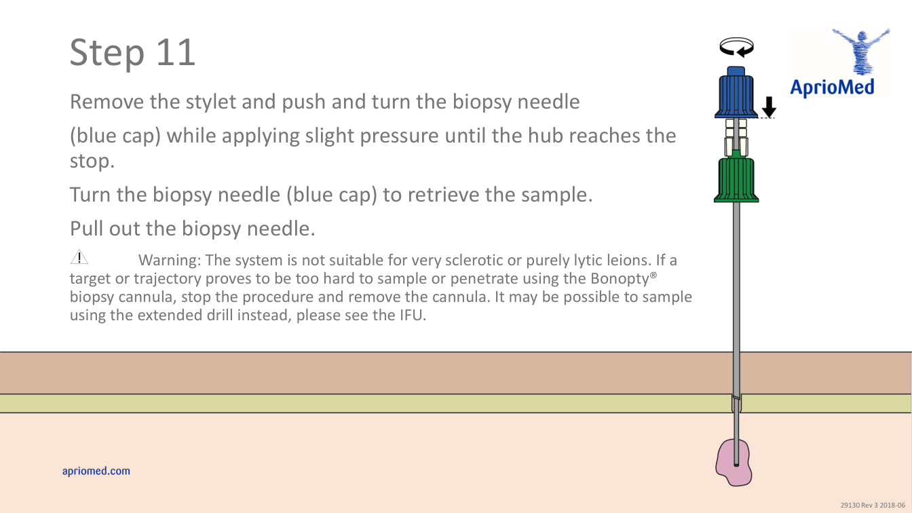{ loading=lazy }

### Pagina 13

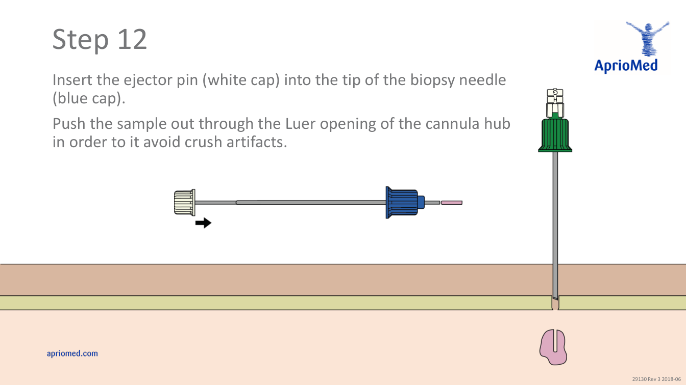{ loading=lazy }

### Pagina 14

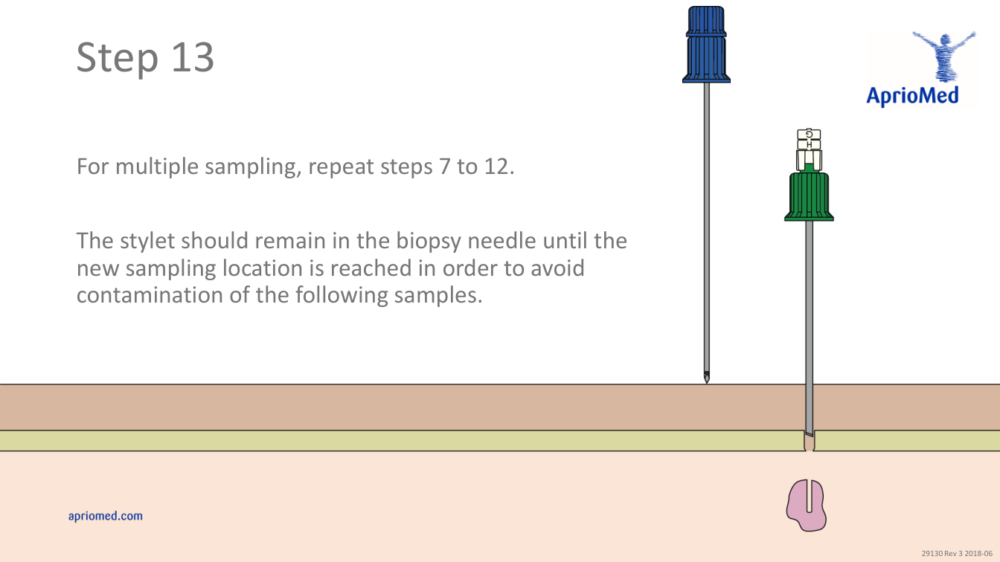{ loading=lazy }

### Pagina 15

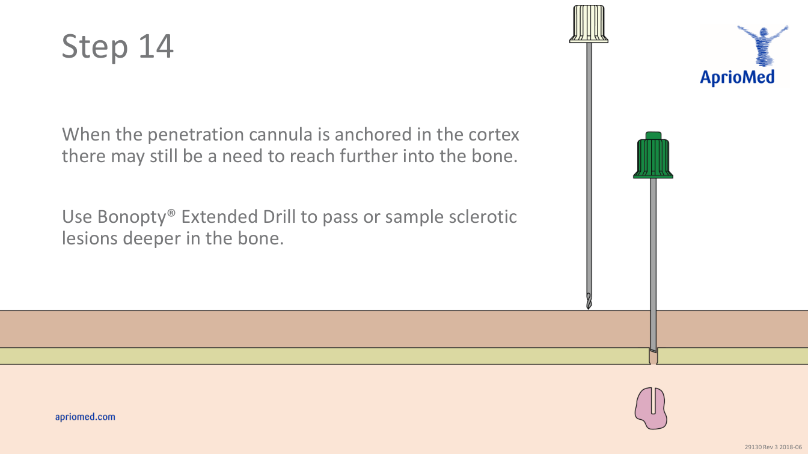{ loading=lazy }

### Pagina 16

{ loading=lazy }

## Textul documentului original

??? abstract "Pagina 1 — text în engleză"

    
Step by step description -
    Use of Bonopty® Bone Biopsy 
    System, 14 gauge
    Before use, please read the Instructions For Use which accompany 
    the product for indications, contraindications, warnings and 
    precautions.
    Caution: Federal law restricts this device to sale by or on the order of 
    a physician.
    29130 Rev 3 2018-06
    

??? abstract "Pagina 2 — text în engleză"

    
Step 1
    Plan the procedure carefully.
    Administer local anesthetic at the puncture site.
    Make a small incision with a scalpel to make the penetration of 
    the skin easier.
    Press the penetration cannula with the stylet firmly down until 
    the tip reaches the bone.
    29130 Rev 3 2018-06
    

??? abstract "Pagina 3 — text în engleză"

    
Step 2
    Remove the stylet while holding the penetration cannula 
    firmly against the bone to maintain the position.
    29130 Rev 3 2018-06
    

??? abstract "Pagina 4 — text în engleză"

    
Step 3
    Insert the eccentric drill (white cap) into the penetration 
    cannula (green cap) and rotate it a few turns until the drill 
    tip catches the bone.
    Verify the position and direction of the drill with diagnostic 
    imaging. It is easy to correct the position and direction at 
    this point.
    29130 Rev 3 2018-06
    

??? abstract "Pagina 5 — text în engleză"

    
Step 4
    Before drilling, retract the penetration cannula to allow 
    the wobbling movement of the eccentric drill.
    From an engineering standpoint, retracting the cannula 
    exposes the eccentric drill tip, which allows the drill to 
    make a hole that is larger than the drill itself.
    Warning: During drilling, do not push the cannula forward over 
    the drill. This hinders the ”wobbling” movement of the eccentric drill and 
    prevents the transportation of bone material out from the drilled hole. 
    29130 Rev 3 2018-06
    

??? abstract "Pagina 6 — text în engleză"

    
Step 5
    Continue to drill through the cortical bone. Use moderate axial 
    pressure and as long turns as possible. This may take several 
    minutes. When the drill has passed the cortical bone, advance 
    the penetration cannula 2-3 mm into cortex.
    Make sure that the penetration cannula is firmly anchored into 
    the bone.
    Remove the drill.
    29130 Rev 3 2018-06
    

??? abstract "Pagina 7 — text în engleză"

    
Step 6
    The anchored cannula now provides a passage for the desired 
    intervention, such as an ablation, injection or biopsy.
    The use of Bonopty® Biopsy Set is described in the following slides.
    Please note: If any other device besides the Bonopty® Biopsy Set is 
    to be used through the penetration cannula, compatibility in length 
    and size must be checked first.
    Warning: The penetration cannula is designed for anchorage, and is not 
    intended for passage through thick intact cortical bone.
    29130 Rev 3 2018-06
    

??? abstract "Pagina 8 — text în engleză"

    
Step 7
    The biopsy needle (blue cap) is designed for successful sampling 
    of somewhat sclerotic lesions. More lytic lesions are also possible 
    to sample by using a syringe pressed on to the Luer fitting.
    For increased accuracy and precision during sampling, use of the 
    Depth Gauge is recommended.
    Snap the Depth Gauge on to the top of the penetration cannula 
    (green cap).
    29130 Rev 3 2018-06
    

??? abstract "Pagina 9 — text în engleză"

    
Step 8
    Insert the biopsy needle. The tip of the biopsy needle will then 
    align with the tip of the penetration cannula.
    Break off the number of indicators on the Depth Gauge 
    needed to reach the target lesion (each indicator is 5 mm).
    29130 Rev 3 2018-06
    

??? abstract "Pagina 10 — text în engleză"

    
Step 9
    Advance the biopsy needle, with the stylet inserted, to the stop. 
    The tip of the biopsy cannula is now at the targeted lesion.
    29130 Rev 3 2018-06
    

??? abstract "Pagina 11 — text în engleză"

    
Step 10
    Break off the number of indicators corresponding to 
    the desired length of the sample.
    29130 Rev 3 2018-06
    

??? abstract "Pagina 12 — text în engleză"

    
Step 11
    Remove the stylet and push and turn the biopsy needle
    (blue cap) while applying slight pressure until the hub reaches the 
    stop.
    Turn the biopsy needle (blue cap) to retrieve the sample.
    Pull out the biopsy needle.
    Warning: The system is not suitable for very sclerotic or purely lytic leions. If a 
    target or trajectory proves to be too hard to sample or penetrate using the Bonopty® 
    biopsy cannula, stop the procedure and remove the cannula. It may be possible to sample 
    using the extended drill instead, please see the IFU.
    29130 Rev 3 2018-06
    

??? abstract "Pagina 13 — text în engleză"

    
Step 12
    Insert the ejector pin (white cap) into the tip of the biopsy needle 
    (blue cap).
    Push the sample out through the Luer opening of the cannula hub 
    in order to it avoid crush artifacts.
    29130 Rev 3 2018-06
    

??? abstract "Pagina 14 — text în engleză"

    
Step 13
    For multiple sampling, repeat steps 7 to 12.
    The stylet should remain in the biopsy needle until the 
    new sampling location is reached in order to avoid 
    contamination of the following samples.
    29130 Rev 3 2018-06
    

??? abstract "Pagina 15 — text în engleză"

    
Step 14
    When the penetration cannula is anchored in the cortex 
    there may still be a need to reach further into the bone.
    Use Bonopty® Extended Drill to pass or sample sclerotic 
    lesions deeper in the bone.
    29130 Rev 3 2018-06
    

??? abstract "Pagina 16 — text în engleză"

    
About
    AprioMed develops, manufactures, markets and sells innovative medical devices and related services 
    within the field of interventional radiology. We aim to deliver, in close collaboration with healthcare 
    practitioners, innovative, quality tools to achieve optimal solutions for radiologists worldwide. 
    29130 Rev 3 2018-06
    

