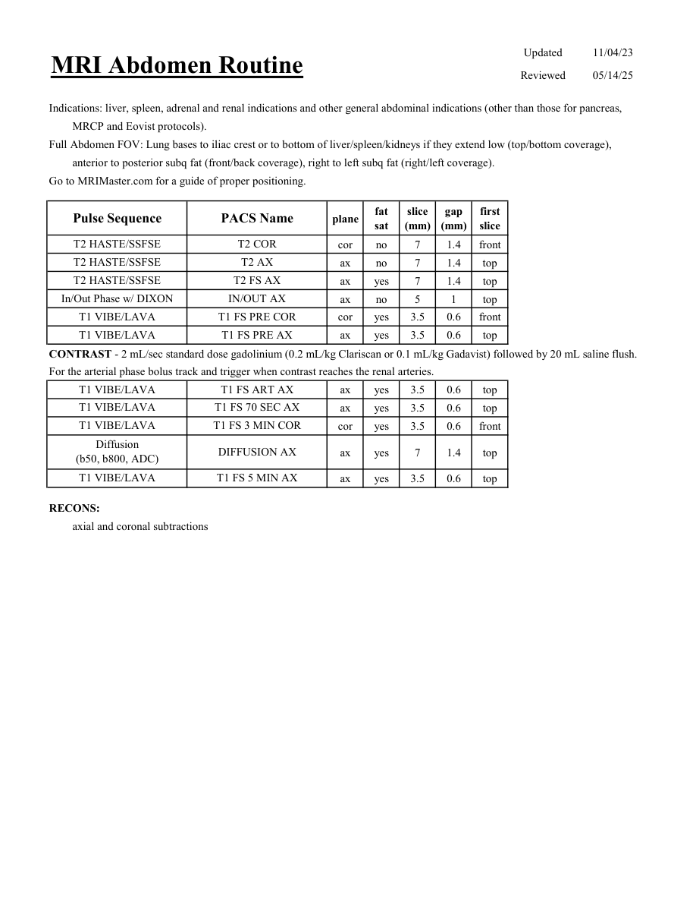

# IRM – Abdomen de rutină (MCB)

[Catalog MCB](../mcb/index.md) · [Descarcă PDF-ul complet](../../assets/mcb-mri/irm-abdomen-de-rutina-mcb/protocol.pdf) · [Sursa MCB](https://ref.mcbradiology.com/Protocols,%20Policies,%20Worksheets%20&%20Forms/MRI/Protocols/Body/1%20Abdomen%20Routine.pdf)

Documentul MCB este disponibil integral mai jos, inclusiv notele, condițiile de utilizare a contrastului și imaginile de planificare. Textul clinic al sursei este în **engleză**; titlul și etichetele parametrilor sunt în română.

## Protocolul original

### Pagina 1

{ loading=lazy }

??? abstract "Textul paginii (engleză)"

    
Updated
    11/04/23
    Reviewed
    05/14/25
    MRI Abdomen Routine
    Indications: liver, spleen, adrenal and renal indications and other general abdominal indications (other than those for pancreas, 
    MRCP and Eovist protocols).
    Full Abdomen FOV: Lung bases to iliac crest or to bottom of liver/spleen/kidneys if they extend low (top/bottom coverage),
    anterior to posterior subq fat (front/back coverage), right to left subq fat (right/left coverage).
    Go to MRIMaster.com for a guide of proper positioning.
    slice                    
    gap                    
    Pulse Sequence
    PACS Name
    plane
    fat                   
    sat
    (mm)
    (mm)
    first                               
    slice
    T2 HASTE/SSFSE
    T2 COR
    cor
    no
    7
    1.4
    front
    T2 HASTE/SSFSE
    T2 AX
    ax
    no
    7
    1.4
    top
    T2 HASTE/SSFSE
    T2 FS AX
    ax
    yes
    7
    1.4
    top
    In/Out Phase w/ DIXON
    IN/OUT AX
    ax
    no
    5
    1
    top
    T1 VIBE/LAVA
    T1 FS PRE COR
    cor
    yes
    3.5
    0.6
    front
    T1 VIBE/LAVA
    T1 FS PRE AX
    ax
    yes
    3.5
    0.6
    top
    CONTRAST - 2 mL/sec standard dose gadolinium (0.2 mL/kg Clariscan or 0.1 mL/kg Gadavist) followed by 20 mL saline flush.
    For the arterial phase bolus track and trigger when contrast reaches the renal arteries.
    T1 VIBE/LAVA
    T1 FS ART AX
    ax
    yes
    3.5
    0.6
    top
    T1 VIBE/LAVA
    T1 FS 70 SEC AX
    ax
    yes
    3.5
    0.6
    top
    T1 VIBE/LAVA
    T1 FS 3 MIN COR
    cor
    yes
    3.5
    0.6
    front
    Diffusion                                      
    ax
    yes
    7
    1.4
    top
    (b50, b800, ADC)
    DIFFUSION AX
    T1 VIBE/LAVA
    T1 FS 5 MIN AX
    ax
    yes
    3.5
    0.6
    top
    RECONS:
    axial and coronal subtractions
    

## Parametrii secvențelor

Tabele extrase din PDF. Variantele, secvențele condiționate și momentele administrării contrastului se citesc împreună cu notele de pe pagina originală indicată.

### Tabelul 1 — pagina 1

| Secvență | Denumire PACS | Plan | Supresie grăsime | Grosime (mm) | Interval (mm) | Prima secțiune |
|---|---|---|---|---|---|---|
| T2 HASTE/SSFSE | T2 COR | Coronal | Nu | 7 | 1.4 | Anterior |
| T2 HASTE/SSFSE | T2 AX | Axial | Nu | 7 | 1.4 | Superior |
| T2 HASTE/SSFSE | T2 FS AX | Axial | Da | 7 | 1.4 | Superior |
| In/Out Phase w/ DIXON | IN/OUT AX | Axial | Nu | 5 | 1 | Superior |
| T1 VIBE/LAVA | T1 FS PRE COR | Coronal | Da | 3.5 | 0.6 | Anterior |
| T1 VIBE/LAVA | T1 FS PRE AX | Axial | Da | 3.5 | 0.6 | Superior |
| T1 VIBE/LAVA | T1 FS ART AX | Axial | Da | 3.5 | 0.6 | Superior |
| T1 VIBE/LAVA | T1 FS 70 SEC AX | Axial | Da | 3.5 | 0.6 | Superior |
| T1 VIBE/LAVA | T1 FS 3 MIN COR | Coronal | Da | 3.5 | 0.6 | Anterior |
| Diffusion (b50, b800, ADC) | DIFFUSION AX | Axial | Da | 7 | 1.4 | Superior |
| T1 VIBE/LAVA | T1 FS 5 MIN AX | Axial | Da | 3.5 | 0.6 | Superior |

