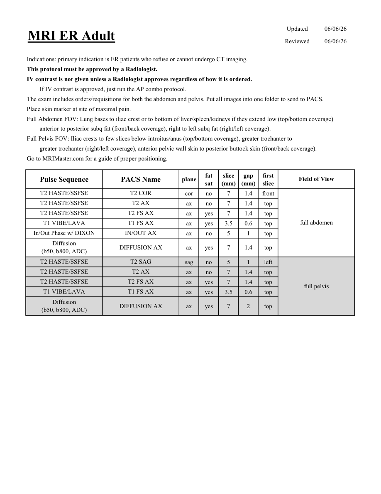

# IRM – Abdomen în urgență la adult (MCB)

[Catalog MCB](../mcb/index.md) · [Descarcă PDF-ul complet](../../assets/mcb-mri/irm-abdomen-in-urgenta-la-adult-mcb/protocol.pdf) · [Sursa MCB](https://ref.mcbradiology.com/Protocols,%20Policies,%20Worksheets%20&%20Forms/MRI/Protocols/Body/21%20ER%20Adult.pdf)

Documentul MCB este disponibil integral mai jos, inclusiv notele, condițiile de utilizare a contrastului și imaginile de planificare. Textul clinic al sursei este în **engleză**; titlul și etichetele parametrilor sunt în română.

## Protocolul original

### Pagina 1

{ loading=lazy }

??? abstract "Textul paginii (engleză)"

    
Updated
    06/06/26
    MRI ER Adult
    Reviewed
    06/06/26
    Indications: primary indication is ER patients who refuse or cannot undergo CT imaging.
    This protocol must be approved by a Radiologist.
    IV contrast is not given unless a Radiologist approves regardless of how it is ordered.
    If IV contrast is approved, just run the AP combo protocol. 
    The exam includes orders/requisitions for both the abdomen and pelvis. Put all images into one folder to send to PACS.
    Place skin marker at site of maximal pain.
    Full Abdomen FOV: Lung bases to iliac crest or to bottom of liver/spleen/kidneys if they extend low (top/bottom coverage)
    anterior to posterior subq fat (front/back coverage), right to left subq fat (right/left coverage).
    Full Pelvis FOV: Iliac crests to few slices below introitus/anus (top/bottom coverage), greater trochanter to 
    greater trochanter (right/left coverage), anterior pelvic wall skin to posterior buttock skin (front/back coverage).
    Go to MRIMaster.com for a guide of proper positioning.
    slice                    
    gap                    
    Field of View
    Pulse Sequence
    PACS Name
    plane
    fat                   
    sat
    (mm)
    (mm)
    first                               
    slice
    T2 HASTE/SSFSE
    T2 COR
    cor
    no
    7
    1.4
    front
    T2 HASTE/SSFSE
    T2 AX
    ax
    no
    7
    1.4
    top
    T2 HASTE/SSFSE
    T2 FS AX
    ax
    yes
    7
    1.4
    top
    full abdomen
    T1 VIBE/LAVA
    T1 FS AX
    ax
    yes
    3.5
    0.6
    top
    In/Out Phase w/ DIXON
    IN/OUT AX
    ax
    no
    5
    1
    top
    Diffusion                                      
    ax
    yes
    7
    1.4
    top
    (b50, b800, ADC)
    DIFFUSION AX
    T2 HASTE/SSFSE
    T2 SAG
    sag
    no
    5
    1
    left
    T2 HASTE/SSFSE
    T2 AX
    ax
    no
    7
    1.4
    top
    T2 HASTE/SSFSE
    T2 FS AX
    ax
    yes
    7
    1.4
    top
    full pelvis
    T1 VIBE/LAVA
    T1 FS AX
    ax
    yes
    3.5
    0.6
    top
    Diffusion                                      
    ax
    yes
    7
    2
    top
    (b50, b800, ADC)
    DIFFUSION AX
    

## Parametrii secvențelor

Tabele extrase din PDF. Variantele, secvențele condiționate și momentele administrării contrastului se citesc împreună cu notele de pe pagina originală indicată.

### Tabelul 1 — pagina 1

| Secvență | Denumire PACS | Plan | Supresie grăsime | Grosime (mm) | Interval (mm) | Prima secțiune | FOV |
|---|---|---|---|---|---|---|---|
| T2 HASTE/SSFSE | T2 COR | Coronal | Nu | 7 | 1.4 | Anterior | full abdomen |
| T2 HASTE/SSFSE | T2 AX | Axial | Nu | 7 | 1.4 | Superior |  |
| T2 HASTE/SSFSE | T2 FS AX | Axial | Da | 7 | 1.4 | Superior |  |
| T1 VIBE/LAVA | T1 FS AX | Axial | Da | 3.5 | 0.6 | Superior |  |
| In/Out Phase w/ DIXON | IN/OUT AX | Axial | Nu | 5 | 1 | Superior |  |
| Diffusion (b50, b800, ADC) | DIFFUSION AX | Axial | Da | 7 | 1.4 | Superior |  |
| T2 HASTE/SSFSE | T2 SAG | Sagital | Nu | 5 | 1 | Stânga | full pelvis |
| T2 HASTE/SSFSE | T2 AX | Axial | Nu | 7 | 1.4 | Superior |  |
| T2 HASTE/SSFSE | T2 FS AX | Axial | Da | 7 | 1.4 | Superior |  |
| T1 VIBE/LAVA | T1 FS AX | Axial | Da | 3.5 | 0.6 | Superior |  |
| Diffusion (b50, b800, ADC) | DIFFUSION AX | Axial | Da | 7 | 2 | Superior |  |

