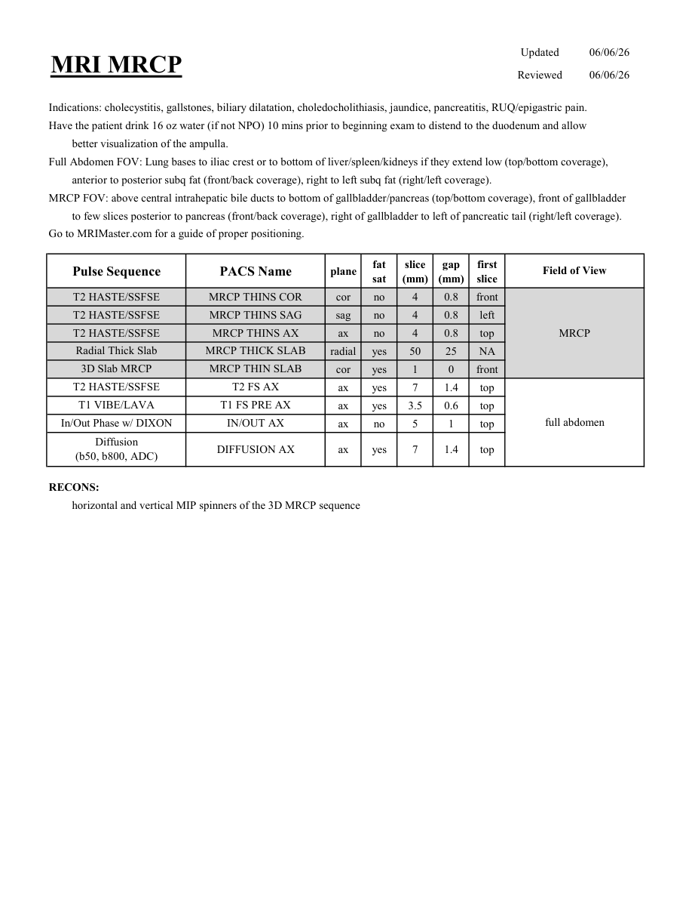

# IRM – Colangio-IRM (MRCP) (MCB)

[Catalog MCB](../mcb/index.md) · [Descarcă PDF-ul complet](../../assets/mcb-mri/irm-colangio-irm-mrcp-mcb/protocol.pdf) · [Sursa MCB](https://ref.mcbradiology.com/Protocols,%20Policies,%20Worksheets%20&%20Forms/MRI/Protocols/Body/6%20MRCP.pdf)

Documentul MCB este disponibil integral mai jos, inclusiv notele, condițiile de utilizare a contrastului și imaginile de planificare. Textul clinic al sursei este în **engleză**; titlul și etichetele parametrilor sunt în română.

## Protocolul original

### Pagina 1

{ loading=lazy }

??? abstract "Textul paginii (engleză)"

    
Updated
    06/06/26
    MRI MRCP
    Reviewed
    06/06/26
    Indications: cholecystitis, gallstones, biliary dilatation, choledocholithiasis, jaundice, pancreatitis, RUQ/epigastric pain.
    Have the patient drink 16 oz water (if not NPO) 10 mins prior to beginning exam to distend to the duodenum and allow 
    better visualization of the ampulla.
    Full Abdomen FOV: Lung bases to iliac crest or to bottom of liver/spleen/kidneys if they extend low (top/bottom coverage),
    anterior to posterior subq fat (front/back coverage), right to left subq fat (right/left coverage).
    MRCP FOV: above central intrahepatic bile ducts to bottom of gallbladder/pancreas (top/bottom coverage), front of gallbladder  
    to few slices posterior to pancreas (front/back coverage), right of gallbladder to left of pancreatic tail (right/left coverage).
    Go to MRIMaster.com for a guide of proper positioning.
    slice                    
    gap                    
    Field of View
    Pulse Sequence
    PACS Name
    plane
    fat                   
    sat
    (mm)
    (mm)
    first                               
    slice
    T2 HASTE/SSFSE
    MRCP THINS COR
    cor
    no
    4
    0.8
    front
    T2 HASTE/SSFSE
    MRCP THINS SAG
    sag
    no
    4
    0.8
    left
    T2 HASTE/SSFSE
    MRCP THINS AX
    MRCP
    ax
    no
    4
    0.8
    top
    Radial Thick Slab
    MRCP THICK SLAB
    radial
    yes
    50
    25
    NA
    3D Slab MRCP
    MRCP THIN SLAB
    cor
    yes
    1
    0
    front
    T2 HASTE/SSFSE
    T2 FS AX
    ax
    yes
    7
    1.4
    top
    T1 VIBE/LAVA
    T1 FS PRE AX
    ax
    yes
    3.5
    0.6
    top
    full abdomen
    In/Out Phase w/ DIXON
    IN/OUT AX
    ax
    no
    5
    1
    top
    Diffusion                                      
    ax
    yes
    7
    1.4
    top
    (b50, b800, ADC)
    DIFFUSION AX
    RECONS:
    horizontal and vertical MIP spinners of the 3D MRCP sequence
    

## Parametrii secvențelor

Tabele extrase din PDF. Variantele, secvențele condiționate și momentele administrării contrastului se citesc împreună cu notele de pe pagina originală indicată.

### Tabelul 1 — pagina 1

| Secvență | Denumire PACS | Plan | Supresie grăsime | Grosime (mm) | Interval (mm) | Prima secțiune | FOV |
|---|---|---|---|---|---|---|---|
| T2 HASTE/SSFSE | MRCP THINS COR | Coronal | Nu | 4 | 0.8 | Anterior | MRCP |
| T2 HASTE/SSFSE | MRCP THINS SAG | Sagital | Nu | 4 | 0.8 | Stânga |  |
| T2 HASTE/SSFSE | MRCP THINS AX | Axial | Nu | 4 | 0.8 | Superior |  |
| Radial Thick Slab | MRCP THICK SLAB | radial | Da | 50 | 25 | NA |  |
| 3D Slab MRCP | MRCP THIN SLAB | Coronal | Da | 1 | 0 | Anterior |  |
| T2 HASTE/SSFSE | T2 FS AX | Axial | Da | 7 | 1.4 | Superior | full abdomen |
| T1 VIBE/LAVA | T1 FS PRE AX | Axial | Da | 3.5 | 0.6 | Superior |  |
| In/Out Phase w/ DIXON | IN/OUT AX | Axial | Nu | 5 | 1 | Superior |  |
| Diffusion (b50, b800, ADC) | DIFFUSION AX | Axial | Da | 7 | 1.4 | Superior |  |

