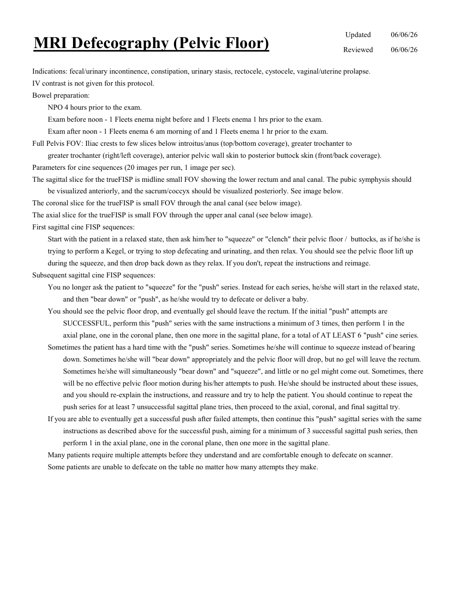
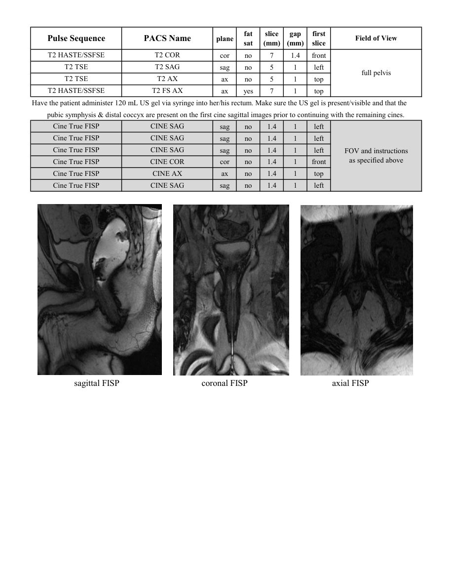

# IRM – Defecografie IRM (planșeu pelvin) (MCB)

[Catalog MCB](../mcb/index.md) · [Descarcă PDF-ul complet](../../assets/mcb-mri/irm-defecografie-irm-planseu-pelvin-mcb/protocol.pdf) · [Sursa MCB](https://ref.mcbradiology.com/Protocols,%20Policies,%20Worksheets%20&%20Forms/MRI/Protocols/Body/18%20Defecography.pdf)

Documentul MCB este disponibil integral mai jos, inclusiv notele, condițiile de utilizare a contrastului și imaginile de planificare. Textul clinic al sursei este în **engleză**; titlul și etichetele parametrilor sunt în română.

## Protocolul original

### Pagina 1

{ loading=lazy }

??? abstract "Textul paginii (engleză)"

    
Updated
    06/06/26
    MRI Defecography (Pelvic Floor)
    Reviewed
    06/06/26
    Indications: fecal/urinary incontinence, constipation, urinary stasis, rectocele, cystocele, vaginal/uterine prolapse.
    IV contrast is not given for this protocol.
    Bowel preparation:
    NPO 4 hours prior to the exam.
    Exam before noon - 1 Fleets enema night before and 1 Fleets enema 1 hrs prior to the exam.
    Exam after noon - 1 Fleets enema 6 am morning of and 1 Fleets enema 1 hr prior to the exam.
    Full Pelvis FOV: Iliac crests to few slices below introitus/anus (top/bottom coverage), greater trochanter to 
    greater trochanter (right/left coverage), anterior pelvic wall skin to posterior buttock skin (front/back coverage).
    Parameters for cine sequences (20 images per run, 1 image per sec).
    The sagittal slice for the trueFISP is midline small FOV showing the lower rectum and anal canal. The pubic symphysis should 
    be visualized anteriorly, and the sacrum/coccyx should be visualized posteriorly. See image below.
    The coronal slice for the trueFISP is small FOV through the anal canal (see below image). 
    The axial slice for the trueFISP is small FOV through the upper anal canal (see below image). 
    First sagittal cine FISP sequences:
    Start with the patient in a relaxed state, then ask him/her to &quot;squeeze&quot; or &quot;clench&quot; their pelvic floor /  buttocks, as if he/she is 
    trying to perform a Kegel, or trying to stop defecating and urinating, and then relax. You should see the pelvic floor lift up 
    during the squeeze, and then drop back down as they relax. If you don&#x27;t, repeat the instructions and reimage.
    Subsequent sagittal cine FISP sequences:
    You no longer ask the patient to &quot;squeeze&quot; for the &quot;push&quot; series. Instead for each series, he/she will start in the relaxed state, 
    and then &quot;bear down&quot; or &quot;push&quot;, as he/she would try to defecate or deliver a baby. 
    You should see the pelvic floor drop, and eventually gel should leave the rectum. If the initial &quot;push&quot; attempts are 
    SUCCESSFUL, perform this &quot;push&quot; series with the same instructions a minimum of 3 times, then perform 1 in the 
    axial plane, one in the coronal plane, then one more in the sagittal plane, for a total of AT LEAST 6 &quot;push&quot; cine series. 
    Sometimes the patient has a hard time with the &quot;push&quot; series. Sometimes he/she will continue to squeeze instead of bearing 
    down. Sometimes he/she will &quot;bear down&quot; appropriately and the pelvic floor will drop, but no gel will leave the rectum. 
    Sometimes he/she will simultaneously &quot;bear down&quot; and &quot;squeeze&quot;, and little or no gel might come out. Sometimes, there 
    will be no effective pelvic floor motion during his/her attempts to push. He/she should be instructed about these issues, 
    and you should re-explain the instructions, and reassure and try to help the patient. You should continue to repeat the 
    push series for at least 7 unsuccessful sagittal plane tries, then proceed to the axial, coronal, and final sagittal try. 
    If you are able to eventually get a successful push after failed attempts, then continue this &quot;push&quot; sagittal series with the same 
    instructions as described above for the successful push, aiming for a minimum of 3 successful sagittal push series, then
    perform 1 in the axial plane, one in the coronal plane, then one more in the sagittal plane.
    Many patients require multiple attempts before they understand and are comfortable enough to defecate on scanner.
    Some patients are unable to defecate on the table no matter how many attempts they make.
    

### Pagina 2

{ loading=lazy }

??? abstract "Textul paginii (engleză)"

    
slice                    
    gap                    
    Pulse Sequence
    PACS Name
    Field of View
    plane
    fat                   
    sat
    (mm)
    (mm)
    first                               
    slice
    T2 HASTE/SSFSE
    T2 COR
    cor
    no
    7
    1.4
    front
    T2 TSE
    T2 SAG
    sag
    no
    5
    1
    left
    full pelvis
    T2 TSE
    T2 AX
    ax
    no
    5
    1
    top
    T2 HASTE/SSFSE
    T2 FS AX
    ax
    yes
    7
    1
    top
    Have the patient administer 120 mL US gel via syringe into her/his rectum. Make sure the US gel is present/visible and that the
    pubic symphysis &amp; distal coccyx are present on the first cine sagittal images prior to continuing with the remaining cines.
    Cine True FISP
    CINE SAG
    sag
    no
    1.4
    1
    left
    Cine True FISP
    CINE SAG
    sag
    no
    1.4
    1
    left
    Cine True FISP
    CINE SAG
    sag
    no
    1.4
    1
    left
    FOV and instructions                         
    as specified above
    Cine True FISP
    CINE COR
    cor
    no
    1.4
    1
    front
    Cine True FISP
    CINE AX
    ax
    no
    1.4
    1
    top
    Cine True FISP
    CINE SAG
    sag
    no
    1.4
    1
    left
                       sagittal FISP                                     coronal FISP                                      axial FISP
    

## Parametrii secvențelor

Tabele extrase din PDF. Variantele, secvențele condiționate și momentele administrării contrastului se citesc împreună cu notele de pe pagina originală indicată.

### Tabelul 1 — pagina 2

| Secvență | Denumire PACS | Plan | Supresie grăsime | Grosime (mm) | Interval (mm) | Prima secțiune | FOV |
|---|---|---|---|---|---|---|---|
| T2 HASTE/SSFSE | T2 COR | Coronal | Nu | 7 | 1.4 | Anterior | full pelvis |
| T2 TSE | T2 SAG | Sagital | Nu | 5 | 1 | Stânga |  |
| T2 TSE | T2 AX | Axial | Nu | 5 | 1 | Superior |  |
| T2 HASTE/SSFSE | T2 FS AX | Axial | Da | 7 | 1 | Superior |  |
| Cine True FISP | CINE SAG | Sagital | Nu | 1.4 | 1 | Stânga | FOV and instructions as specified above |
| Cine True FISP | CINE SAG | Sagital | Nu | 1.4 | 1 | Stânga |  |
| Cine True FISP | CINE SAG | Sagital | Nu | 1.4 | 1 | Stânga |  |
| Cine True FISP | CINE COR | Coronal | Nu | 1.4 | 1 | Anterior |  |
| Cine True FISP | CINE AX | Axial | Nu | 1.4 | 1 | Superior |  |
| Cine True FISP | CINE SAG | Sagital | Nu | 1.4 | 1 | Stânga |  |

