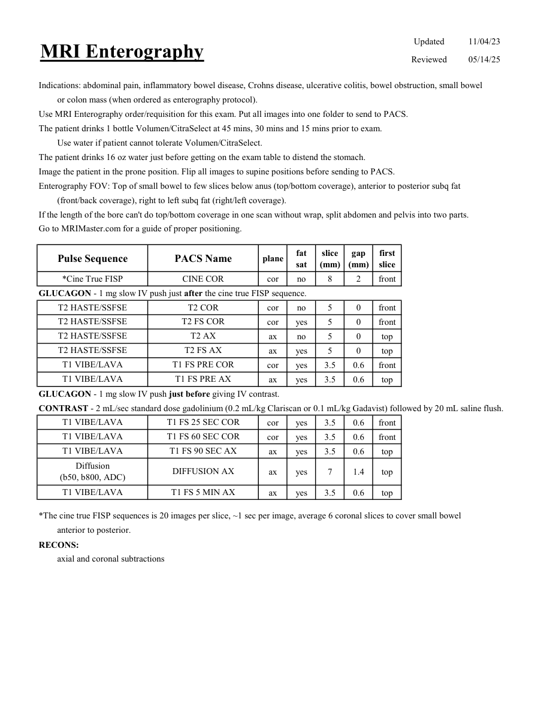

# IRM – Enterografie IRM (MCB)

[Catalog MCB](../mcb/index.md) · [Descarcă PDF-ul complet](../../assets/mcb-mri/irm-enterografie-irm-mcb/protocol.pdf) · [Sursa MCB](https://ref.mcbradiology.com/Protocols,%20Policies,%20Worksheets%20&%20Forms/MRI/Protocols/Body/10%20Enterography.pdf)

Documentul MCB este disponibil integral mai jos, inclusiv notele, condițiile de utilizare a contrastului și imaginile de planificare. Textul clinic al sursei este în **engleză**; titlul și etichetele parametrilor sunt în română.

## Protocolul original

### Pagina 1

{ loading=lazy }

??? abstract "Textul paginii (engleză)"

    
Updated
    11/04/23
    MRI Enterography
    Reviewed
    05/14/25
    Indications: abdominal pain, inflammatory bowel disease, Crohns disease, ulcerative colitis, bowel obstruction, small bowel
    or colon mass (when ordered as enterography protocol).
    Use MRI Enterography order/requisition for this exam. Put all images into one folder to send to PACS.
    The patient drinks 1 bottle Volumen/CitraSelect at 45 mins, 30 mins and 15 mins prior to exam. 
    Use water if patient cannot tolerate Volumen/CitraSelect.
    The patient drinks 16 oz water just before getting on the exam table to distend the stomach.
    Image the patient in the prone position. Flip all images to supine positions before sending to PACS.
    Enterography FOV: Top of small bowel to few slices below anus (top/bottom coverage), anterior to posterior subq fat
    (front/back coverage), right to left subq fat (right/left coverage).
    If the length of the bore can&#x27;t do top/bottom coverage in one scan without wrap, split abdomen and pelvis into two parts.
    Go to MRIMaster.com for a guide of proper positioning.
    slice                    
    gap                    
    Pulse Sequence
    PACS Name
    plane
    fat                   
    sat
    (mm)
    (mm)
    first                               
    slice
    *Cine True FISP
    CINE COR
    cor
    no
    8
    2
    front
    GLUCAGON - 1 mg slow IV push just after the cine true FISP sequence.
    T2 HASTE/SSFSE
    T2 COR
    cor
    no
    5
    0
    front
    T2 HASTE/SSFSE
    T2 FS COR
    cor
    yes
    5
    0
    front
    T2 HASTE/SSFSE
    T2 AX
    ax
    no
    5
    0
    top
    T2 HASTE/SSFSE
    T2 FS AX
    ax
    yes
    5
    0
    top
    T1 VIBE/LAVA
    T1 FS PRE COR
    cor
    yes
    3.5
    0.6
    front
    T1 VIBE/LAVA
    T1 FS PRE AX
    ax
    yes
    3.5
    0.6
    top
    GLUCAGON - 1 mg slow IV push just before giving IV contrast.
    CONTRAST - 2 mL/sec standard dose gadolinium (0.2 mL/kg Clariscan or 0.1 mL/kg Gadavist) followed by 20 mL saline flush. 
    T1 VIBE/LAVA
    T1 FS 25 SEC COR
    cor
    yes
    3.5
    0.6
    front
    T1 VIBE/LAVA
    T1 FS 60 SEC COR
    cor
    yes
    3.5
    0.6
    front
    T1 VIBE/LAVA
    T1 FS 90 SEC AX
    ax
    yes
    3.5
    0.6
    top
    Diffusion                                      
    ax
    yes
    7
    1.4
    top
    (b50, b800, ADC)
    DIFFUSION AX
    T1 VIBE/LAVA
    T1 FS 5 MIN AX
    ax
    yes
    3.5
    0.6
    top
    *The cine true FISP sequences is 20 images per slice, ~1 sec per image, average 6 coronal slices to cover small bowel 
    anterior to posterior.
    RECONS:
    axial and coronal subtractions
    

## Parametrii secvențelor

Tabele extrase din PDF. Variantele, secvențele condiționate și momentele administrării contrastului se citesc împreună cu notele de pe pagina originală indicată.

### Tabelul 1 — pagina 1

| Secvență | Denumire PACS | Plan | Supresie grăsime | Grosime (mm) | Interval (mm) | Prima secțiune |
|---|---|---|---|---|---|---|
| *Cine True FISP | CINE COR | Coronal | Nu | 8 | 2 | Anterior |
| T2 HASTE/SSFSE | T2 COR | Coronal | Nu | 5 | 0 | Anterior |
| T2 HASTE/SSFSE | T2 FS COR | Coronal | Da | 5 | 0 | Anterior |
| T2 HASTE/SSFSE | T2 AX | Axial | Nu | 5 | 0 | Superior |
| T2 HASTE/SSFSE | T2 FS AX | Axial | Da | 5 | 0 | Superior |
| T1 VIBE/LAVA | T1 FS PRE COR | Coronal | Da | 3.5 | 0.6 | Anterior |
| T1 VIBE/LAVA | T1 FS PRE AX | Axial | Da | 3.5 | 0.6 | Superior |
| T1 VIBE/LAVA | T1 FS 25 SEC COR | Coronal | Da | 3.5 | 0.6 | Anterior |
| T1 VIBE/LAVA | T1 FS 60 SEC COR | Coronal | Da | 3.5 | 0.6 | Anterior |
| T1 VIBE/LAVA | T1 FS 90 SEC AX | Axial | Da | 3.5 | 0.6 | Superior |
| Diffusion (b50, b800, ADC) | DIFFUSION AX | Axial | Da | 7 | 1.4 | Superior |
| T1 VIBE/LAVA | T1 FS 5 MIN AX | Axial | Da | 3.5 | 0.6 | Superior |

