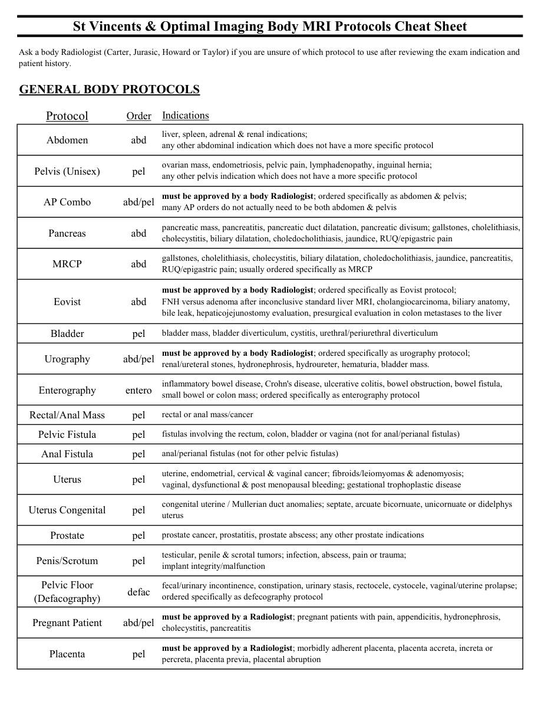
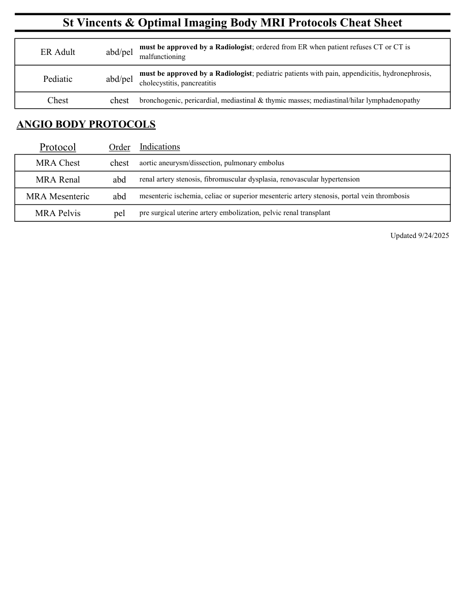

# IRM – Fișă de orientare pentru alegerea protocolului Body (MCB)

[Catalog MCB](../mcb/index.md) · [Descarcă PDF-ul complet](../../assets/mcb-mri/irm-fisa-de-orientare-pentru-alegerea-protocolului-body-mcb/protocol.pdf) · [Sursa MCB](https://ref.mcbradiology.com/Protocols,%20Policies,%20Worksheets%20&%20Forms/MRI/Protocols/Body/0%20Body%20MRI%20Protocol%20Cheat%20Sheet.pdf)

Documentul MCB este disponibil integral mai jos, inclusiv notele, condițiile de utilizare a contrastului și imaginile de planificare. Textul clinic al sursei este în **engleză**; titlul și etichetele parametrilor sunt în română.

## Protocolul original

### Pagina 1

{ loading=lazy }

??? abstract "Textul paginii (engleză)"

    
St Vincents &amp; Optimal Imaging Body MRI Protocols Cheat Sheet
    Ask a body Radiologist (Carter, Jurasic, Howard or Taylor) if you are unsure of which protocol to use after reviewing the exam indication and 
    patient history.
    GENERAL BODY PROTOCOLS
    Indications
    Protocol
    Order
    Abdomen
    abd
    liver, spleen, adrenal &amp; renal indications;                                                                                                         
    any other abdominal indication which does not have a more specific protocol
    Pelvis (Unisex)
    pel
    ovarian mass, endometriosis, pelvic pain, lymphadenopathy, inguinal hernia;                                                  
    any other pelvis indication which does not have a more specific protocol
    AP Combo
    abd/pel
    must be approved by a body Radiologist; ordered specifically as abdomen &amp; pelvis;                                  
    many AP orders do not actually need to be both abdomen &amp; pelvis
    Pancreas
    abd
    pancreatic mass, pancreatitis, pancreatic duct dilatation, pancreatic divisum; gallstones, cholelithiasis, 
    cholecystitis, biliary dilatation, choledocholithiasis, jaundice, RUQ/epigastric pain
    MRCP
    abd
    gallstones, cholelithiasis, cholecystitis, biliary dilatation, choledocholithiasis, jaundice, pancreatitis, 
    RUQ/epigastric pain; usually ordered specifically as MRCP
    Eovist
    abd
    must be approved by a body Radiologist; ordered specifically as Eovist protocol;                                       
    FNH versus adenoma after inconclusive standard liver MRI, cholangiocarcinoma, biliary anatomy, 
    bile leak, hepaticojejunostomy evaluation, presurgical evaluation in colon metastases to the liver
    bladder mass, bladder diverticulum, cystitis, urethral/periurethral diverticulum
    Bladder
    pel
    Urography
    abd/pel
    must be approved by a body Radiologist; ordered specifically as urography protocol;                                
    renal/ureteral stones, hydronephrosis, hydroureter, hematuria, bladder mass.
    Enterography
    entero
    inflammatory bowel disease, Crohn&#x27;s disease, ulcerative colitis, bowel obstruction, bowel fistula, 
    small bowel or colon mass; ordered specifically as enterography protocol
    rectal or anal mass/cancer
    Rectal/Anal Mass
    pel
    fistulas involving the rectum, colon, bladder or vagina (not for anal/perianal fistulas)
    Pelvic Fistula
    pel
    anal/perianal fistulas (not for other pelvic fistulas)
    Anal Fistula
    pel
    Uterus
    pel
    uterine, endometrial, cervical &amp; vaginal cancer; fibroids/leiomyomas &amp; adenomyosis;                                   
    vaginal, dysfunctional &amp; post menopausal bleeding; gestational trophoplastic disease
    Uterus Congenital
    pel
    congenital uterine / Mullerian duct anomalies; septate, arcuate bicornuate, unicornuate or didelphys 
    uterus
    prostate cancer, prostatitis, prostate abscess; any other prostate indications
    Prostate
    pel
    Penis/Scrotum
    pel
    testicular, penile &amp; scrotal tumors; infection, abscess, pain or trauma;                                                           
    implant integrity/malfunction
    Pelvic Floor                                             
    fecal/urinary incontinence, constipation, urinary stasis, rectocele, cystocele, vaginal/uterine prolapse; 
    ordered specifically as defecography protocol 
    (Defacography)
    defac
    Pregnant Patient
    abd/pel
    must be approved by a Radiologist; pregnant patients with pain, appendicitis, hydronephrosis, 
    cholecystitis, pancreatitis
    Placenta
    pel
    must be approved by a Radiologist; morbidly adherent placenta, placenta accreta, increta or 
    percreta, placenta previa, placental abruption
    

### Pagina 2

{ loading=lazy }

??? abstract "Textul paginii (engleză)"

    
St Vincents &amp; Optimal Imaging Body MRI Protocols Cheat Sheet
    ER Adult
    abd/pel
    must be approved by a Radiologist; ordered from ER when patient refuses CT or CT is 
    malfunctioning
    Pediatic
    abd/pel
    must be approved by a Radiologist; pediatric patients with pain, appendicitis, hydronephrosis, 
    cholecystitis, pancreatitis
    bronchogenic, pericardial, mediastinal &amp; thymic masses; mediastinal/hilar lymphadenopathy
    Chest
    chest
    ANGIO BODY PROTOCOLS
    Indications
    Protocol
    Order
    aortic aneurysm/dissection, pulmonary embolus
    MRA Chest
    chest
    renal artery stenosis, fibromuscular dysplasia, renovascular hypertension
    MRA Renal
    abd
    mesenteric ischemia, celiac or superior mesenteric artery stenosis, portal vein thrombosis
    MRA Mesenteric
    abd
    pre surgical uterine artery embolization, pelvic renal transplant
    MRA Pelvis
    pel
    Updated 9/24/2025
    

