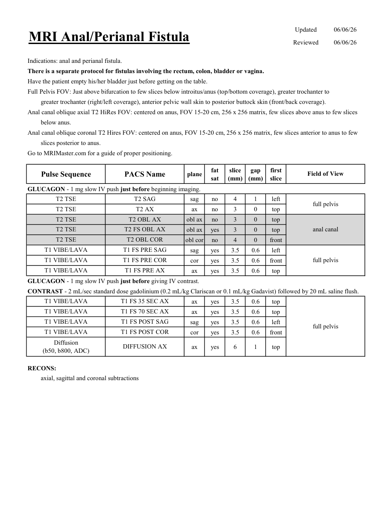
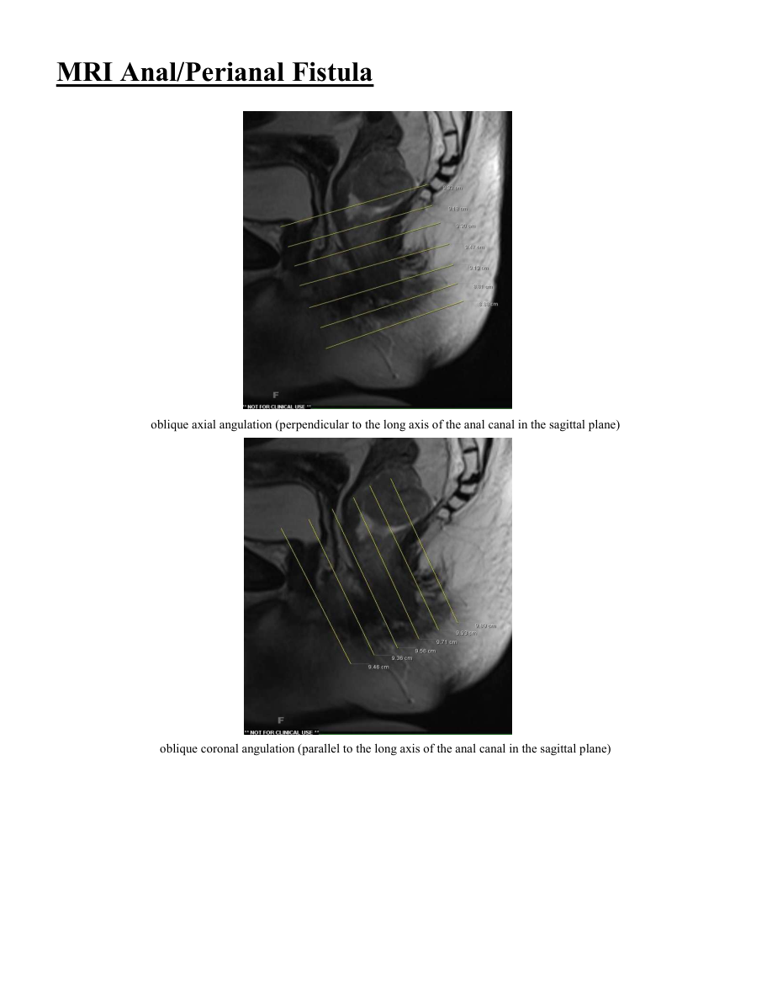

# IRM – Fistulă anală (MCB)

[Catalog MCB](../mcb/index.md) · [Descarcă PDF-ul complet](../../assets/mcb-mri/irm-fistula-anala-mcb/protocol.pdf) · [Sursa MCB](https://ref.mcbradiology.com/Protocols,%20Policies,%20Worksheets%20&%20Forms/MRI/Protocols/Body/13%20Anal%20Fistula.pdf)

Documentul MCB este disponibil integral mai jos, inclusiv notele, condițiile de utilizare a contrastului și imaginile de planificare. Textul clinic al sursei este în **engleză**; titlul și etichetele parametrilor sunt în română.

## Protocolul original

### Pagina 1

{ loading=lazy }

??? abstract "Textul paginii (engleză)"

    
Updated
    06/06/26
    MRI Anal/Perianal Fistula
    Reviewed
    06/06/26
    Indications: anal and perianal fistula.
    There is a separate protocol for fistulas involving the rectum, colon, bladder or vagina. 
    Have the patient empty his/her bladder just before getting on the table.
    Full Pelvis FOV: Just above bifurcation to few slices below introitus/anus (top/bottom coverage), greater trochanter to 
    greater trochanter (right/left coverage), anterior pelvic wall skin to posterior buttock skin (front/back coverage).
    Anal canal oblique axial T2 HiRes FOV: centered on anus, FOV 15-20 cm, 256 x 256 matrix, few slices above anus to few slices
    below anus.
    Anal canal oblique coronal T2 Hires FOV: centered on anus, FOV 15-20 cm, 256 x 256 matrix, few slices anterior to anus to few
    slices posterior to anus.
    Go to MRIMaster.com for a guide of proper positioning.
    slice                    
    gap                    
    Field of View
    Pulse Sequence
    PACS Name
    plane
    fat                   
    sat
    (mm)
    (mm)
    first                               
    slice
    GLUCAGON - 1 mg slow IV push just before beginning imaging.
    T2 TSE
    T2 SAG
    sag
    no
    4
    1
    left
    full pelvis
    T2 TSE
    T2 AX
    ax
    no
    3
    0
    top
    T2 TSE
    T2 OBL AX
    obl ax
    no
    3
    0
    top
    T2 TSE
    T2 FS OBL AX
    anal canal
    obl ax
    yes
    3
    0
    top
    T2 TSE
    T2 OBL COR
    obl cor
    no
    4
    0
    front
    T1 VIBE/LAVA
    T1 FS PRE SAG
    sag
    yes
    3.5
    0.6
    left
    T1 VIBE/LAVA
    T1 FS PRE COR
    full pelvis
    cor
    yes
    3.5
    0.6
    front
    T1 VIBE/LAVA
    T1 FS PRE AX
    ax
    yes
    3.5
    0.6
    top
    GLUCAGON - 1 mg slow IV push just before giving IV contrast.
    CONTRAST - 2 mL/sec standard dose gadolinium (0.2 mL/kg Clariscan or 0.1 mL/kg Gadavist) followed by 20 mL saline flush. 
    T1 VIBE/LAVA
    T1 FS 35 SEC AX
    ax
    yes
    3.5
    0.6
    top
    T1 VIBE/LAVA
    T1 FS 70 SEC AX
    ax
    yes
    3.5
    0.6
    top
    sag
    yes
    3.5
    0.6
    left
    full pelvis
    T1 VIBE/LAVA
    T1 FS POST SAG
    T1 VIBE/LAVA
    T1 FS POST COR
    cor
    yes
    3.5
    0.6
    front
    Diffusion                                      
    ax
    yes
    6
    1
    top
    (b50, b800, ADC)
    DIFFUSION AX
    RECONS:
    axial, sagittal and coronal subtractions
    

### Pagina 2

{ loading=lazy }

??? abstract "Textul paginii (engleză)"

    
MRI Anal/Perianal Fistula
    oblique axial angulation (perpendicular to the long axis of the anal canal in the sagittal plane)
    oblique coronal angulation (parallel to the long axis of the anal canal in the sagittal plane)
    

## Parametrii secvențelor

Tabele extrase din PDF. Variantele, secvențele condiționate și momentele administrării contrastului se citesc împreună cu notele de pe pagina originală indicată.

### Tabelul 1 — pagina 1

| Secvență | Denumire PACS | Plan | Supresie grăsime | Grosime (mm) | Interval (mm) | Prima secțiune | FOV |
|---|---|---|---|---|---|---|---|
| T2 TSE | T2 SAG | Sagital | Nu | 4 | 1 | Stânga | full pelvis |
| T2 TSE | T2 AX | Axial | Nu | 3 | 0 | Superior |  |
| T2 TSE | T2 OBL AX | obl ax | Nu | 3 | 0 | Superior | anal canal |
| T2 TSE | T2 FS OBL AX | obl ax | Da | 3 | 0 | Superior |  |
| T2 TSE | T2 OBL COR | obl cor | Nu | 4 | 0 | Anterior |  |
| T1 VIBE/LAVA | T1 FS PRE SAG | Sagital | Da | 3.5 | 0.6 | Stânga | full pelvis |
| T1 VIBE/LAVA | T1 FS PRE COR | Coronal | Da | 3.5 | 0.6 | Anterior |  |
| T1 VIBE/LAVA | T1 FS PRE AX | Axial | Da | 3.5 | 0.6 | Superior |  |
| T1 VIBE/LAVA | T1 FS 35 SEC AX | Axial | Da | 3.5 | 0.6 | Superior | full pelvis |
| T1 VIBE/LAVA | T1 FS 70 SEC AX | Axial | Da | 3.5 | 0.6 | Superior |  |
| T1 VIBE/LAVA | T1 FS POST SAG | Sagital | Da | 3.5 | 0.6 | Stânga |  |
| T1 VIBE/LAVA | T1 FS POST COR | Coronal | Da | 3.5 | 0.6 | Anterior |  |
| Diffusion (b50, b800, ADC) | DIFFUSION AX | Axial | Da | 6 | 1 | Superior |  |

