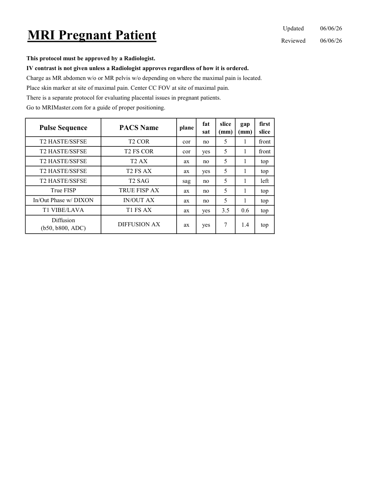

# IRM – Pacientă gravidă (MCB)

[Catalog MCB](../mcb/index.md) · [Descarcă PDF-ul complet](../../assets/mcb-mri/irm-pacienta-gravida-mcb/protocol.pdf) · [Sursa MCB](https://ref.mcbradiology.com/Protocols,%20Policies,%20Worksheets%20&%20Forms/MRI/Protocols/Body/19%20Pregnant%20Patient.pdf)

Documentul MCB este disponibil integral mai jos, inclusiv notele, condițiile de utilizare a contrastului și imaginile de planificare. Textul clinic al sursei este în **engleză**; titlul și etichetele parametrilor sunt în română.

## Protocolul original

### Pagina 1

{ loading=lazy }

??? abstract "Textul paginii (engleză)"

    
Updated
    06/06/26
    MRI Pregnant Patient
    Reviewed
    06/06/26
    This protocol must be approved by a Radiologist.
    IV contrast is not given unless a Radiologist approves regardless of how it is ordered.
    Charge as MR abdomen w/o or MR pelvis w/o depending on where the maximal pain is located.
    Place skin marker at site of maximal pain. Center CC FOV at site of maximal pain.
    There is a separate protocol for evaluating placental issues in pregnant patients.
    Go to MRIMaster.com for a guide of proper positioning.
    slice                    
    gap                    
    Pulse Sequence
    PACS Name
    plane
    fat                   
    sat
    (mm)
    (mm)
    first                               
    slice
    T2 HASTE/SSFSE
    T2 COR
    cor
    no
    5
    1
    front
    T2 HASTE/SSFSE
    T2 FS COR
    cor
    yes
    5
    1
    front
    T2 HASTE/SSFSE
    T2 AX
    ax
    no
    5
    1
    top
    T2 HASTE/SSFSE
    T2 FS AX
    ax
    yes
    5
    1
    top
    T2 HASTE/SSFSE
    T2 SAG
    sag
    no
    5
    1
    left
    True FISP
    TRUE FISP AX
    ax
    no
    5
    1
    top
    In/Out Phase w/ DIXON
    IN/OUT AX
    ax
    no
    5
    1
    top
    T1 VIBE/LAVA
    T1 FS AX
    ax
    yes
    3.5
    0.6
    top
    ax
    yes
    7
    1.4
    top
    Diffusion                                      
    (b50, b800, ADC)
    DIFFUSION AX
    

## Parametrii secvențelor

Tabele extrase din PDF. Variantele, secvențele condiționate și momentele administrării contrastului se citesc împreună cu notele de pe pagina originală indicată.

### Tabelul 1 — pagina 1

| Secvență | Denumire PACS | Plan | Supresie grăsime | Grosime (mm) | Interval (mm) | Prima secțiune |
|---|---|---|---|---|---|---|
| T2 HASTE/SSFSE | T2 COR | Coronal | Nu | 5 | 1 | Anterior |
| T2 HASTE/SSFSE | T2 FS COR | Coronal | Da | 5 | 1 | Anterior |
| T2 HASTE/SSFSE | T2 AX | Axial | Nu | 5 | 1 | Superior |
| T2 HASTE/SSFSE | T2 FS AX | Axial | Da | 5 | 1 | Superior |
| T2 HASTE/SSFSE | T2 SAG | Sagital | Nu | 5 | 1 | Stânga |
| True FISP | TRUE FISP AX | Axial | Nu | 5 | 1 | Superior |
| In/Out Phase w/ DIXON | IN/OUT AX | Axial | Nu | 5 | 1 | Superior |
| T1 VIBE/LAVA | T1 FS AX | Axial | Da | 3.5 | 0.6 | Superior |
| Diffusion (b50, b800, ADC) | DIFFUSION AX | Axial | Da | 7 | 1.4 | Superior |

