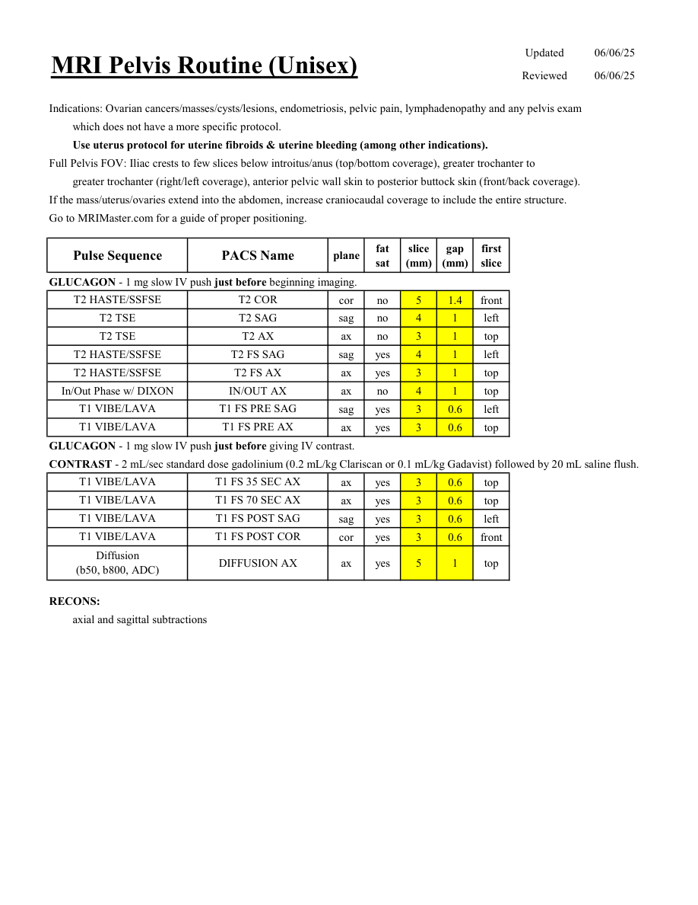

# IRM – Pelvis de rutină (unisex) (MCB)

[Catalog MCB](../mcb/index.md) · [Descarcă PDF-ul complet](../../assets/mcb-mri/irm-pelvis-de-rutina-unisex-mcb/protocol.pdf) · [Sursa MCB](https://ref.mcbradiology.com/Protocols,%20Policies,%20Worksheets%20&%20Forms/MRI/Protocols/Body/2%20Pelvis%20Routine%20%28Unisex%29.pdf)

Documentul MCB este disponibil integral mai jos, inclusiv notele, condițiile de utilizare a contrastului și imaginile de planificare. Textul clinic al sursei este în **engleză**; titlul și etichetele parametrilor sunt în română.

## Protocolul original

### Pagina 1

{ loading=lazy }

??? abstract "Textul paginii (engleză)"

    
Updated
    06/06/25
    Reviewed
    06/06/25
    MRI Pelvis Routine (Unisex)
    Indications: Ovarian cancers/masses/cysts/lesions, endometriosis, pelvic pain, lymphadenopathy and any pelvis exam 
    which does not have a more specific protocol.
    Use uterus protocol for uterine fibroids &amp; uterine bleeding (among other indications).
    Full Pelvis FOV: Iliac crests to few slices below introitus/anus (top/bottom coverage), greater trochanter to 
    greater trochanter (right/left coverage), anterior pelvic wall skin to posterior buttock skin (front/back coverage).
    If the mass/uterus/ovaries extend into the abdomen, increase craniocaudal coverage to include the entire structure.
    Go to MRIMaster.com for a guide of proper positioning.
    slice                    
    gap                    
    Pulse Sequence
    PACS Name
    plane
    fat                   
    sat
    (mm)
    (mm)
    first                               
    slice
    GLUCAGON - 1 mg slow IV push just before beginning imaging.
    T2 HASTE/SSFSE
    T2 COR
    cor
    no
    5
    1.4
    front
    T2 TSE
    T2 SAG
    sag
    no
    4
    1
    left
    T2 TSE
    T2 AX
    ax
    no
    3
    1
    top
    T2 HASTE/SSFSE
    T2 FS SAG
    sag
    yes
    4
    1
    left
    T2 HASTE/SSFSE
    T2 FS AX
    ax
    yes
    3
    1
    top
    In/Out Phase w/ DIXON
    IN/OUT AX
    ax
    no
    4
    1
    top
    T1 VIBE/LAVA
    T1 FS PRE SAG
    sag
    yes
    3
    0.6
    left
    T1 VIBE/LAVA
    T1 FS PRE AX
    ax
    yes
    3
    0.6
    top
    GLUCAGON - 1 mg slow IV push just before giving IV contrast.
    CONTRAST - 2 mL/sec standard dose gadolinium (0.2 mL/kg Clariscan or 0.1 mL/kg Gadavist) followed by 20 mL saline flush. 
    T1 VIBE/LAVA
    T1 FS 35 SEC AX
    ax
    yes
    3
    0.6
    top
    T1 VIBE/LAVA
    T1 FS 70 SEC AX
    ax
    yes
    3
    0.6
    top
    T1 VIBE/LAVA
    T1 FS POST SAG
    sag
    yes
    3
    0.6
    left
    T1 VIBE/LAVA
    T1 FS POST COR
    cor
    yes
    3
    0.6
    front
    Diffusion                                      
    ax
    yes
    5
    1
    top
    (b50, b800, ADC)
    DIFFUSION AX
    RECONS:
    axial and sagittal subtractions
    

## Parametrii secvențelor

Tabele extrase din PDF. Variantele, secvențele condiționate și momentele administrării contrastului se citesc împreună cu notele de pe pagina originală indicată.

### Tabelul 1 — pagina 1

| Secvență | Denumire PACS | Plan | Supresie grăsime | Grosime (mm) | Interval (mm) | Prima secțiune |
|---|---|---|---|---|---|---|
| T2 HASTE/SSFSE | T2 COR | Coronal | Nu | 5 | 1.4 | Anterior |
| T2 TSE | T2 SAG | Sagital | Nu | 4 | 1 | Stânga |
| T2 TSE | T2 AX | Axial | Nu | 3 | 1 | Superior |
| T2 HASTE/SSFSE | T2 FS SAG | Sagital | Da | 4 | 1 | Stânga |
| T2 HASTE/SSFSE | T2 FS AX | Axial | Da | 3 | 1 | Superior |
| In/Out Phase w/ DIXON | IN/OUT AX | Axial | Nu | 4 | 1 | Superior |
| T1 VIBE/LAVA | T1 FS PRE SAG | Sagital | Da | 3 | 0.6 | Stânga |
| T1 VIBE/LAVA | T1 FS PRE AX | Axial | Da | 3 | 0.6 | Superior |
| T1 VIBE/LAVA | T1 FS 35 SEC AX | Axial | Da | 3 | 0.6 | Superior |
| T1 VIBE/LAVA | T1 FS 70 SEC AX | Axial | Da | 3 | 0.6 | Superior |
| T1 VIBE/LAVA | T1 FS POST SAG | Sagital | Da | 3 | 0.6 | Stânga |
| T1 VIBE/LAVA | T1 FS POST COR | Coronal | Da | 3 | 0.6 | Anterior |
| Diffusion (b50, b800, ADC) | DIFFUSION AX | Axial | Da | 5 | 1 | Superior |

