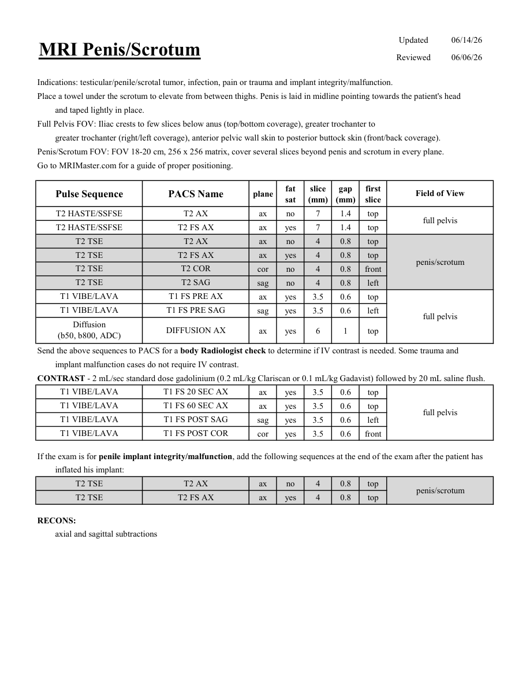

# IRM – Penis și scrot (MCB)

[Catalog MCB](../mcb/index.md) · [Descarcă PDF-ul complet](../../assets/mcb-mri/irm-penis-si-scrot-mcb/protocol.pdf) · [Sursa MCB](https://ref.mcbradiology.com/Protocols,%20Policies,%20Worksheets%20&%20Forms/MRI/Protocols/Body/17%20Penis%20Scrotum.pdf)

Documentul MCB este disponibil integral mai jos, inclusiv notele, condițiile de utilizare a contrastului și imaginile de planificare. Textul clinic al sursei este în **engleză**; titlul și etichetele parametrilor sunt în română.

## Protocolul original

### Pagina 1

{ loading=lazy }

??? abstract "Textul paginii (engleză)"

    
Updated
    06/14/26
    MRI Penis/Scrotum
    Reviewed
    06/06/26
    Indications: testicular/penile/scrotal tumor, infection, pain or trauma and implant integrity/malfunction.
    Place a towel under the scrotum to elevate from between thighs. Penis is laid in midline pointing towards the patient&#x27;s head
    and taped lightly in place.
    Full Pelvis FOV: Iliac crests to few slices below anus (top/bottom coverage), greater trochanter to 
    greater trochanter (right/left coverage), anterior pelvic wall skin to posterior buttock skin (front/back coverage).
    Penis/Scrotum FOV: FOV 18-20 cm, 256 x 256 matrix, cover several slices beyond penis and scrotum in every plane.
    Go to MRIMaster.com for a guide of proper positioning.
    slice                    
    gap                    
    Pulse Sequence
    PACS Name
    Field of View
    plane
    fat                   
    sat
    (mm)
    (mm)
    first                               
    slice
    T2 HASTE/SSFSE
    T2 AX
    ax
    no
    7
    1.4
    top
    full pelvis
    T2 HASTE/SSFSE
    T2 FS AX
    ax
    yes
    7
    1.4
    top
    T2 TSE
    T2 AX
    ax
    no
    4
    0.8
    top
    T2 TSE
    T2 FS AX
    ax
    yes
    4
    0.8
    top
    penis/scrotum
    T2 TSE
    T2 COR
    cor
    no
    4
    0.8
    front
    T2 TSE
    T2 SAG
    sag
    no
    4
    0.8
    left
    T1 VIBE/LAVA
    T1 FS PRE AX
    ax
    yes
    3.5
    0.6
    top
    sag
    yes
    3.5
    0.6
    left
    full pelvis
    T1 VIBE/LAVA
    T1 FS PRE SAG
    Diffusion                                      
    DIFFUSION AX
    ax
    yes
    6
    1
    top
    (b50, b800, ADC)
    Send the above sequences to PACS for a body Radiologist check to determine if IV contrast is needed. Some trauma and
    implant malfunction cases do not require IV contrast.
    CONTRAST - 2 mL/sec standard dose gadolinium (0.2 mL/kg Clariscan or 0.1 mL/kg Gadavist) followed by 20 mL saline flush. 
    T1 VIBE/LAVA
    T1 FS 20 SEC AX
    ax
    yes
    3.5
    0.6
    top
    T1 VIBE/LAVA
    T1 FS 60 SEC AX
    ax
    yes
    3.5
    0.6
    top
    full pelvis
    T1 VIBE/LAVA
    T1 FS POST SAG
    sag
    yes
    3.5
    0.6
    left
    T1 VIBE/LAVA
    T1 FS POST COR
    cor
    yes
    3.5
    0.6
    front
    If the exam is for penile implant integrity/malfunction, add the following sequences at the end of the exam after the patient has 
    inflated his implant:
    T2 TSE
    T2 AX
    ax
    no
    4
    0.8
    top
    T2 TSE
    T2 FS AX
    penis/scrotum
    ax
    yes
    4
    0.8
    top
    RECONS:
    axial and sagittal subtractions
    

## Parametrii secvențelor

Tabele extrase din PDF. Variantele, secvențele condiționate și momentele administrării contrastului se citesc împreună cu notele de pe pagina originală indicată.

### Tabelul 1 — pagina 1

| Secvență | Denumire PACS | Plan | Supresie grăsime | Grosime (mm) | Interval (mm) | Prima secțiune | FOV |
|---|---|---|---|---|---|---|---|
| T2 HASTE/SSFSE | T2 AX | Axial | Nu | 7 | 1.4 | Superior | full pelvis |
| T2 HASTE/SSFSE | T2 FS AX | Axial | Da | 7 | 1.4 | Superior |  |
| T2 TSE | T2 AX | Axial | Nu | 4 | 0.8 | Superior | penis/scrotum |
| T2 TSE | T2 FS AX | Axial | Da | 4 | 0.8 | Superior |  |
| T2 TSE | T2 COR | Coronal | Nu | 4 | 0.8 | Anterior |  |
| T2 TSE | T2 SAG | Sagital | Nu | 4 | 0.8 | Stânga |  |
| T1 VIBE/LAVA | T1 FS PRE AX | Axial | Da | 3.5 | 0.6 | Superior | full pelvis |
| T1 VIBE/LAVA | T1 FS PRE SAG | Sagital | Da | 3.5 | 0.6 | Stânga |  |
| Diffusion (b50, b800, ADC) | DIFFUSION AX | Axial | Da | 6 | 1 | Superior |  |
| T1 VIBE/LAVA | T1 FS 20 SEC AX | Axial | Da | 3.5 | 0.6 | Superior | full pelvis |
| T1 VIBE/LAVA | T1 FS 60 SEC AX | Axial | Da | 3.5 | 0.6 | Superior |  |
| T1 VIBE/LAVA | T1 FS POST SAG | Sagital | Da | 3.5 | 0.6 | Stânga |  |
| T1 VIBE/LAVA | T1 FS POST COR | Coronal | Da | 3.5 | 0.6 | Anterior |  |
| T2 TSE | T2 AX | Axial | Nu | 4 | 0.8 | Superior | penis/scrotum |
| T2 TSE | T2 FS AX | Axial | Da | 4 | 0.8 | Superior |  |

