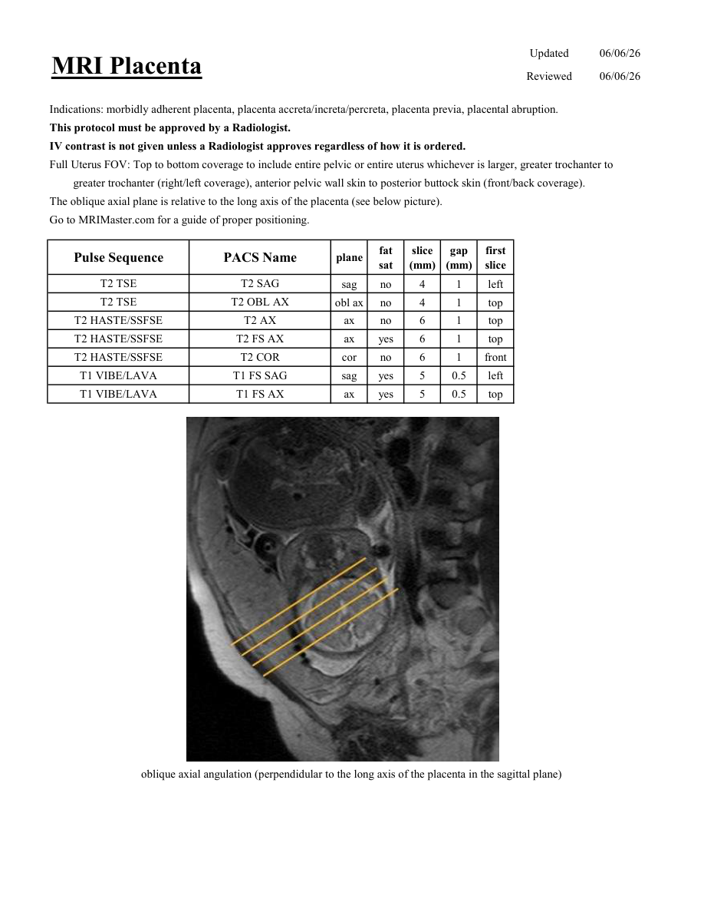

# IRM – Placentă (MCB)

[Catalog MCB](../mcb/index.md) · [Descarcă PDF-ul complet](../../assets/mcb-mri/irm-placenta-mcb/protocol.pdf) · [Sursa MCB](https://ref.mcbradiology.com/Protocols,%20Policies,%20Worksheets%20&%20Forms/MRI/Protocols/Body/20%20Placenta.pdf)

Documentul MCB este disponibil integral mai jos, inclusiv notele, condițiile de utilizare a contrastului și imaginile de planificare. Textul clinic al sursei este în **engleză**; titlul și etichetele parametrilor sunt în română.

## Protocolul original

### Pagina 1

{ loading=lazy }

??? abstract "Textul paginii (engleză)"

    
Updated
    06/06/26
    MRI Placenta
    Reviewed
    06/06/26
    Indications: morbidly adherent placenta, placenta accreta/increta/percreta, placenta previa, placental abruption.
    This protocol must be approved by a Radiologist.
    IV contrast is not given unless a Radiologist approves regardless of how it is ordered.
    Full Uterus FOV: Top to bottom coverage to include entire pelvic or entire uterus whichever is larger, greater trochanter to 
    greater trochanter (right/left coverage), anterior pelvic wall skin to posterior buttock skin (front/back coverage).
    The oblique axial plane is relative to the long axis of the placenta (see below picture).
    Go to MRIMaster.com for a guide of proper positioning.
    slice                    
    gap                    
    Pulse Sequence
    PACS Name
    plane
    fat                   
    sat
    (mm)
    (mm)
    first                               
    slice
    T2 TSE
    T2 SAG
    sag
    no
    4
    1
    left
    T2 TSE
    T2 OBL AX
    obl ax
    no
    4
    1
    top
    T2 HASTE/SSFSE
    T2 AX
    ax
    no
    6
    1
    top
    T2 HASTE/SSFSE
    T2 FS AX
    ax
    yes
    6
    1
    top
    T2 HASTE/SSFSE
    T2 COR
    cor
    no
    6
    1
    front
    T1 VIBE/LAVA
    T1 FS SAG
    sag
    yes
    5
    0.5
    left
    T1 VIBE/LAVA
    T1 FS AX
    ax
    yes
    5
    0.5
    top
    oblique axial angulation (perpendidular to the long axis of the placenta in the sagittal plane)
    

## Parametrii secvențelor

Tabele extrase din PDF. Variantele, secvențele condiționate și momentele administrării contrastului se citesc împreună cu notele de pe pagina originală indicată.

### Tabelul 1 — pagina 1

| Secvență | Denumire PACS | Plan | Supresie grăsime | Grosime (mm) | Interval (mm) | Prima secțiune |
|---|---|---|---|---|---|---|
| T2 TSE | T2 SAG | Sagital | Nu | 4 | 1 | Stânga |
| T2 TSE | T2 OBL AX | obl ax | Nu | 4 | 1 | Superior |
| T2 HASTE/SSFSE | T2 AX | Axial | Nu | 6 | 1 | Superior |
| T2 HASTE/SSFSE | T2 FS AX | Axial | Da | 6 | 1 | Superior |
| T2 HASTE/SSFSE | T2 COR | Coronal | Nu | 6 | 1 | Anterior |
| T1 VIBE/LAVA | T1 FS SAG | Sagital | Da | 5 | 0.5 | Stânga |
| T1 VIBE/LAVA | T1 FS AX | Axial | Da | 5 | 0.5 | Superior |

