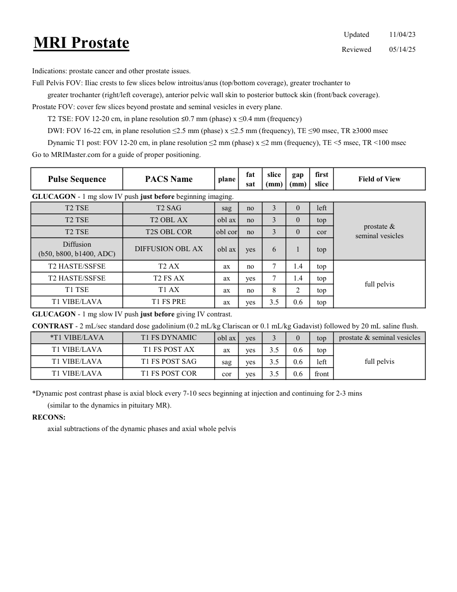
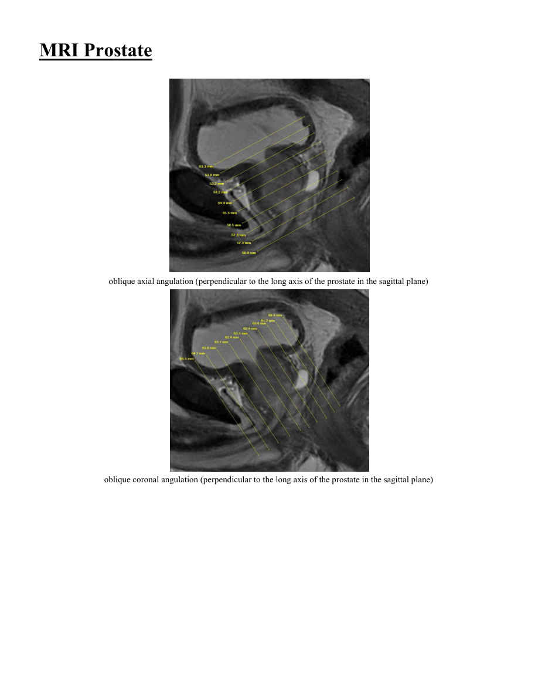

# IRM – Prostată (MCB)

[Catalog MCB](../mcb/index.md) · [Descarcă PDF-ul complet](../../assets/mcb-mri/irm-prostata-mcb/protocol.pdf) · [Sursa MCB](https://ref.mcbradiology.com/Protocols,%20Policies,%20Worksheets%20&%20Forms/MRI/Protocols/Body/16%20Prostate.pdf)

Documentul MCB este disponibil integral mai jos, inclusiv notele, condițiile de utilizare a contrastului și imaginile de planificare. Textul clinic al sursei este în **engleză**; titlul și etichetele parametrilor sunt în română.

## Protocolul original

### Pagina 1

{ loading=lazy }

??? abstract "Textul paginii (engleză)"

    
Updated
    11/04/23
    MRI Prostate
    Reviewed
    05/14/25
    Indications: prostate cancer and other prostate issues.
    Full Pelvis FOV: Iliac crests to few slices below introitus/anus (top/bottom coverage), greater trochanter to 
    greater trochanter (right/left coverage), anterior pelvic wall skin to posterior buttock skin (front/back coverage).
    Prostate FOV: cover few slices beyond prostate and seminal vesicles in every plane.
    T2 TSE: FOV 12-20 cm, in plane resolution ≤0.7 mm (phase) x ≤0.4 mm (frequency)
    DWI: FOV 16-22 cm, in plane resolution ≤2.5 mm (phase) x ≤2.5 mm (frequency), TE ≤90 msec, TR ≥3000 msec
    Dynamic T1 post: FOV 12-20 cm, in plane resolution ≤2 mm (phase) x ≤2 mm (frequency), TE &lt;5 msec, TR &lt;100 msec
    Go to MRIMaster.com for a guide of proper positioning.
    slice                    
    gap                    
    Field of View
    Pulse Sequence
    PACS Name
    plane
    fat                   
    sat
    (mm)
    (mm)
    first                               
    slice
    GLUCAGON - 1 mg slow IV push just before beginning imaging.
    T2 TSE
    T2 SAG
    sag
    no
    3
    0
    left
    T2 TSE
    T2 OBL AX
    obl ax
    no
    3
    0
    top
    prostate &amp;                                
    T2 TSE
    T2S OBL COR
    obl cor
    no
    3
    0
    cor
    seminal vesicles
    Diffusion                                      
    obl ax
    yes
    6
    1
    top
    (b50, b800, b1400, ADC)
    DIFFUSION OBL AX
    T2 HASTE/SSFSE
    T2 AX
    ax
    no
    7
    1.4
    top
    T2 HASTE/SSFSE
    T2 FS AX
    ax
    yes
    7
    1.4
    top
    full pelvis
    T1 TSE
    T1 AX
    ax
    no
    8
    2
    top
    T1 VIBE/LAVA
    T1 FS PRE
    ax
    yes
    3.5
    0.6
    top
    GLUCAGON - 1 mg slow IV push just before giving IV contrast.
    CONTRAST - 2 mL/sec standard dose gadolinium (0.2 mL/kg Clariscan or 0.1 mL/kg Gadavist) followed by 20 mL saline flush. 
    *T1 VIBE/LAVA
    T1 FS DYNAMIC
    prostate &amp; seminal vesicles
    obl ax
    yes
    3
    0
    top
    T1 VIBE/LAVA
    T1 FS POST AX
    ax
    yes
    3.5
    0.6
    top
    T1 VIBE/LAVA
    T1 FS POST SAG
    full pelvis
    sag
    yes
    3.5
    0.6
    left
    T1 VIBE/LAVA
    T1 FS POST COR
    cor
    yes
    3.5
    0.6
    front
    *Dynamic post contrast phase is axial block every 7-10 secs beginning at injection and continuing for 2-3 mins
    (similar to the dynamics in pituitary MR).
    RECONS:
    axial subtractions of the dynamic phases and axial whole pelvis
    

### Pagina 2

{ loading=lazy }

??? abstract "Textul paginii (engleză)"

    
MRI Prostate
    oblique axial angulation (perpendicular to the long axis of the prostate in the sagittal plane)
    oblique coronal angulation (perpendicular to the long axis of the prostate in the sagittal plane)
    

## Parametrii secvențelor

Tabele extrase din PDF. Variantele, secvențele condiționate și momentele administrării contrastului se citesc împreună cu notele de pe pagina originală indicată.

### Tabelul 1 — pagina 1

| Secvență | Denumire PACS | Plan | Supresie grăsime | Grosime (mm) | Interval (mm) | Prima secțiune | FOV |
|---|---|---|---|---|---|---|---|
| T2 TSE | T2 SAG | Sagital | Nu | 3 | 0 | Stânga | prostate &amp; seminal vesicles |
| T2 TSE | T2 OBL AX | obl ax | Nu | 3 | 0 | Superior |  |
| T2 TSE | T2S OBL COR | obl cor | Nu | 3 | 0 | Coronal |  |
| Diffusion (b50, b800, b1400, ADC) | DIFFUSION OBL AX | obl ax | Da | 6 | 1 | Superior |  |
| T2 HASTE/SSFSE | T2 AX | Axial | Nu | 7 | 1.4 | Superior | full pelvis |
| T2 HASTE/SSFSE | T2 FS AX | Axial | Da | 7 | 1.4 | Superior |  |
| T1 TSE | T1 AX | Axial | Nu | 8 | 2 | Superior |  |
| T1 VIBE/LAVA | T1 FS PRE | Axial | Da | 3.5 | 0.6 | Superior |  |
| *T1 VIBE/LAVA | T1 FS DYNAMIC | obl ax | Da | 3 | 0 | Superior | prostate &amp; seminal vesicles |
| T1 VIBE/LAVA | T1 FS POST AX | Axial | Da | 3.5 | 0.6 | Superior | full pelvis |
| T1 VIBE/LAVA | T1 FS POST SAG | Sagital | Da | 3.5 | 0.6 | Stânga |  |
| T1 VIBE/LAVA | T1 FS POST COR | Coronal | Da | 3.5 | 0.6 | Anterior |  |

