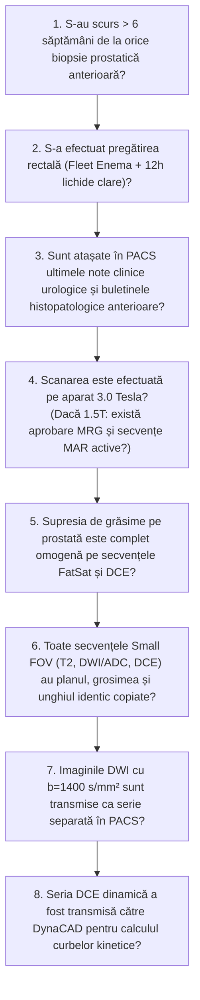

# Protocol & Checklist de Calitate IRM Prostată mpMRI (Medford Radiology Group)

**Ultima actualizare:** 2026-09-27  
**Autori:** Medford Radiology Group (MRG) / Clinical MRI Quality Committee  

---

-   __1. Rezumat Protocol Tehnic mpMRI__

    ---

    === "Pachete Secvențe Cheie"

        | Secvență | Plan / Geometrie | Grosime / Gap | Parametri Esențiali |
        |:---|:---|:---|:---|
        | **T2 TSE Small FOV** | Axial Oblic (perpendicular pe uretră) | 3.0 mm / gap 0 | FOV 180 mm, rezoluție spațială sub-milimetrică |
        | **T2 TSE Sagital & Coronal** | Sagital & Coronal Oblic | 3.0 mm / gap 0 | Apex, bază, invazie vezicule seminale |
        | **DWI / ADC (b=50, 800, 1400)** | Axial Oblic (geometrie copiată din T2) | 3.0 mm / gap 0 | Serie dedicată b=1400 s/mm² în PACS |
        | **T1 TSE Large FOV** | Axial Pelvis | 4.0 mm / gap 0.5 | Hemoragii post-biopsie, noduli limfatici |
        | **DCE Dinamic (DynaCAD)** | Axial Oblic (geometrie copiată din T2) | 3.0 mm / gap 0 | Rezoluție temporală < 10 secunde, 2-3 minute |

    === "Indicații Clinice"

        - Suspiciune înaltă de adenocarcinom prostatic (PSA crescut, raport PSA liber/total scăzut, tușeu rectal suspect)
        - Cartografiere lezională și ghidare pentru puncție biopsie de fuziune RMN-Ecografie (Fusion Biopsy)
        - Stadializare loco-regională a cancerului confirmat (depășire capsulară ECE, invazie vezicule seminale)
        - Monitorizare activă a tumorilor cu risc scăzut (Active Surveillance)
        - Recidivă biochimică post-prostatectomie radicală sau post-radioterapie

    === "Ghid Național IRIS"

        !!! info "Referință Ghid Național IRIS (Ordinul MS 1342/2012)"
            - **Capitol:** *Urologie & Oncologie - Neoplasm Prostatic*
            - **Grad de Recomandare:** **Grad A**
            - **Nivel de Iradiere Estimată:** `Clasa 0 (Fără Iradiere / Câmp Magnetic Non-Ionant)`

            [:octicons-search-16: Deschide Ghidul IRIS](../../iris.md){ .md-button .md-button--primary }

-   __2. Pregătire Pacient (MRG Bowel Prep Protocol)__

    ---

    - **Fleet Saline Enema (Clismă Evacuatorie Salină):**
        - *Programare Dimineața (înainte de ora 12:00):* Autoadministrare clismă Fleet în seara precedentă examinării.
        - *Programare După-amiaza (ora 13:00 sau mai târziu):* Autoadministrare clismă Fleet în dimineața examinării.
    - **Regim Alimentar:** Exclusiv lichide clare timp de **12 ore** înainte de sosirea în serviciul de imagistică.
    - **Prevenirea Artefactelor:** Administrare Buscopan 20 mg IV sau Glucagon 1 mg SC/IV imediat înainte de așezarea pacientului pe masa de scanare pentru a suprima peristaltismul rectosigmoidian.

---

## Checklist Instituțional de Calitate MRG (Prostate MRI Quality Checklist)

Medford Radiology Group impune tehnicienilor și medicilor radiologi verificarea obligatorie a următorilor 12 parametri înainte de finalizarea și validarea examinării:

### Detalierea Punctelor din Checklist-ul MRG

1. **Intervalul Post-Biopsie (> 6 Săptămâni):**
    - Puncția biopsie prostatică produce micro-hematoame intraglandulare și periprostatice. Methemoglobina produce hipersemnal T1 și hiposemnal marcat pe T2/DWI/ADC prin artefact de susceptibilitate magnetică, simulând sau mascând adenocarcinoamele semnificative clinic.
    - Dacă pacientul a suferit o biopsie recentă (< 6 săptămâni), examinarea se reprogramează, cu excepția cazurilor oncologice urgente agreate direct de medicul radiolog.
2. **Sincronizarea Geometrică a Imaginilor (Exact Parameter Copying):**
    - Pentru a permite citirea sincronă ("cross-referencing") în PACS, toate secvențele small-FOV (T2 axial oblic, DWI b50/800/1400, harta ADC și dinamica DCE) **trebuie să aibă parametri identici de poziție, unghi, grosime de secțiune (3.0 mm) și interval (gap 0)**.
3. **Verificarea Calității Secvențelor DWI & Conduita în caz de Artefacte:**
    - Se examinează imediat calitatea imaginilor de difuzie la consola aparatului înainte de injectarea contrastului.
    - *Artefact de aer rectal / distorsiune EPI:* Dacă gazul rectal deformează conturul posterior al prostatei, pacientul este dat jos de pe masă și invitat să elimine gazele/materiile la toaletă, după care se rescanază. Se poate schimba de asemenea direcția de codare a fazei (Phase Encoding).
    - **Regulă Majoră MRG:** Dacă secvența DWI/ADC trebuie repetată din cauza mișcării pacientului sau a gazelor rectale, **se vor repeta OBLIGATORIU și toate secvențele T2 Small FOV în cele 3 planuri**, pentru a menține alinierea spațială perfectă între anatomie și difuzie!
4. **Exportul Separat al Seriei b = 1400 s/mm²:**
    - Seria cu valoare b mare (b=1400) evidențiază hipersemnalul nodulilor tumorali maligni denși celulari cu restricție netă de difuzie în zona periferică (PZ). Ea trebuie trimisă ca serie de sine stătătoare în PACS, independent de b50 și b800.
5. **Integrarea DynaCAD:**
    - Datele DCE de perfuzie sunt încărcate în software-ul dedicat DynaCAD pentru trasarea curbelor de captare și spălare rapidă a contrastului (Tip III Washout = suspiciune crescută de malignitate).
