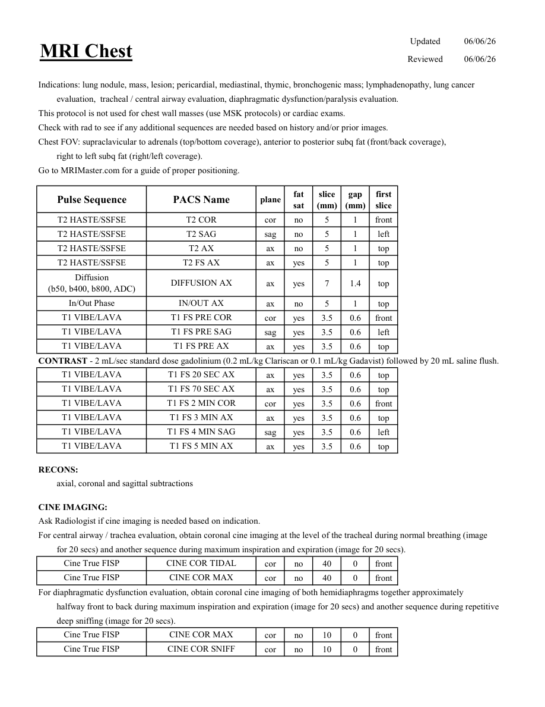
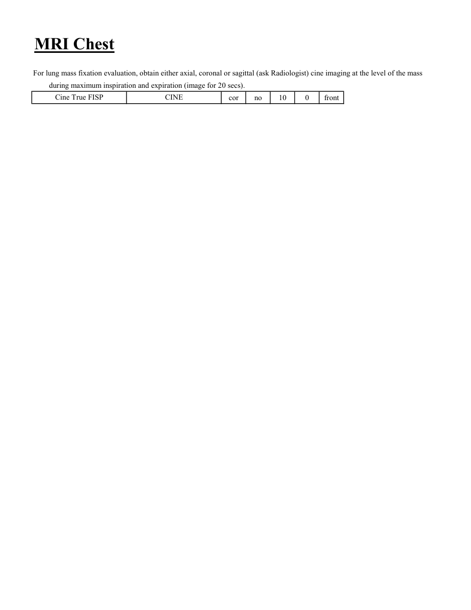

# IRM – Torace (MCB)

[Catalog MCB](../mcb/index.md) · [Descarcă PDF-ul complet](../../assets/mcb-mri/irm-torace-mcb/protocol.pdf) · [Sursa MCB](https://ref.mcbradiology.com/Protocols,%20Policies,%20Worksheets%20&%20Forms/MRI/Protocols/Body/4%20Chest.pdf)

Documentul MCB este disponibil integral mai jos, inclusiv notele, condițiile de utilizare a contrastului și imaginile de planificare. Textul clinic al sursei este în **engleză**; titlul și etichetele parametrilor sunt în română.

## Protocolul original

### Pagina 1

{ loading=lazy }

??? abstract "Textul paginii (engleză)"

    
Updated
    06/06/26
    Reviewed
    06/06/26
    MRI Chest
    Indications: lung nodule, mass, lesion; pericardial, mediastinal, thymic, bronchogenic mass; lymphadenopathy, lung cancer
    evaluation,  tracheal / central airway evaluation, diaphragmatic dysfunction/paralysis evaluation.
    This protocol is not used for chest wall masses (use MSK protocols) or cardiac exams.
    Check with rad to see if any additional sequences are needed based on history and/or prior images.
     
    Chest FOV: supraclavicular to adrenals (top/bottom coverage), anterior to posterior subq fat (front/back coverage), 
    right to left subq fat (right/left coverage).
    Go to MRIMaster.com for a guide of proper positioning.
    slice                    
    gap                    
    Pulse Sequence
    PACS Name
    plane
    fat                   
    sat
    (mm)
    (mm)
    first                               
    slice
    T2 HASTE/SSFSE
    T2 COR
    cor
    no
    5
    1
    front
    T2 HASTE/SSFSE
    T2 SAG
    sag
    no
    5
    1
    left
    T2 HASTE/SSFSE
    T2 AX
    ax
    no
    5
    1
    top
    T2 HASTE/SSFSE
    T2 FS AX
    ax
    yes
    5
    1
    top
    Diffusion                                      
    ax
    yes
    7
    1.4
    top
    (b50, b400, b800, ADC)
    DIFFUSION AX
    In/Out Phase
    IN/OUT AX
    ax
    no
    5
    1
    top
    T1 VIBE/LAVA
    T1 FS PRE COR
    cor
    yes
    3.5
    0.6
    front
    T1 VIBE/LAVA
    T1 FS PRE SAG
    sag
    yes
    3.5
    0.6
    left
    T1 VIBE/LAVA
    T1 FS PRE AX
    ax
    yes
    3.5
    0.6
    top
    CONTRAST - 2 mL/sec standard dose gadolinium (0.2 mL/kg Clariscan or 0.1 mL/kg Gadavist) followed by 20 mL saline flush.
    T1 FS 20 SEC AX
    T1 VIBE/LAVA
    ax
    yes
    3.5
    0.6
    top
    T1 VIBE/LAVA
    T1 FS 70 SEC AX
    ax
    yes
    3.5
    0.6
    top
    T1 VIBE/LAVA
    T1 FS 2 MIN COR
    cor
    yes
    3.5
    0.6
    front
    T1 VIBE/LAVA
    T1 FS 3 MIN AX
    ax
    yes
    3.5
    0.6
    top
    T1 VIBE/LAVA
    T1 FS 4 MIN SAG
    sag
    yes
    3.5
    0.6
    left
    T1 VIBE/LAVA
    T1 FS 5 MIN AX
    ax
    yes
    3.5
    0.6
    top
    RECONS:
    axial, coronal and sagittal subtractions
    CINE IMAGING:
    Ask Radiologist if cine imaging is needed based on indication.
    For central airway / trachea evaluation, obtain coronal cine imaging at the level of the tracheal during normal breathing (image 
    for 20 secs) and another sequence during maximum inspiration and expiration (image for 20 secs). 
    Cine True FISP
    CINE COR TIDAL
    cor
    no
    40
    0
    front
    Cine True FISP
    CINE COR MAX
    cor
    no
    40
    0
    front
    For diaphragmatic dysfunction evaluation, obtain coronal cine imaging of both hemidiaphragms together approximately 
    halfway front to back during maximum inspiration and expiration (image for 20 secs) and another sequence during repetitive 
    deep sniffing (image for 20 secs). 
    Cine True FISP
    CINE COR MAX
    cor
    no
    10
    0
    front
    Cine True FISP
    CINE COR SNIFF
    cor
    no
    10
    0
    front
    

### Pagina 2

{ loading=lazy }

??? abstract "Textul paginii (engleză)"

    
MRI Chest
    For lung mass fixation evaluation, obtain either axial, coronal or sagittal (ask Radiologist) cine imaging at the level of the mass
    during maximum inspiration and expiration (image for 20 secs).
    Cine True FISP
    CINE
    cor
    no
    10
    0
    front
    

## Parametrii secvențelor

Tabele extrase din PDF. Variantele, secvențele condiționate și momentele administrării contrastului se citesc împreună cu notele de pe pagina originală indicată.

### Tabelul 1 — pagina 1

| Secvență | Denumire PACS | Plan | Supresie grăsime | Grosime (mm) | Interval (mm) | Prima secțiune |
|---|---|---|---|---|---|---|
| T2 HASTE/SSFSE | T2 COR | Coronal | Nu | 5 | 1 | Anterior |
| T2 HASTE/SSFSE | T2 SAG | Sagital | Nu | 5 | 1 | Stânga |
| T2 HASTE/SSFSE | T2 AX | Axial | Nu | 5 | 1 | Superior |
| T2 HASTE/SSFSE | T2 FS AX | Axial | Da | 5 | 1 | Superior |
| Diffusion (b50, b400, b800, ADC) | DIFFUSION AX | Axial | Da | 7 | 1.4 | Superior |
| In/Out Phase | IN/OUT AX | Axial | Nu | 5 | 1 | Superior |
| T1 VIBE/LAVA | T1 FS PRE COR | Coronal | Da | 3.5 | 0.6 | Anterior |
| T1 VIBE/LAVA | T1 FS PRE SAG | Sagital | Da | 3.5 | 0.6 | Stânga |
| T1 VIBE/LAVA | T1 FS PRE AX | Axial | Da | 3.5 | 0.6 | Superior |
| T1 VIBE/LAVA | T1 FS 20 SEC AX | Axial | Da | 3.5 | 0.6 | Superior |
| T1 VIBE/LAVA | T1 FS 70 SEC AX | Axial | Da | 3.5 | 0.6 | Superior |
| T1 VIBE/LAVA | T1 FS 2 MIN COR | Coronal | Da | 3.5 | 0.6 | Anterior |
| T1 VIBE/LAVA | T1 FS 3 MIN AX | Axial | Da | 3.5 | 0.6 | Superior |
| T1 VIBE/LAVA | T1 FS 4 MIN SAG | Sagital | Da | 3.5 | 0.6 | Stânga |
| T1 VIBE/LAVA | T1 FS 5 MIN AX | Axial | Da | 3.5 | 0.6 | Superior |
| Cine True FISP | CINE COR TIDAL | Coronal | Nu | 40 | 0 | Anterior |
| Cine True FISP | CINE COR MAX | Coronal | Nu | 40 | 0 | Anterior |
| Cine True FISP | CINE COR MAX | Coronal | Nu | 10 | 0 | Anterior |
| Cine True FISP | CINE COR SNIFF | Coronal | Nu | 10 | 0 | Anterior |

