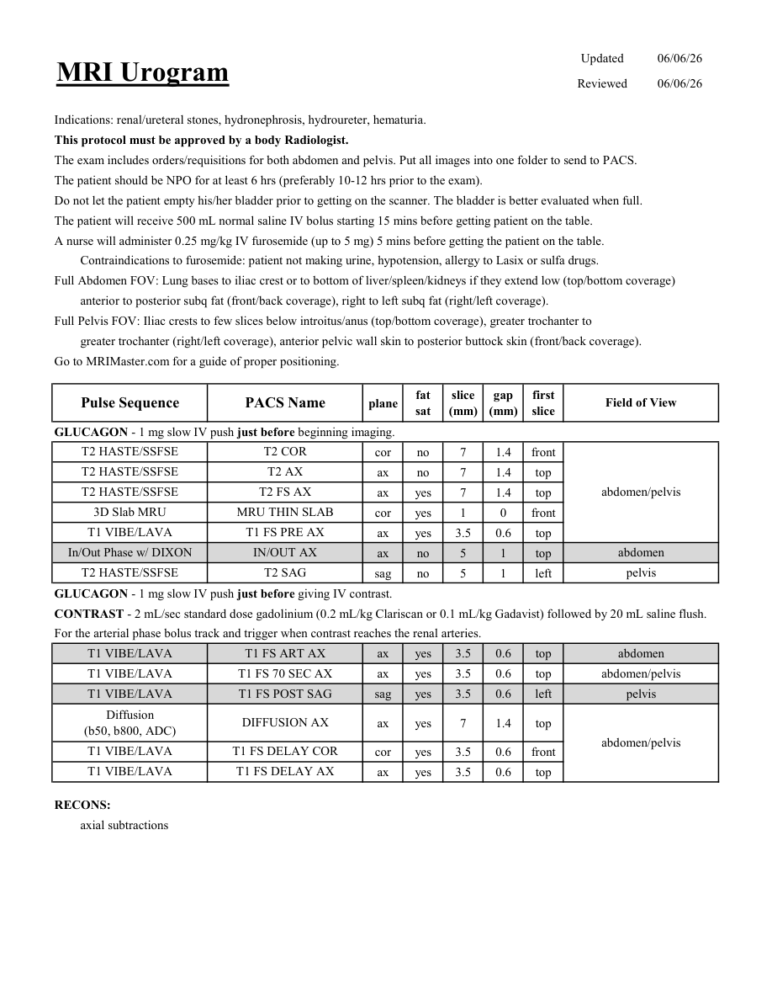

# IRM – Urografie IRM (MCB)

[Catalog MCB](../mcb/index.md) · [Descarcă PDF-ul complet](../../assets/mcb-mri/irm-urografie-irm-mcb/protocol.pdf) · [Sursa MCB](https://ref.mcbradiology.com/Protocols,%20Policies,%20Worksheets%20&%20Forms/MRI/Protocols/Body/9%20Urogram.pdf)

Documentul MCB este disponibil integral mai jos, inclusiv notele, condițiile de utilizare a contrastului și imaginile de planificare. Textul clinic al sursei este în **engleză**; titlul și etichetele parametrilor sunt în română.

## Protocolul original

### Pagina 1

{ loading=lazy }

??? abstract "Textul paginii (engleză)"

    
Updated
    06/06/26
    MRI Urogram
    Reviewed
    06/06/26
    Indications: renal/ureteral stones, hydronephrosis, hydroureter, hematuria.
    This protocol must be approved by a body Radiologist.
    The exam includes orders/requisitions for both abdomen and pelvis. Put all images into one folder to send to PACS.
    The patient should be NPO for at least 6 hrs (preferably 10-12 hrs prior to the exam).
    Do not let the patient empty his/her bladder prior to getting on the scanner. The bladder is better evaluated when full.
    The patient will receive 500 mL normal saline IV bolus starting 15 mins before getting patient on the table.
    A nurse will administer 0.25 mg/kg IV furosemide (up to 5 mg) 5 mins before getting the patient on the table. 
    Contraindications to furosemide: patient not making urine, hypotension, allergy to Lasix or sulfa drugs.
    Full Abdomen FOV: Lung bases to iliac crest or to bottom of liver/spleen/kidneys if they extend low (top/bottom coverage)
    anterior to posterior subq fat (front/back coverage), right to left subq fat (right/left coverage).
    Full Pelvis FOV: Iliac crests to few slices below introitus/anus (top/bottom coverage), greater trochanter to 
    greater trochanter (right/left coverage), anterior pelvic wall skin to posterior buttock skin (front/back coverage).
    Go to MRIMaster.com for a guide of proper positioning.
    slice                    
    gap                    
    Field of View
    Pulse Sequence
    PACS Name
    plane
    fat                   
    sat
    (mm)
    (mm)
    first                               
    slice
    GLUCAGON - 1 mg slow IV push just before beginning imaging.
    T2 HASTE/SSFSE
    T2 COR
    cor
    no
    7
    1.4
    front
    T2 HASTE/SSFSE
    T2 AX
    ax
    no
    7
    1.4
    top
    T2 HASTE/SSFSE
    T2 FS AX
    abdomen/pelvis
    ax
    yes
    7
    1.4
    top
    3D Slab MRU
    MRU THIN SLAB
    cor
    yes
    1
    0
    front
    T1 VIBE/LAVA
    T1 FS PRE AX
    ax
    yes
    3.5
    0.6
    top
    In/Out Phase w/ DIXON
    IN/OUT AX
    abdomen
    ax
    no
    5
    1
    top
    T2 HASTE/SSFSE
    T2 SAG
    pelvis
    sag
    no
    5
    1
    left
    GLUCAGON - 1 mg slow IV push just before giving IV contrast.
    CONTRAST - 2 mL/sec standard dose gadolinium (0.2 mL/kg Clariscan or 0.1 mL/kg Gadavist) followed by 20 mL saline flush. 
    For the arterial phase bolus track and trigger when contrast reaches the renal arteries.
    T1 VIBE/LAVA
    T1 FS ART AX
    abdomen
    ax
    yes
    3.5
    0.6
    top
    T1 VIBE/LAVA
    T1 FS 70 SEC AX
    abdomen/pelvis
    ax
    yes
    3.5
    0.6
    top
    T1 VIBE/LAVA
    T1 FS POST SAG
    pelvis
    sag
    yes
    3.5
    0.6
    left
    Diffusion                                      
    ax
    yes
    7
    1.4
    top
    (b50, b800, ADC)
    DIFFUSION AX
    abdomen/pelvis
    T1 VIBE/LAVA
    T1 FS DELAY COR
    cor
    yes
    3.5
    0.6
    front
    T1 VIBE/LAVA
    T1 FS DELAY AX
    ax
    yes
    3.5
    0.6
    top
    RECONS:
    axial subtractions
    

## Parametrii secvențelor

Tabele extrase din PDF. Variantele, secvențele condiționate și momentele administrării contrastului se citesc împreună cu notele de pe pagina originală indicată.

### Tabelul 1 — pagina 1

| Secvență | Denumire PACS | Plan | Supresie grăsime | Grosime (mm) | Interval (mm) | Prima secțiune | FOV |
|---|---|---|---|---|---|---|---|
| T2 HASTE/SSFSE | T2 COR | Coronal | Nu | 7 | 1.4 | Anterior | abdomen/pelvis |
| T2 HASTE/SSFSE | T2 AX | Axial | Nu | 7 | 1.4 | Superior |  |
| T2 HASTE/SSFSE | T2 FS AX | Axial | Da | 7 | 1.4 | Superior |  |
| 3D Slab MRU | MRU THIN SLAB | Coronal | Da | 1 | 0 | Anterior |  |
| T1 VIBE/LAVA | T1 FS PRE AX | Axial | Da | 3.5 | 0.6 | Superior |  |
| In/Out Phase w/ DIXON | IN/OUT AX | Axial | Nu | 5 | 1 | Superior | abdomen |
| T2 HASTE/SSFSE | T2 SAG | Sagital | Nu | 5 | 1 | Stânga | pelvis |
| T1 VIBE/LAVA | T1 FS ART AX | Axial | Da | 3.5 | 0.6 | Superior | abdomen |
| T1 VIBE/LAVA | T1 FS 70 SEC AX | Axial | Da | 3.5 | 0.6 | Superior | abdomen/pelvis |
| T1 VIBE/LAVA | T1 FS POST SAG | Sagital | Da | 3.5 | 0.6 | Stânga | pelvis |
| Diffusion (b50, b800, ADC) | DIFFUSION AX | Axial | Da | 7 | 1.4 | Superior | abdomen/pelvis |
| T1 VIBE/LAVA | T1 FS DELAY COR | Coronal | Da | 3.5 | 0.6 | Anterior |  |
| T1 VIBE/LAVA | T1 FS DELAY AX | Axial | Da | 3.5 | 0.6 | Superior |  |

