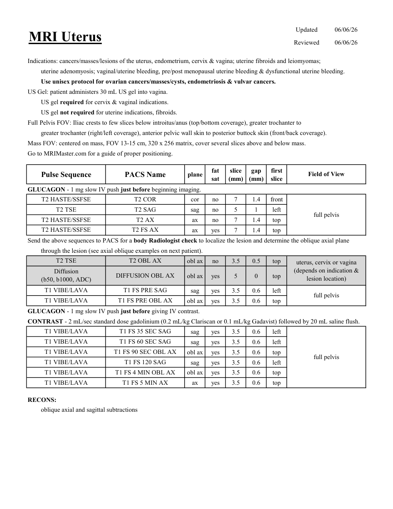
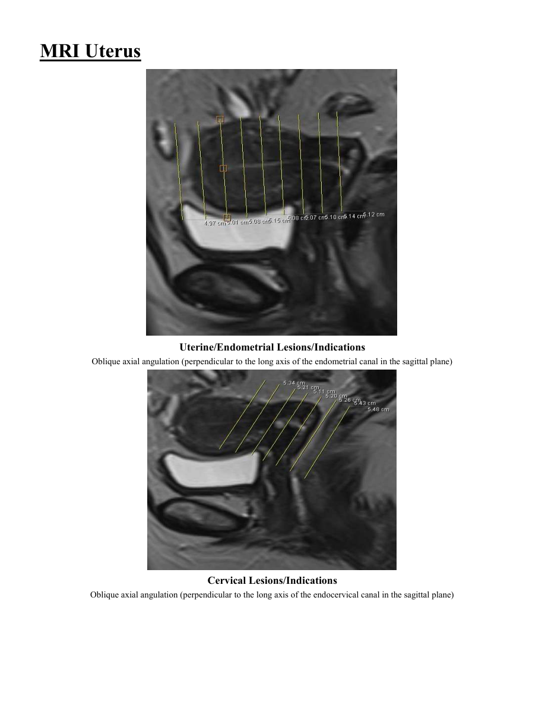
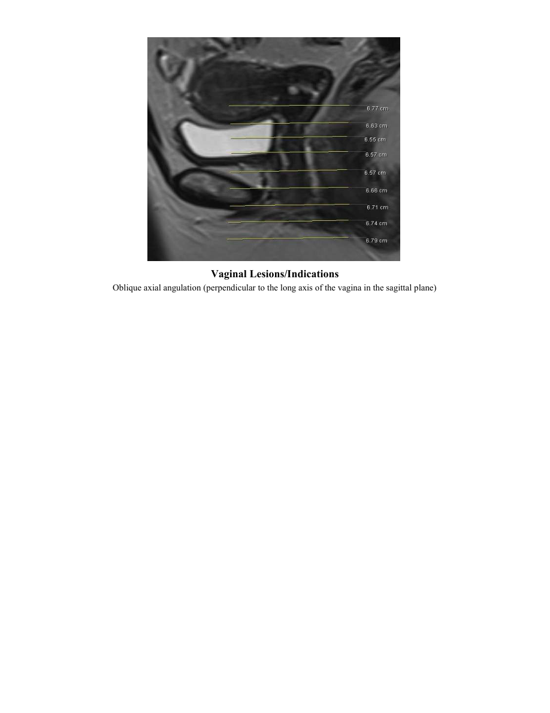

# IRM – Uter (MCB)

[Catalog MCB](../mcb/index.md) · [Descarcă PDF-ul complet](../../assets/mcb-mri/irm-uter-mcb/protocol.pdf) · [Sursa MCB](https://ref.mcbradiology.com/Protocols,%20Policies,%20Worksheets%20&%20Forms/MRI/Protocols/Body/14%20Uterus.pdf)

Documentul MCB este disponibil integral mai jos, inclusiv notele, condițiile de utilizare a contrastului și imaginile de planificare. Textul clinic al sursei este în **engleză**; titlul și etichetele parametrilor sunt în română.

## Protocolul original

### Pagina 1

{ loading=lazy }

??? abstract "Textul paginii (engleză)"

    
Updated
    06/06/26
    MRI Uterus
    Reviewed
    06/06/26
    Indications: cancers/masses/lesions of the uterus, endometrium, cervix &amp; vagina; uterine fibroids and leiomyomas; 
    uterine adenomyosis; vaginal/uterine bleeding, pre/post menopausal uterine bleeding &amp; dysfunctional uterine bleeding.
    Use unisex protocol for ovarian cancers/masses/cysts, endometriosis &amp; vulvar cancers.
    US Gel: patient administers 30 mL US gel into vagina.
    US gel required for cervix &amp; vaginal indications.
    US gel not required for uterine indications, fibroids.
    Full Pelvis FOV: Iliac crests to few slices below introitus/anus (top/bottom coverage), greater trochanter to 
    greater trochanter (right/left coverage), anterior pelvic wall skin to posterior buttock skin (front/back coverage).
    Mass FOV: centered on mass, FOV 13-15 cm, 320 x 256 matrix, cover several slices above and below mass.
    Go to MRIMaster.com for a guide of proper positioning.
    slice                    
    gap                    
    Pulse Sequence
    PACS Name
    Field of View
    plane
    fat                   
    sat
    (mm)
    (mm)
    first                               
    slice
    GLUCAGON - 1 mg slow IV push just before beginning imaging.
    T2 HASTE/SSFSE
    T2 COR
    cor
    no
    7
    1.4
    front
    T2 TSE
    T2 SAG
    sag
    no
    5
    1
    left
    full pelvis
    T2 HASTE/SSFSE
    T2 AX
    ax
    no
    7
    1.4
    top
    T2 HASTE/SSFSE
    T2 FS AX
    ax
    yes
    7
    1.4
    top
    Send the above sequences to PACS for a body Radiologist check to localize the lesion and determine the oblique axial plane
    through the lesion (see axial oblique examples on next patient).
    T2 TSE
    T2 OBL AX
    obl ax
    no
    3.5
    0.5
    top
    uterus, cervix or vagina              
    (depends on indication &amp; 
    Diffusion                                      
    obl ax
    yes
    5
    0
    top
    lesion location)               
    (b50, b1000, ADC)
    DIFFUSION OBL AX
    T1 VIBE/LAVA
    T1 FS PRE SAG
    sag
    yes
    3.5
    0.6
    left
    T1 VIBE/LAVA
    full pelvis
    T1 FS PRE OBL AX
    obl ax
    yes
    3.5
    0.6
    top
    GLUCAGON - 1 mg slow IV push just before giving IV contrast.
    CONTRAST - 2 mL/sec standard dose gadolinium (0.2 mL/kg Clariscan or 0.1 mL/kg Gadavist) followed by 20 mL saline flush. 
    T1 VIBE/LAVA
    T1 FS 35 SEC SAG
    sag
    yes
    3.5
    0.6
    left
    T1 VIBE/LAVA
    T1 FS 60 SEC SAG
    sag
    yes
    3.5
    0.6
    left
    T1 VIBE/LAVA
    T1 FS 90 SEC OBL AX
    obl ax
    yes
    3.5
    0.6
    top
    full pelvis
    T1 VIBE/LAVA
    T1 FS 120 SAG
    sag
    yes
    3.5
    0.6
    left
    T1 VIBE/LAVA
    T1 FS 4 MIN OBL AX
    obl ax
    yes
    3.5
    0.6
    top
    T1 VIBE/LAVA
    T1 FS 5 MIN AX
    ax
    yes
    3.5
    0.6
    top
    RECONS:
    oblique axial and sagittal subtractions
    

### Pagina 2

{ loading=lazy }

??? abstract "Textul paginii (engleză)"

    
MRI Uterus
    Uterine/Endometrial Lesions/Indications
    Oblique axial angulation (perpendicular to the long axis of the endometrial canal in the sagittal plane)
    Cervical Lesions/Indications
    Oblique axial angulation (perpendicular to the long axis of the endocervical canal in the sagittal plane)
    

### Pagina 3

{ loading=lazy }

??? abstract "Textul paginii (engleză)"

    
Vaginal Lesions/Indications
    Oblique axial angulation (perpendicular to the long axis of the vagina in the sagittal plane)
    

## Parametrii secvențelor

Tabele extrase din PDF. Variantele, secvențele condiționate și momentele administrării contrastului se citesc împreună cu notele de pe pagina originală indicată.

### Tabelul 1 — pagina 1

| Secvență | Denumire PACS | Plan | Supresie grăsime | Grosime (mm) | Interval (mm) | Prima secțiune | FOV |
|---|---|---|---|---|---|---|---|
| T2 HASTE/SSFSE | T2 COR | Coronal | Nu | 7 | 1.4 | Anterior | full pelvis |
| T2 TSE | T2 SAG | Sagital | Nu | 5 | 1 | Stânga |  |
| T2 HASTE/SSFSE | T2 AX | Axial | Nu | 7 | 1.4 | Superior |  |
| T2 HASTE/SSFSE | T2 FS AX | Axial | Da | 7 | 1.4 | Superior |  |
| T2 TSE | T2 OBL AX | obl ax | Nu | 3.5 | 0.5 | Superior | uterus, cervix or vagina (depends on indication &amp; lesion location) |
| Diffusion (b50, b1000, ADC) | DIFFUSION OBL AX | obl ax | Da | 5 | 0 | Superior |  |
| T1 VIBE/LAVA | T1 FS PRE SAG | Sagital | Da | 3.5 | 0.6 | Stânga | full pelvis |
| T1 VIBE/LAVA | T1 FS PRE OBL AX | obl ax | Da | 3.5 | 0.6 | Superior |  |
| T1 VIBE/LAVA | T1 FS 35 SEC SAG | Sagital | Da | 3.5 | 0.6 | Stânga | full pelvis |
| T1 VIBE/LAVA | T1 FS 60 SEC SAG | Sagital | Da | 3.5 | 0.6 | Stânga |  |
| T1 VIBE/LAVA | T1 FS 90 SEC OBL AX | obl ax | Da | 3.5 | 0.6 | Superior |  |
| T1 VIBE/LAVA | T1 FS 120 SAG | Sagital | Da | 3.5 | 0.6 | Stânga |  |
| T1 VIBE/LAVA | T1 FS 4 MIN OBL AX | obl ax | Da | 3.5 | 0.6 | Superior |  |
| T1 VIBE/LAVA | T1 FS 5 MIN AX | Axial | Da | 3.5 | 0.6 | Superior |  |

