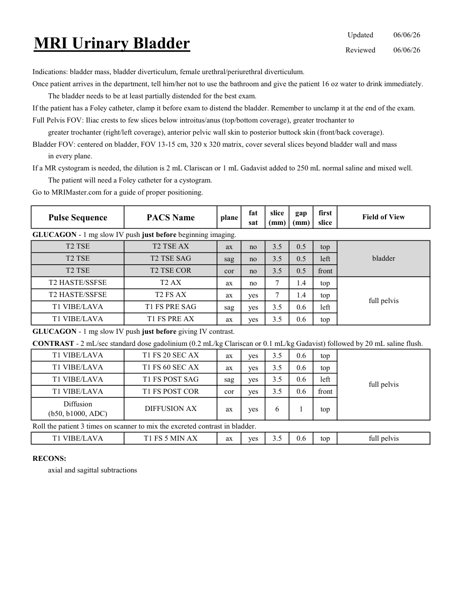

# IRM – Vezică urinară (MCB)

[Catalog MCB](../mcb/index.md) · [Descarcă PDF-ul complet](../../assets/mcb-mri/irm-vezica-urinara-mcb/protocol.pdf) · [Sursa MCB](https://ref.mcbradiology.com/Protocols,%20Policies,%20Worksheets%20&%20Forms/MRI/Protocols/Body/8%20Urinary%20Bladder.pdf)

Documentul MCB este disponibil integral mai jos, inclusiv notele, condițiile de utilizare a contrastului și imaginile de planificare. Textul clinic al sursei este în **engleză**; titlul și etichetele parametrilor sunt în română.

## Protocolul original

### Pagina 1

{ loading=lazy }

??? abstract "Textul paginii (engleză)"

    
Updated
    06/06/26
    MRI Urinary Bladder
    Reviewed
    06/06/26
    Indications: bladder mass, bladder diverticulum, female urethral/periurethral diverticulum.
    Once patient arrives in the department, tell him/her not to use the bathroom and give the patient 16 oz water to drink immediately. 
    The bladder needs to be at least partially distended for the best exam.
    If the patient has a Foley catheter, clamp it before exam to distend the bladder. Remember to unclamp it at the end of the exam.
    Full Pelvis FOV: Iliac crests to few slices below introitus/anus (top/bottom coverage), greater trochanter to 
    greater trochanter (right/left coverage), anterior pelvic wall skin to posterior buttock skin (front/back coverage).
    Bladder FOV: centered on bladder, FOV 13-15 cm, 320 x 320 matrix, cover several slices beyond bladder wall and mass
    in every plane.
    If a MR cystogram is needed, the dilution is 2 mL Clariscan or 1 mL Gadavist added to 250 mL normal saline and mixed well. 
    The patient will need a Foley catheter for a cystogram.
    Go to MRIMaster.com for a guide of proper positioning.
    slice                    
    gap                    
    Pulse Sequence
    PACS Name
    Field of View
    plane
    fat                   
    sat
    (mm)
    (mm)
    first                               
    slice
    GLUCAGON - 1 mg slow IV push just before beginning imaging.
    T2 TSE
    T2 TSE AX
    ax
    no
    3.5
    0.5
    top
    bladder
    T2 TSE
    T2 TSE SAG
    sag
    no
    3.5
    0.5
    left
    T2 TSE
    T2 TSE COR
    cor
    no
    3.5
    0.5
    front
    T2 HASTE/SSFSE
    T2 AX
    ax
    no
    7
    1.4
    top
    T2 HASTE/SSFSE
    T2 FS AX
    ax
    yes
    7
    1.4
    top
    full pelvis
    T1 VIBE/LAVA
    T1 FS PRE SAG
    sag
    yes
    3.5
    0.6
    left
    T1 VIBE/LAVA
    T1 FS PRE AX
    ax
    yes
    3.5
    0.6
    top
    GLUCAGON - 1 mg slow IV push just before giving IV contrast.
    CONTRAST - 2 mL/sec standard dose gadolinium (0.2 mL/kg Clariscan or 0.1 mL/kg Gadavist) followed by 20 mL saline flush. 
    T1 VIBE/LAVA
    T1 FS 20 SEC AX
    ax
    yes
    3.5
    0.6
    top
    T1 VIBE/LAVA
    T1 FS 60 SEC AX
    ax
    yes
    3.5
    0.6
    top
    T1 VIBE/LAVA
    T1 FS POST SAG
    sag
    yes
    3.5
    0.6
    left
    full pelvis
    T1 VIBE/LAVA
    T1 FS POST COR
    cor
    yes
    3.5
    0.6
    front
    Diffusion                                      
    ax
    yes
    6
    1
    top
    (b50, b1000, ADC)
    DIFFUSION AX
    Roll the patient 3 times on scanner to mix the excreted contrast in bladder.
    T1 VIBE/LAVA
    T1 FS 5 MIN AX
    full pelvis
    ax
    yes
    3.5
    0.6
    top
    RECONS:
    axial and sagittal subtractions
    

## Parametrii secvențelor

Tabele extrase din PDF. Variantele, secvențele condiționate și momentele administrării contrastului se citesc împreună cu notele de pe pagina originală indicată.

### Tabelul 1 — pagina 1

| Secvență | Denumire PACS | Plan | Supresie grăsime | Grosime (mm) | Interval (mm) | Prima secțiune | FOV |
|---|---|---|---|---|---|---|---|
| T2 TSE | T2 TSE AX | Axial | Nu | 3.5 | 0.5 | Superior | bladder |
| T2 TSE | T2 TSE SAG | Sagital | Nu | 3.5 | 0.5 | Stânga |  |
| T2 TSE | T2 TSE COR | Coronal | Nu | 3.5 | 0.5 | Anterior |  |
| T2 HASTE/SSFSE | T2 AX | Axial | Nu | 7 | 1.4 | Superior | full pelvis |
| T2 HASTE/SSFSE | T2 FS AX | Axial | Da | 7 | 1.4 | Superior |  |
| T1 VIBE/LAVA | T1 FS PRE SAG | Sagital | Da | 3.5 | 0.6 | Stânga |  |
| T1 VIBE/LAVA | T1 FS PRE AX | Axial | Da | 3.5 | 0.6 | Superior |  |
| T1 VIBE/LAVA | T1 FS 20 SEC AX | Axial | Da | 3.5 | 0.6 | Superior | full pelvis |
| T1 VIBE/LAVA | T1 FS 60 SEC AX | Axial | Da | 3.5 | 0.6 | Superior |  |
| T1 VIBE/LAVA | T1 FS POST SAG | Sagital | Da | 3.5 | 0.6 | Stânga |  |
| T1 VIBE/LAVA | T1 FS POST COR | Coronal | Da | 3.5 | 0.6 | Anterior |  |
| Diffusion (b50, b1000, ADC) | DIFFUSION AX | Axial | Da | 6 | 1 | Superior |  |
| T1 VIBE/LAVA | T1 FS 5 MIN AX | Axial | Da | 3.5 | 0.6 | Superior | full pelvis |

