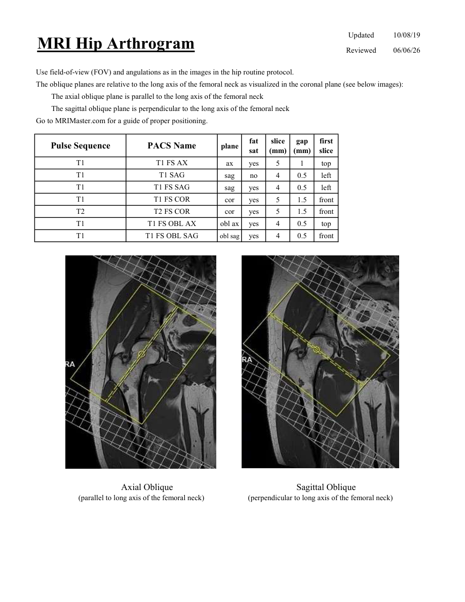

# IRM – Artrografie IRM de șold (MCB)

[Catalog MCB](../mcb/index.md) · [Descarcă PDF-ul complet](../../assets/mcb-mri/irm-artrografie-irm-de-sold-mcb/protocol.pdf) · [Sursa MCB](https://ref.mcbradiology.com/Protocols,%20Policies,%20Worksheets%20&%20Forms/MRI/Protocols/MSK/7%20Hip%20Arthrogram.pdf)

Documentul MCB este disponibil integral mai jos, inclusiv notele, condițiile de utilizare a contrastului și imaginile de planificare. Textul clinic al sursei este în **engleză**; titlul și etichetele parametrilor sunt în română.

## Protocolul original

### Pagina 1

{ loading=lazy }

??? abstract "Textul paginii (engleză)"

    
Updated
    10/08/19
    MRI Hip Arthrogram
    Reviewed
    06/06/26
    Use field-of-view (FOV) and angulations as in the images in the hip routine protocol.
    The oblique planes are relative to the long axis of the femoral neck as visualized in the coronal plane (see below images): 
    The axial oblique plane is parallel to the long axis of the femoral neck
    The sagittal oblique plane is perpendicular to the long axis of the femoral neck
    Go to MRIMaster.com for a guide of proper positioning.
    slice                    
    gap                    
    Pulse Sequence
    PACS Name
    plane
    fat                   
    sat
    (mm)
    (mm)
    first                               
    slice
    T1
    T1 FS AX
    ax
    yes
    5
    1
    top
    T1
    T1 SAG
    sag
    no
    4
    0.5
    left
    T1
    T1 FS SAG
    sag
    yes
    4
    0.5
    left
    T1
    T1 FS COR
    cor
    yes
    5
    1.5
    front
    T2
    T2 FS COR
    cor
    yes
    5
    1.5
    front
    T1
    T1 FS OBL AX
    obl ax
    yes
    4
    0.5
    top
    T1
    T1 FS OBL SAG
    obl sag
    yes
    4
    0.5
    front
         Axial Oblique                                                                                                                   
         Sagittal Oblique                                                 
    (parallel to long axis of the femoral neck)
    (perpendicular to long axis of the femoral neck)
    

## Parametrii secvențelor

Tabele extrase din PDF. Variantele, secvențele condiționate și momentele administrării contrastului se citesc împreună cu notele de pe pagina originală indicată.

### Tabelul 1 — pagina 1

| Secvență | Denumire PACS | Plan | Supresie grăsime | Grosime (mm) | Interval (mm) | Prima secțiune |
|---|---|---|---|---|---|---|
| T1 | T1 FS AX | Axial | Da | 5 | 1 | Superior |
| T1 | T1 SAG | Sagital | Nu | 4 | 0.5 | Stânga |
| T1 | T1 FS SAG | Sagital | Da | 4 | 0.5 | Stânga |
| T1 | T1 FS COR | Coronal | Da | 5 | 1.5 | Anterior |
| T2 | T2 FS COR | Coronal | Da | 5 | 1.5 | Anterior |
| T1 | T1 FS OBL AX | obl ax | Da | 4 | 0.5 | Superior |
| T1 | T1 FS OBL SAG | obl sag | Da | 4 | 0.5 | Anterior |

