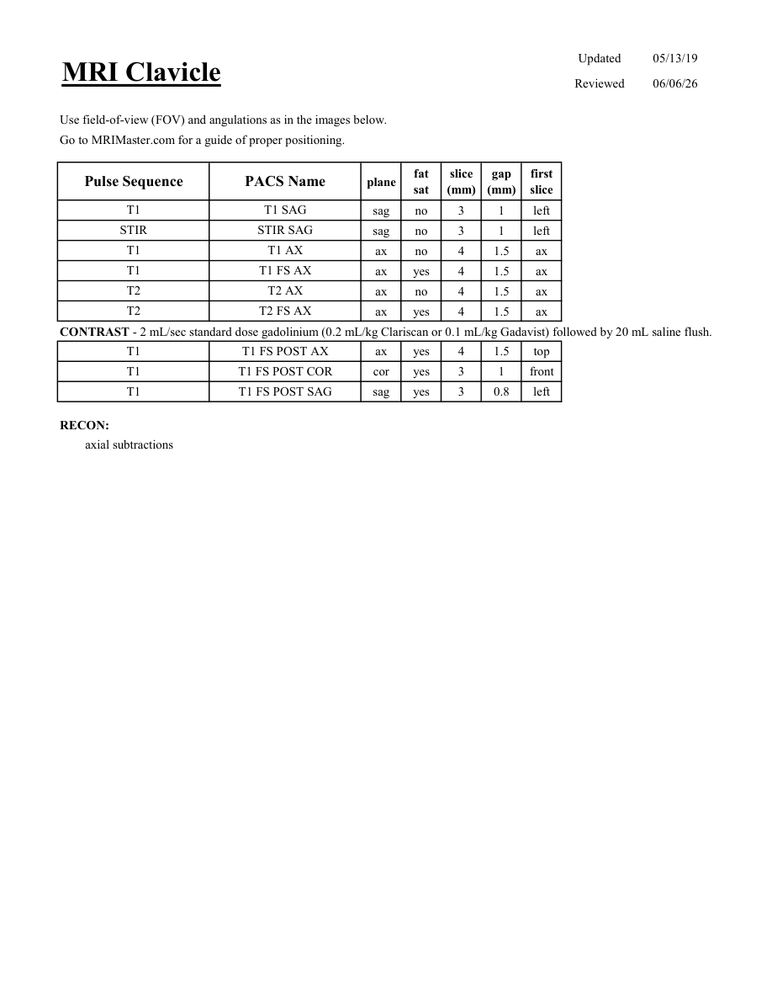
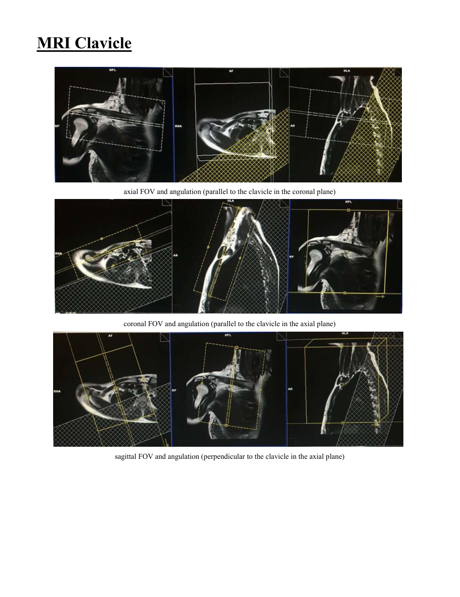

# IRM – Claviculă (MCB)

[Catalog MCB](../mcb/index.md) · [Descarcă PDF-ul complet](../../assets/mcb-mri/irm-clavicula-mcb/protocol.pdf) · [Sursa MCB](https://ref.mcbradiology.com/Protocols,%20Policies,%20Worksheets%20&%20Forms/MRI/Protocols/MSK/17%20Clavicle.pdf)

Documentul MCB este disponibil integral mai jos, inclusiv notele, condițiile de utilizare a contrastului și imaginile de planificare. Textul clinic al sursei este în **engleză**; titlul și etichetele parametrilor sunt în română.

## Protocolul original

### Pagina 1

{ loading=lazy }

??? abstract "Textul paginii (engleză)"

    
Updated
    05/13/19
    MRI Clavicle
    Reviewed
    06/06/26
    Use field-of-view (FOV) and angulations as in the images below.
    Go to MRIMaster.com for a guide of proper positioning.
    slice                    
    gap                    
    Pulse Sequence
    PACS Name
    plane
    fat                   
    sat
    (mm)
    (mm)
    first                               
    slice
    T1
    T1 SAG
    sag
    no
    3
    1
    left
    STIR
    STIR SAG
    sag
    no
    3
    1
    left
    T1
    T1 AX
    ax
    no
    4
    1.5
    ax
    T1
    T1 FS AX
    ax
    yes
    4
    1.5
    ax
    T2
    T2 AX
    ax
    no
    4
    1.5
    ax
    T2
    T2 FS AX
    ax
    yes
    4
    1.5
    ax
    CONTRAST - 2 mL/sec standard dose gadolinium (0.2 mL/kg Clariscan or 0.1 mL/kg Gadavist) followed by 20 mL saline flush.
    T1
    T1 FS POST AX
    ax
    yes
    4
    1.5
    top
    T1
    T1 FS POST COR
    cor
    yes
    3
    1
    front
    T1
    T1 FS POST SAG
    sag
    yes
    3
    0.8
    left
    RECON:
    axial subtractions
    

### Pagina 2

{ loading=lazy }

??? abstract "Textul paginii (engleză)"

    
MRI Clavicle
    axial FOV and angulation (parallel to the clavicle in the coronal plane)
    coronal FOV and angulation (parallel to the clavicle in the axial plane)
    sagittal FOV and angulation (perpendicular to the clavicle in the axial plane)
    

## Parametrii secvențelor

Tabele extrase din PDF. Variantele, secvențele condiționate și momentele administrării contrastului se citesc împreună cu notele de pe pagina originală indicată.

### Tabelul 1 — pagina 1

| Secvență | Denumire PACS | Plan | Supresie grăsime | Grosime (mm) | Interval (mm) | Prima secțiune |
|---|---|---|---|---|---|---|
| T1 | T1 SAG | Sagital | Nu | 3 | 1 | Stânga |
| STIR | STIR SAG | Sagital | Nu | 3 | 1 | Stânga |
| T1 | T1 AX | Axial | Nu | 4 | 1.5 | Axial |
| T1 | T1 FS AX | Axial | Da | 4 | 1.5 | Axial |
| T2 | T2 AX | Axial | Nu | 4 | 1.5 | Axial |
| T2 | T2 FS AX | Axial | Da | 4 | 1.5 | Axial |
| T1 | T1 FS POST AX | Axial | Da | 4 | 1.5 | Superior |
| T1 | T1 FS POST COR | Coronal | Da | 3 | 1 | Anterior |
| T1 | T1 FS POST SAG | Sagital | Da | 3 | 0.8 | Stânga |

