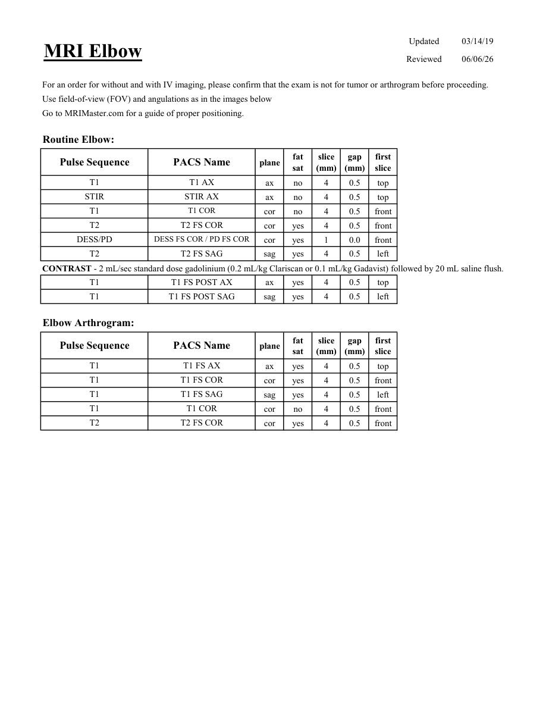
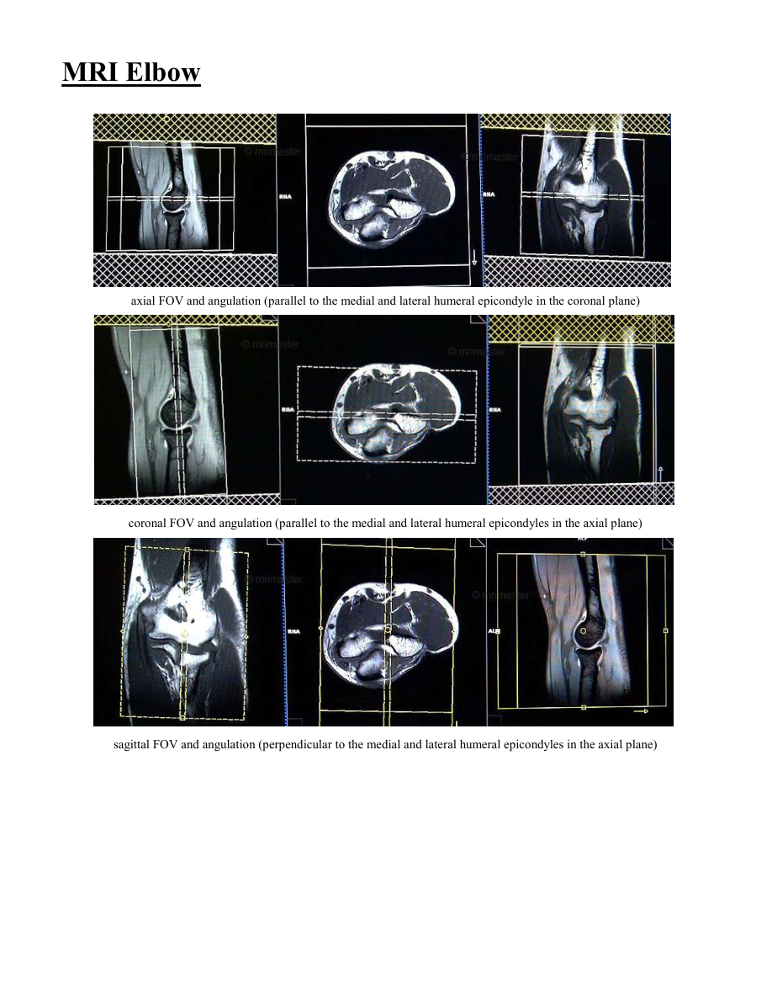

# IRM – Cot (MCB)

[Catalog MCB](../mcb/index.md) · [Descarcă PDF-ul complet](../../assets/mcb-mri/irm-cot-mcb/protocol.pdf) · [Sursa MCB](https://ref.mcbradiology.com/Protocols,%20Policies,%20Worksheets%20&%20Forms/MRI/Protocols/MSK/2%20Elbow.pdf)

Documentul MCB este disponibil integral mai jos, inclusiv notele, condițiile de utilizare a contrastului și imaginile de planificare. Textul clinic al sursei este în **engleză**; titlul și etichetele parametrilor sunt în română.

## Protocolul original

### Pagina 1

{ loading=lazy }

??? abstract "Textul paginii (engleză)"

    
Updated
    03/14/19
    MRI Elbow
    Reviewed
    06/06/26
    For an order for without and with IV imaging, please confirm that the exam is not for tumor or arthrogram before proceeding.
    Use field-of-view (FOV) and angulations as in the images below
    Go to MRIMaster.com for a guide of proper positioning.
    Routine Elbow:
    slice                    
    gap                    
    Pulse Sequence
    PACS Name
    plane
    fat                   
    sat
    (mm)
    (mm)
    first                               
    slice
    T1
    T1 AX
    ax
    no
    4
    0.5
    top
    STIR
    STIR AX
    ax
    no
    4
    0.5
    top
    T1
    T1 COR
    cor
    no
    4
    0.5
    front
    T2
    T2 FS COR
    cor
    yes
    4
    0.5
    front
    DESS/PD
    DESS FS COR / PD FS COR
    cor
    yes
    1
    0.0
    front
    T2
    T2 FS SAG
    sag
    yes
    4
    0.5
    left
    CONTRAST - 2 mL/sec standard dose gadolinium (0.2 mL/kg Clariscan or 0.1 mL/kg Gadavist) followed by 20 mL saline flush.
    T1
    T1 FS POST AX
    ax
    yes
    4
    0.5
    top
    T1
    T1 FS POST SAG
    sag
    yes
    4
    0.5
    left
    Elbow Arthrogram:
    slice                    
    gap                    
    Pulse Sequence
    PACS Name
    plane
    fat                   
    sat
    (mm)
    (mm)
    first                               
    slice
    T1
    T1 FS AX
    ax
    yes
    4
    0.5
    top
    T1
    T1 FS COR
    cor
    yes
    4
    0.5
    front
    T1
    T1 FS SAG
    sag
    yes
    4
    0.5
    left
    T1
    T1 COR
    cor
    no
    4
    0.5
    front
    T2
    T2 FS COR
    cor
    yes
    4
    0.5
    front
    

### Pagina 2

{ loading=lazy }

??? abstract "Textul paginii (engleză)"

    
MRI Elbow
    axial FOV and angulation (parallel to the medial and lateral humeral epicondyle in the coronal plane)
    coronal FOV and angulation (parallel to the medial and lateral humeral epicondyles in the axial plane)
    sagittal FOV and angulation (perpendicular to the medial and lateral humeral epicondyles in the axial plane)
    

## Parametrii secvențelor

Tabele extrase din PDF. Variantele, secvențele condiționate și momentele administrării contrastului se citesc împreună cu notele de pe pagina originală indicată.

### Tabelul 1 — pagina 1

| Secvență | Denumire PACS | Plan | Supresie grăsime | Grosime (mm) | Interval (mm) | Prima secțiune |
|---|---|---|---|---|---|---|
| T1 | T1 AX | Axial | Nu | 4 | 0.5 | Superior |
| STIR | STIR AX | Axial | Nu | 4 | 0.5 | Superior |
| T1 | T1 COR | Coronal | Nu | 4 | 0.5 | Anterior |
| T2 | T2 FS COR | Coronal | Da | 4 | 0.5 | Anterior |
| DESS/PD | DESS FS COR / PD FS COR | Coronal | Da | 1 | 0.0 | Anterior |
| T2 | T2 FS SAG | Sagital | Da | 4 | 0.5 | Stânga |
| T1 | T1 FS POST AX | Axial | Da | 4 | 0.5 | Superior |
| T1 | T1 FS POST SAG | Sagital | Da | 4 | 0.5 | Stânga |
| T1 | T1 FS AX | Axial | Da | 4 | 0.5 | Superior |
| T1 | T1 FS COR | Coronal | Da | 4 | 0.5 | Anterior |
| T1 | T1 FS SAG | Sagital | Da | 4 | 0.5 | Stânga |
| T1 | T1 COR | Coronal | Nu | 4 | 0.5 | Anterior |
| T2 | T2 FS COR | Coronal | Da | 4 | 0.5 | Anterior |

