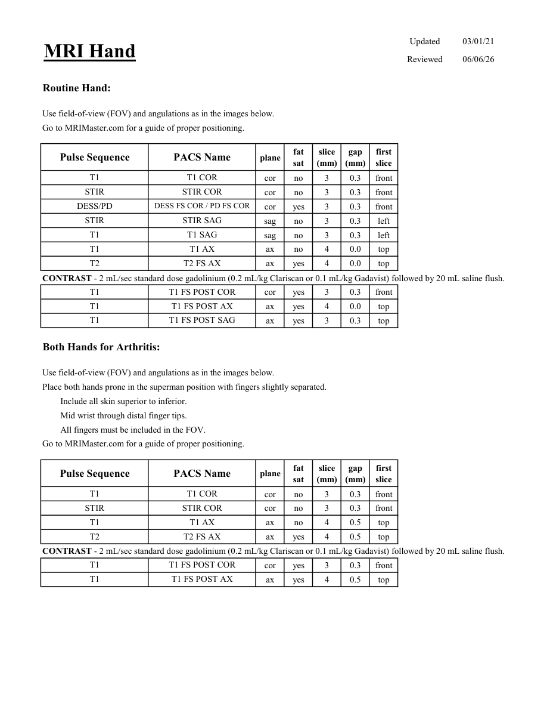
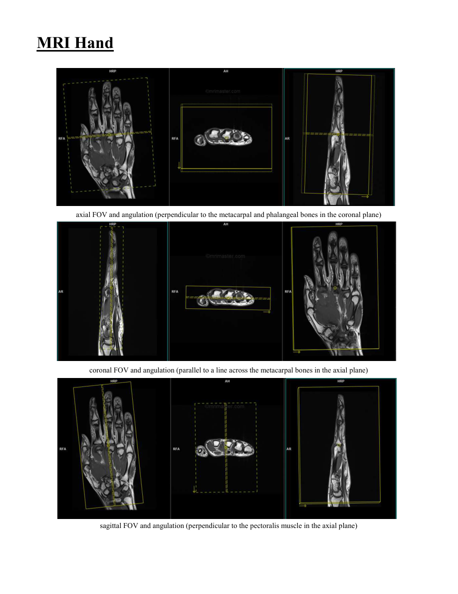

# IRM – Mână (MCB)

[Catalog MCB](../mcb/index.md) · [Descarcă PDF-ul complet](../../assets/mcb-mri/irm-mana-mcb/protocol.pdf) · [Sursa MCB](https://ref.mcbradiology.com/Protocols,%20Policies,%20Worksheets%20&%20Forms/MRI/Protocols/MSK/4%20Hand.pdf)

Documentul MCB este disponibil integral mai jos, inclusiv notele, condițiile de utilizare a contrastului și imaginile de planificare. Textul clinic al sursei este în **engleză**; titlul și etichetele parametrilor sunt în română.

## Protocolul original

### Pagina 1

{ loading=lazy }

??? abstract "Textul paginii (engleză)"

    
Updated
    03/01/21
    MRI Hand
    Reviewed
    06/06/26
    Routine Hand:
    Use field-of-view (FOV) and angulations as in the images below.
    Go to MRIMaster.com for a guide of proper positioning.
    slice                    
    gap                    
    Pulse Sequence
    PACS Name
    plane
    fat                   
    sat
    (mm)
    (mm)
    first                               
    slice
    T1
    T1 COR
    cor
    no
    3
    0.3
    front
    STIR
    STIR COR
    cor
    no
    3
    0.3
    front
    DESS/PD
    DESS FS COR / PD FS COR
    cor
    yes
    3
    0.3
    front
    STIR
    STIR SAG
    sag
    no
    3
    0.3
    left
    T1
    T1 SAG
    sag
    no
    3
    0.3
    left
    T1
    T1 AX
    ax
    no
    4
    0.0
    top
    T2
    T2 FS AX
    ax
    yes
    4
    0.0
    top
    CONTRAST - 2 mL/sec standard dose gadolinium (0.2 mL/kg Clariscan or 0.1 mL/kg Gadavist) followed by 20 mL saline flush.
    T1
    T1 FS POST COR
    cor
    yes
    3
    0.3
    front
    T1
    T1 FS POST AX
    ax
    yes
    4
    0.0
    top
    T1
    T1 FS POST SAG
    ax
    yes
    3
    0.3
    top
    Both Hands for Arthritis:
    Use field-of-view (FOV) and angulations as in the images below.
    Place both hands prone in the superman position with fingers slightly separated.
    Include all skin superior to inferior.
    Mid wrist through distal finger tips.
    All fingers must be included in the FOV.
    Go to MRIMaster.com for a guide of proper positioning.
    slice                    
    gap                    
    Pulse Sequence
    PACS Name
    plane
    fat                   
    sat
    (mm)
    (mm)
    first                               
    slice
    T1
    T1 COR
    cor
    no
    3
    0.3
    front
    STIR
    STIR COR
    cor
    no
    3
    0.3
    front
    T1
    T1 AX
    ax
    no
    4
    0.5
    top
    T2
    T2 FS AX
    ax
    yes
    4
    0.5
    top
    CONTRAST - 2 mL/sec standard dose gadolinium (0.2 mL/kg Clariscan or 0.1 mL/kg Gadavist) followed by 20 mL saline flush.
    T1
    T1 FS POST COR
    cor
    yes
    3
    0.3
    front
    T1
    T1 FS POST AX
    ax
    yes
    4
    0.5
    top
    

### Pagina 2

{ loading=lazy }

??? abstract "Textul paginii (engleză)"

    
MRI Hand
    axial FOV and angulation (perpendicular to the metacarpal and phalangeal bones in the coronal plane)
    coronal FOV and angulation (parallel to a line across the metacarpal bones in the axial plane)
    sagittal FOV and angulation (perpendicular to the pectoralis muscle in the axial plane)
    

## Parametrii secvențelor

Tabele extrase din PDF. Variantele, secvențele condiționate și momentele administrării contrastului se citesc împreună cu notele de pe pagina originală indicată.

### Tabelul 1 — pagina 1

| Secvență | Denumire PACS | Plan | Supresie grăsime | Grosime (mm) | Interval (mm) | Prima secțiune |
|---|---|---|---|---|---|---|
| T1 | T1 COR | Coronal | Nu | 3 | 0.3 | Anterior |
| STIR | STIR COR | Coronal | Nu | 3 | 0.3 | Anterior |
| DESS/PD | DESS FS COR / PD FS COR | Coronal | Da | 3 | 0.3 | Anterior |
| STIR | STIR SAG | Sagital | Nu | 3 | 0.3 | Stânga |
| T1 | T1 SAG | Sagital | Nu | 3 | 0.3 | Stânga |
| T1 | T1 AX | Axial | Nu | 4 | 0.0 | Superior |
| T2 | T2 FS AX | Axial | Da | 4 | 0.0 | Superior |
| T1 | T1 FS POST COR | Coronal | Da | 3 | 0.3 | Anterior |
| T1 | T1 FS POST AX | Axial | Da | 4 | 0.0 | Superior |
| T1 | T1 FS POST SAG | Axial | Da | 3 | 0.3 | Superior |
| T1 | T1 COR | Coronal | Nu | 3 | 0.3 | Anterior |
| STIR | STIR COR | Coronal | Nu | 3 | 0.3 | Anterior |
| T1 | T1 AX | Axial | Nu | 4 | 0.5 | Superior |
| T2 | T2 FS AX | Axial | Da | 4 | 0.5 | Superior |
| T1 | T1 FS POST COR | Coronal | Da | 3 | 0.3 | Anterior |
| T1 | T1 FS POST AX | Axial | Da | 4 | 0.5 | Superior |

