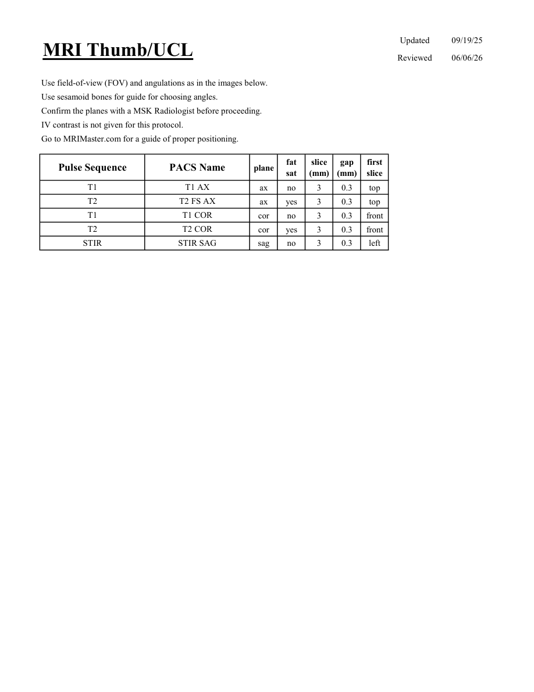
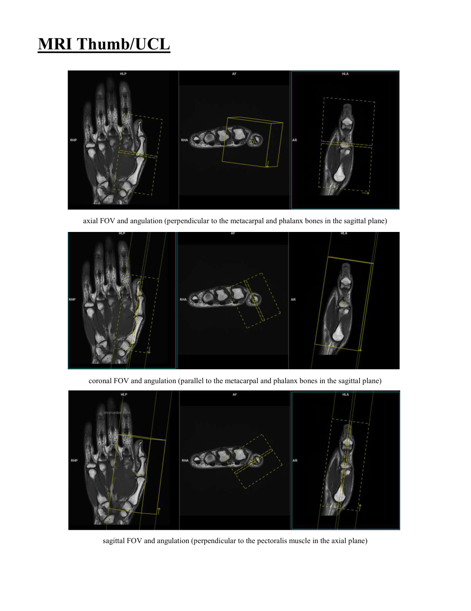

# IRM – Police și ligament colateral ulnar (MCB)

[Catalog MCB](../mcb/index.md) · [Descarcă PDF-ul complet](../../assets/mcb-mri/irm-police-si-ligament-colateral-ulnar-mcb/protocol.pdf) · [Sursa MCB](https://ref.mcbradiology.com/Protocols,%20Policies,%20Worksheets%20&%20Forms/MRI/Protocols/MSK/5%20Thumb.pdf)

Documentul MCB este disponibil integral mai jos, inclusiv notele, condițiile de utilizare a contrastului și imaginile de planificare. Textul clinic al sursei este în **engleză**; titlul și etichetele parametrilor sunt în română.

## Protocolul original

### Pagina 1

{ loading=lazy }

??? abstract "Textul paginii (engleză)"

    
Updated
    09/19/25
    MRI Thumb/UCL
    Reviewed
    06/06/26
    Use field-of-view (FOV) and angulations as in the images below.
    Use sesamoid bones for guide for choosing angles.
    Confirm the planes with a MSK Radiologist before proceeding.
    IV contrast is not given for this protocol.
    Go to MRIMaster.com for a guide of proper positioning.
    slice                    
    gap                    
    Pulse Sequence
    PACS Name
    plane
    fat                   
    sat
    (mm)
    (mm)
    first                               
    slice
    T1
    T1 AX
    ax
    no
    3
    0.3
    top
    T2
    T2 FS AX
    ax
    yes
    3
    0.3
    top
    T1
    T1 COR
    cor
    no
    3
    0.3
    front
    T2
    T2 COR
    cor
    yes
    3
    0.3
    front
    STIR
    STIR SAG
    sag
    no
    3
    0.3
    left
    

### Pagina 2

{ loading=lazy }

??? abstract "Textul paginii (engleză)"

    
MRI Thumb/UCL
    axial FOV and angulation (perpendicular to the metacarpal and phalanx bones in the sagittal plane)
    coronal FOV and angulation (parallel to the metacarpal and phalanx bones in the sagittal plane)
    sagittal FOV and angulation (perpendicular to the pectoralis muscle in the axial plane)
    

## Parametrii secvențelor

Tabele extrase din PDF. Variantele, secvențele condiționate și momentele administrării contrastului se citesc împreună cu notele de pe pagina originală indicată.

### Tabelul 1 — pagina 1

| Secvență | Denumire PACS | Plan | Supresie grăsime | Grosime (mm) | Interval (mm) | Prima secțiune |
|---|---|---|---|---|---|---|
| T1 | T1 AX | Axial | Nu | 3 | 0.3 | Superior |
| T2 | T2 FS AX | Axial | Da | 3 | 0.3 | Superior |
| T1 | T1 COR | Coronal | Nu | 3 | 0.3 | Anterior |
| T2 | T2 COR | Coronal | Da | 3 | 0.3 | Anterior |
| STIR | STIR SAG | Sagital | Nu | 3 | 0.3 | Stânga |

