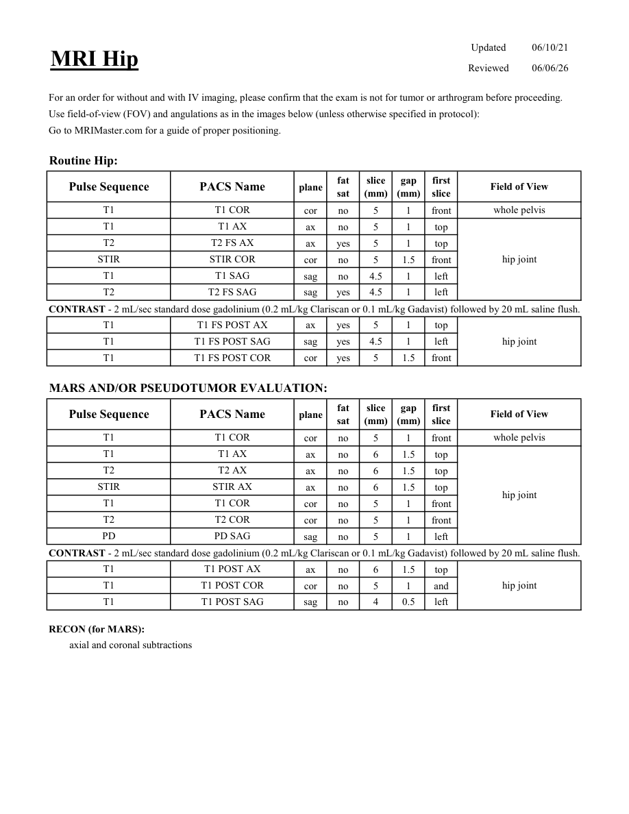
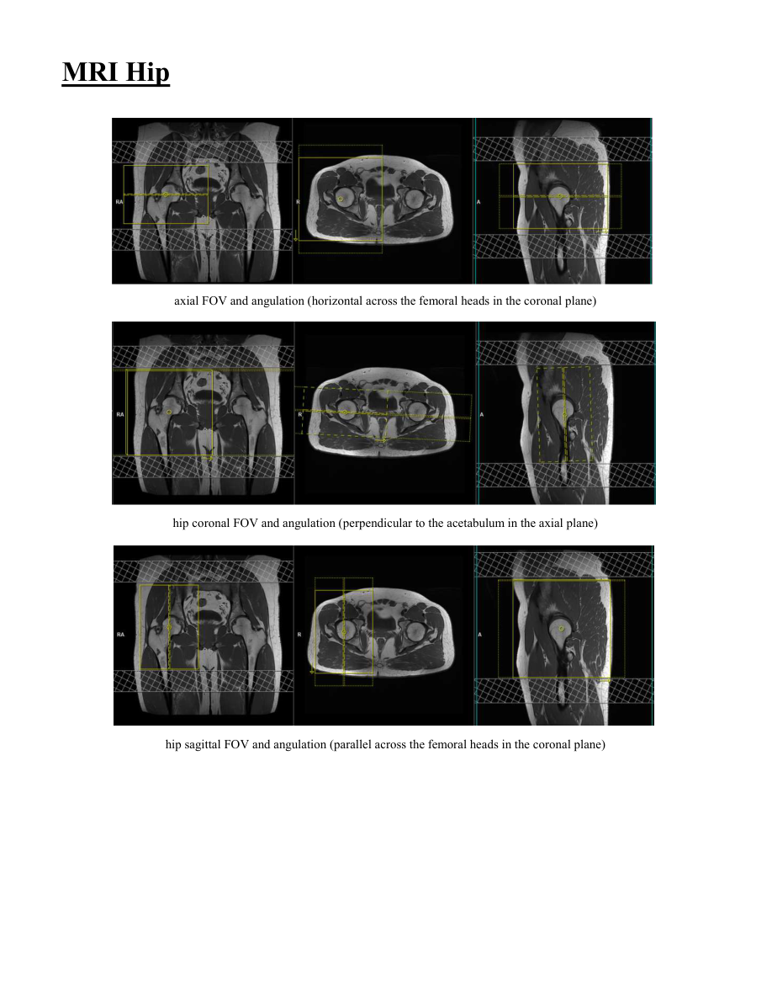

# IRM – Șold (MCB)

[Catalog MCB](../mcb/index.md) · [Descarcă PDF-ul complet](../../assets/mcb-mri/irm-sold-mcb/protocol.pdf) · [Sursa MCB](https://ref.mcbradiology.com/Protocols,%20Policies,%20Worksheets%20&%20Forms/MRI/Protocols/MSK/6%20Hip.pdf)

Documentul MCB este disponibil integral mai jos, inclusiv notele, condițiile de utilizare a contrastului și imaginile de planificare. Textul clinic al sursei este în **engleză**; titlul și etichetele parametrilor sunt în română.

## Protocolul original

### Pagina 1

{ loading=lazy }

??? abstract "Textul paginii (engleză)"

    
Updated
    06/10/21
    MRI Hip
    Reviewed
    06/06/26
    For an order for without and with IV imaging, please confirm that the exam is not for tumor or arthrogram before proceeding.
    Use field-of-view (FOV) and angulations as in the images below (unless otherwise specified in protocol):
    Go to MRIMaster.com for a guide of proper positioning.
    Routine Hip:
    slice                    
    gap                    
    Field of View
    Pulse Sequence
    PACS Name
    plane
    fat                   
    sat
    (mm)
    (mm)
    first                               
    slice
    T1
    T1 COR
    whole pelvis
    cor
    no
    5
    1
    front
    T1
    T1 AX
    ax
    no
    5
    1
    top
    T2
    T2 FS AX
    ax
    yes
    5
    1
    top
    STIR
    STIR COR
    hip joint
    cor
    no 
    5
    1.5
    front
    T1
    T1 SAG
    sag
    no
    4.5
    1
    left
    T2
    T2 FS SAG
    sag
    yes
    4.5
    1
    left
    CONTRAST - 2 mL/sec standard dose gadolinium (0.2 mL/kg Clariscan or 0.1 mL/kg Gadavist) followed by 20 mL saline flush.
    T1
    T1 FS POST AX
    ax
    yes
    5
    1
    top
    T1
    T1 FS POST SAG
    hip joint
    sag
    yes
    4.5
    1
    left
    T1
    T1 FS POST COR
    cor
    yes
    5
    1.5
    front
    MARS AND/OR PSEUDOTUMOR EVALUATION:
    slice                    
    gap                    
    Field of View
    Pulse Sequence
    PACS Name
    plane
    fat                   
    sat
    (mm)
    (mm)
    first                               
    slice
    T1
    T1 COR
    whole pelvis
    cor
    no
    5
    1
    front
    T1
    T1 AX
    ax
    no
    6
    1.5
    top
    T2
    T2 AX
    ax
    no
    6
    1.5
    top
    STIR
    STIR AX
    ax
    no
    6
    1.5
    top
    hip joint
    T1
    T1 COR
    cor
    no
    5
    1
    front
    T2
    T2 COR
    cor
    no
    5
    1
    front
    PD
    PD SAG
    sag
    no
    5
    1
    left
    CONTRAST - 2 mL/sec standard dose gadolinium (0.2 mL/kg Clariscan or 0.1 mL/kg Gadavist) followed by 20 mL saline flush.
    T1
    T1 POST AX
    ax
    no
    6
    1.5
    top
    hip joint
    T1
    T1 POST COR
    cor
    no
    5
    1
    and
    T1
    T1 POST SAG
    sag
    no
    4
    0.5
    left
    RECON (for MARS):
    axial and coronal subtractions
    

### Pagina 2

{ loading=lazy }

??? abstract "Textul paginii (engleză)"

    
MRI Hip
    axial FOV and angulation (horizontal across the femoral heads in the coronal plane)
    hip coronal FOV and angulation (perpendicular to the acetabulum in the axial plane)
    hip sagittal FOV and angulation (parallel across the femoral heads in the coronal plane)
    

## Parametrii secvențelor

Tabele extrase din PDF. Variantele, secvențele condiționate și momentele administrării contrastului se citesc împreună cu notele de pe pagina originală indicată.

### Tabelul 1 — pagina 1

| Secvență | Denumire PACS | Plan | Supresie grăsime | Grosime (mm) | Interval (mm) | Prima secțiune | FOV |
|---|---|---|---|---|---|---|---|
| T1 | T1 COR | Coronal | Nu | 5 | 1 | Anterior | whole pelvis |
| T1 | T1 AX | Axial | Nu | 5 | 1 | Superior | hip joint |
| T2 | T2 FS AX | Axial | Da | 5 | 1 | Superior |  |
| STIR | STIR COR | Coronal | Nu | 5 | 1.5 | Anterior |  |
| T1 | T1 SAG | Sagital | Nu | 4.5 | 1 | Stânga |  |
| T2 | T2 FS SAG | Sagital | Da | 4.5 | 1 | Stânga |  |
| T1 | T1 FS POST AX | Axial | Da | 5 | 1 | Superior | hip joint |
| T1 | T1 FS POST SAG | Sagital | Da | 4.5 | 1 | Stânga |  |
| T1 | T1 FS POST COR | Coronal | Da | 5 | 1.5 | Anterior |  |
| T1 | T1 COR | Coronal | Nu | 5 | 1 | Anterior | whole pelvis |
| T1 | T1 AX | Axial | Nu | 6 | 1.5 | Superior | hip joint |
| T2 | T2 AX | Axial | Nu | 6 | 1.5 | Superior |  |
| STIR | STIR AX | Axial | Nu | 6 | 1.5 | Superior |  |
| T1 | T1 COR | Coronal | Nu | 5 | 1 | Anterior |  |
| T2 | T2 COR | Coronal | Nu | 5 | 1 | Anterior |  |
| PD | PD SAG | Sagital | Nu | 5 | 1 | Stânga |  |
| T1 | T1 POST AX | Axial | Nu | 6 | 1.5 | Superior | hip joint |
| T1 | T1 POST COR | Coronal | Nu | 5 | 1 | and |  |
| T1 | T1 POST SAG | Sagital | Nu | 4 | 0.5 | Stânga |  |

