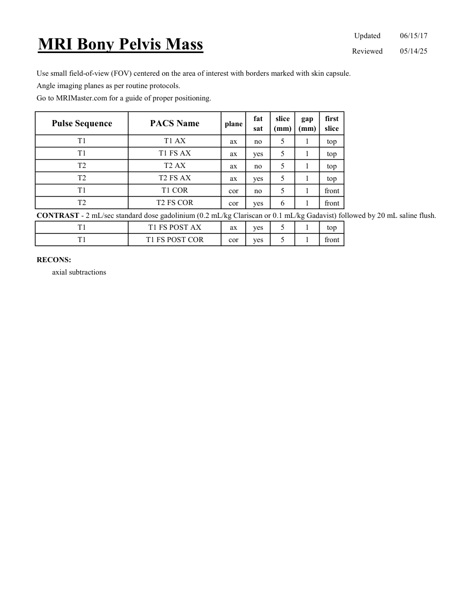

# IRM – Tumori ale bazinului (MCB)

[Catalog MCB](../mcb/index.md) · [Descarcă PDF-ul complet](../../assets/mcb-mri/irm-tumori-ale-bazinului-mcb/protocol.pdf) · [Sursa MCB](https://ref.mcbradiology.com/Protocols,%20Policies,%20Worksheets%20&%20Forms/MRI/Protocols/MSK/14%20Pelvis%20Mass.pdf)

Documentul MCB este disponibil integral mai jos, inclusiv notele, condițiile de utilizare a contrastului și imaginile de planificare. Textul clinic al sursei este în **engleză**; titlul și etichetele parametrilor sunt în română.

## Protocolul original

### Pagina 1

{ loading=lazy }

??? abstract "Textul paginii (engleză)"

    
Updated
    06/15/17
    MRI Bony Pelvis Mass
    Reviewed
    05/14/25
    Use small field-of-view (FOV) centered on the area of interest with borders marked with skin capsule.
    Angle imaging planes as per routine protocols.
    Go to MRIMaster.com for a guide of proper positioning.
    slice                    
    gap                    
    Pulse Sequence
    PACS Name
    plane
    fat                   
    sat
    (mm)
    (mm)
    first                               
    slice
    T1
    T1 AX
    ax
    no
    5
    1
    top
    T1
    T1 FS AX
    ax
    yes
    5
    1
    top
    T2
    T2 AX
    ax
    no
    5
    1
    top
    T2
    T2 FS AX
    ax
    yes
    5
    1
    top
    T1
    T1 COR
    cor
    no
    5
    1
    front
    T2
    T2 FS COR
    cor
    yes
    6
    1
    front
    CONTRAST - 2 mL/sec standard dose gadolinium (0.2 mL/kg Clariscan or 0.1 mL/kg Gadavist) followed by 20 mL saline flush.
    T1
    T1 FS POST AX
    ax
    yes
    5
    1
    top
    T1
    T1 FS POST COR
    cor
    yes
    5
    1
    front
    RECONS:
    axial subtractions
    

## Parametrii secvențelor

Tabele extrase din PDF. Variantele, secvențele condiționate și momentele administrării contrastului se citesc împreună cu notele de pe pagina originală indicată.

### Tabelul 1 — pagina 1

| Secvență | Denumire PACS | Plan | Supresie grăsime | Grosime (mm) | Interval (mm) | Prima secțiune |
|---|---|---|---|---|---|---|
| T1 | T1 AX | Axial | Nu | 5 | 1 | Superior |
| T1 | T1 FS AX | Axial | Da | 5 | 1 | Superior |
| T2 | T2 AX | Axial | Nu | 5 | 1 | Superior |
| T2 | T2 FS AX | Axial | Da | 5 | 1 | Superior |
| T1 | T1 COR | Coronal | Nu | 5 | 1 | Anterior |
| T2 | T2 FS COR | Coronal | Da | 6 | 1 | Anterior |
| T1 | T1 FS POST AX | Axial | Da | 5 | 1 | Superior |
| T1 | T1 FS POST COR | Coronal | Da | 5 | 1 | Anterior |

