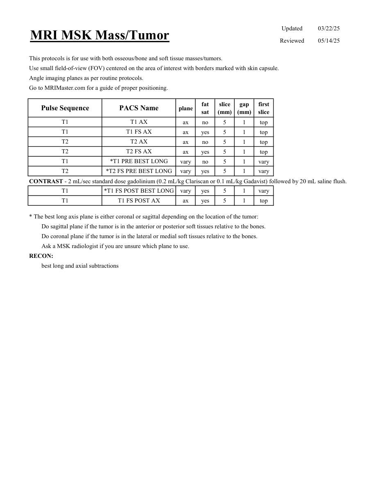

# IRM – Tumori osoase și de părți moi (MCB)

[Catalog MCB](../mcb/index.md) · [Descarcă PDF-ul complet](../../assets/mcb-mri/irm-tumori-osoase-si-de-parti-moi-mcb/protocol.pdf) · [Sursa MCB](https://ref.mcbradiology.com/Protocols,%20Policies,%20Worksheets%20&%20Forms/MRI/Protocols/MSK/22%20Mass.pdf)

Documentul MCB este disponibil integral mai jos, inclusiv notele, condițiile de utilizare a contrastului și imaginile de planificare. Textul clinic al sursei este în **engleză**; titlul și etichetele parametrilor sunt în română.

## Protocolul original

### Pagina 1

{ loading=lazy }

??? abstract "Textul paginii (engleză)"

    
Updated
    03/22/25
    MRI MSK Mass/Tumor
    Reviewed
    05/14/25
    This protocols is for use with both osseous/bone and soft tissue masses/tumors.
    Use small field-of-view (FOV) centered on the area of interest with borders marked with skin capsule.
    Angle imaging planes as per routine protocols.
    Go to MRIMaster.com for a guide of proper positioning.
    slice                    
    gap                    
    Pulse Sequence
    PACS Name
    plane
    fat                   
    sat
    (mm)
    (mm)
    first                               
    slice
    T1
    T1 AX
    ax
    no
    5
    1
    top
    T1
    T1 FS AX
    ax
    yes
    5
    1
    top
    T2
    T2 AX
    ax
    no
    5
    1
    top
    T2
    T2 FS AX
    ax
    yes
    5
    1
    top
    T1
    *T1 PRE BEST LONG
    vary
    no
    5
    1
    vary
    T2
    *T2 FS PRE BEST LONG
    vary
    yes
    5
    1
    vary
    CONTRAST - 2 mL/sec standard dose gadolinium (0.2 mL/kg Clariscan or 0.1 mL/kg Gadavist) followed by 20 mL saline flush.
    T1
    *T1 FS POST BEST LONG
    vary
    yes
    5
    1
    vary
    T1
    T1 FS POST AX
    ax
    yes
    5
    1
    top
    * The best long axis plane is either coronal or sagittal depending on the location of the tumor:
    Do sagittal plane if the tumor is in the anterior or posterior soft tissues relative to the bones.
    Do coronal plane if the tumor is in the lateral or medial soft tissues relative to the bones.
    Ask a MSK radiologist if you are unsure which plane to use.
    RECON:
    best long and axial subtractions
    

## Parametrii secvențelor

Tabele extrase din PDF. Variantele, secvențele condiționate și momentele administrării contrastului se citesc împreună cu notele de pe pagina originală indicată.

### Tabelul 1 — pagina 1

| Secvență | Denumire PACS | Plan | Supresie grăsime | Grosime (mm) | Interval (mm) | Prima secțiune |
|---|---|---|---|---|---|---|
| T1 | T1 AX | Axial | Nu | 5 | 1 | Superior |
| T1 | T1 FS AX | Axial | Da | 5 | 1 | Superior |
| T2 | T2 AX | Axial | Nu | 5 | 1 | Superior |
| T2 | T2 FS AX | Axial | Da | 5 | 1 | Superior |
| T1 | *T1 PRE BEST LONG | vary | Nu | 5 | 1 | vary |
| T2 | *T2 FS PRE BEST LONG | vary | Da | 5 | 1 | vary |
| T1 | *T1 FS POST BEST LONG | vary | Da | 5 | 1 | vary |
| T1 | T1 FS POST AX | Axial | Da | 5 | 1 | Superior |

