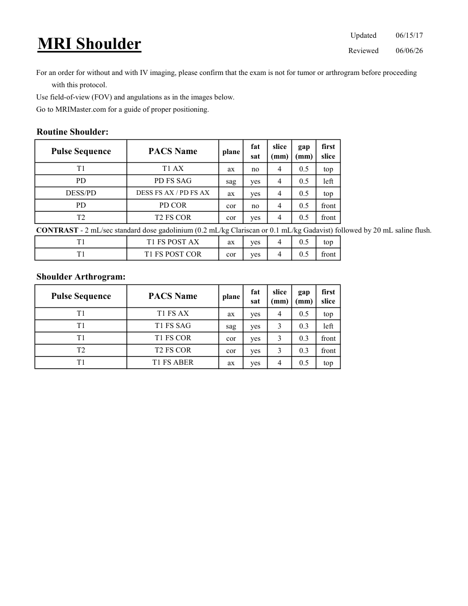
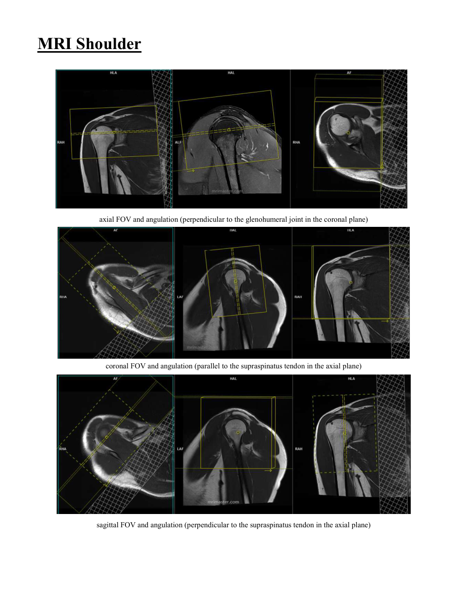

# IRM – Umăr (MCB)

[Catalog MCB](../mcb/index.md) · [Descarcă PDF-ul complet](../../assets/mcb-mri/irm-umar-mcb/protocol.pdf) · [Sursa MCB](https://ref.mcbradiology.com/Protocols,%20Policies,%20Worksheets%20&%20Forms/MRI/Protocols/MSK/1%20Shoulder.pdf)

Documentul MCB este disponibil integral mai jos, inclusiv notele, condițiile de utilizare a contrastului și imaginile de planificare. Textul clinic al sursei este în **engleză**; titlul și etichetele parametrilor sunt în română.

## Protocolul original

### Pagina 1

{ loading=lazy }

??? abstract "Textul paginii (engleză)"

    
Updated
    06/15/17
    MRI Shoulder
    Reviewed
    06/06/26
    For an order for without and with IV imaging, please confirm that the exam is not for tumor or arthrogram before proceeding
    with this protocol.
    Use field-of-view (FOV) and angulations as in the images below.
    Go to MRIMaster.com for a guide of proper positioning.
    Routine Shoulder:
    slice                    
    gap                    
    Pulse Sequence
    PACS Name
    plane
    fat                   
    sat
    (mm)
    (mm)
    first                               
    slice
    T1
    T1 AX
    ax
    no
    4
    0.5
    top
    PD
    PD FS SAG
    sag
    yes
    4
    0.5
    left
    DESS/PD
    DESS FS AX / PD FS AX
    ax
    yes
    4
    0.5
    top
    PD
    PD COR
    cor
    no
    4
    0.5
    front
    T2
    T2 FS COR
    cor
    yes
    4
    0.5
    front
    CONTRAST - 2 mL/sec standard dose gadolinium (0.2 mL/kg Clariscan or 0.1 mL/kg Gadavist) followed by 20 mL saline flush.
    T1
    T1 FS POST AX
    ax
    yes
    4
    0.5
    top
    T1
    T1 FS POST COR
    cor
    yes
    4
    0.5
    front
    Shoulder Arthrogram:
    slice                    
    gap                    
    Pulse Sequence
    PACS Name
    plane
    fat                   
    sat
    (mm)
    (mm)
    first                               
    slice
    T1
    T1 FS AX
    ax
    yes
    4
    0.5
    top
    T1
    T1 FS SAG
    sag
    yes
    3
    0.3
    left
    T1
    T1 FS COR
    cor
    yes
    3
    0.3
    front
    T2
    T2 FS COR
    cor
    yes
    3
    0.3
    front
    T1
    T1 FS ABER
    ax
    yes
    4
    0.5
    top
    

### Pagina 2

{ loading=lazy }

??? abstract "Textul paginii (engleză)"

    
MRI Shoulder
    axial FOV and angulation (perpendicular to the glenohumeral joint in the coronal plane)
    coronal FOV and angulation (parallel to the supraspinatus tendon in the axial plane)
    sagittal FOV and angulation (perpendicular to the supraspinatus tendon in the axial plane)
    

## Parametrii secvențelor

Tabele extrase din PDF. Variantele, secvențele condiționate și momentele administrării contrastului se citesc împreună cu notele de pe pagina originală indicată.

### Tabelul 1 — pagina 1

| Secvență | Denumire PACS | Plan | Supresie grăsime | Grosime (mm) | Interval (mm) | Prima secțiune |
|---|---|---|---|---|---|---|
| T1 | T1 AX | Axial | Nu | 4 | 0.5 | Superior |
| PD | PD FS SAG | Sagital | Da | 4 | 0.5 | Stânga |
| DESS/PD | DESS FS AX / PD FS AX | Axial | Da | 4 | 0.5 | Superior |
| PD | PD COR | Coronal | Nu | 4 | 0.5 | Anterior |
| T2 | T2 FS COR | Coronal | Da | 4 | 0.5 | Anterior |

### Tabelul 2 — pagina 1

| Secvență | Denumire PACS | Plan | Supresie grăsime | Grosime (mm) | Interval (mm) | Prima secțiune |
|---|---|---|---|---|---|---|
| T1 | T1 FS POST AX | Axial | Da | 4 | 0.5 | Superior |
| T1 | T1 FS POST COR | Coronal | Da | 4 | 0.5 | Anterior |

### Tabelul 3 — pagina 1

| Secvență | Denumire PACS | Plan | Supresie grăsime | Grosime (mm) | Interval (mm) | Prima secțiune |
|---|---|---|---|---|---|---|
| T1 | T1 FS AX | Axial | Da | 4 | 0.5 | Superior |
| T1 | T1 FS SAG | Sagital | Da | 3 | 0.3 | Stânga |
| T1 | T1 FS COR | Coronal | Da | 3 | 0.3 | Anterior |
| T2 | T2 FS COR | Coronal | Da | 3 | 0.3 | Anterior |
| T1 | T1 FS ABER | Axial | Da | 4 | 0.5 | Superior |

