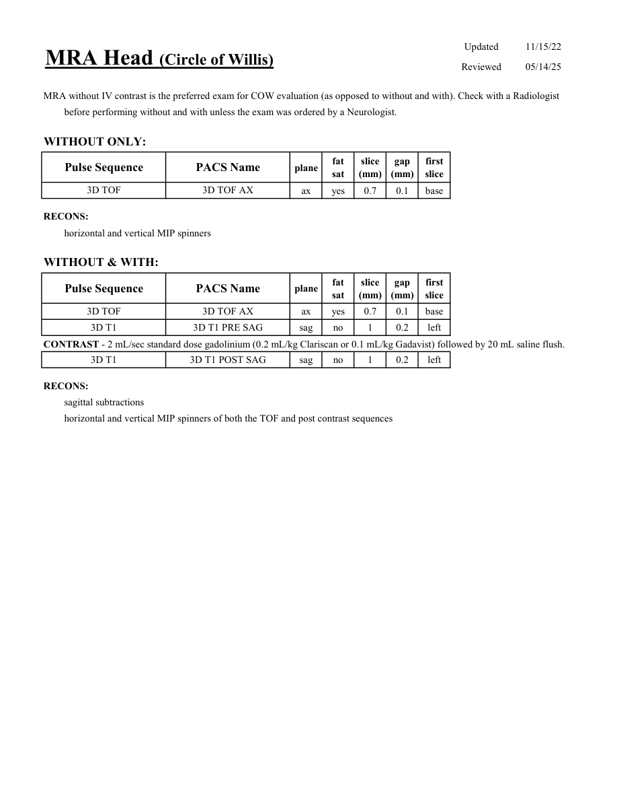

# IRM – Angio-IRM cerebral (poligon Willis) (MCB)

[Catalog MCB](../mcb/index.md) · [Descarcă PDF-ul complet](../../assets/mcb-mri/irm-angio-irm-cerebral-poligon-willis-mcb/protocol.pdf) · [Sursa MCB](https://ref.mcbradiology.com/Protocols,%20Policies,%20Worksheets%20&%20Forms/MRI/Protocols/Neuro/5%20MRA%20Head.pdf)

Documentul MCB este disponibil integral mai jos, inclusiv notele, condițiile de utilizare a contrastului și imaginile de planificare. Textul clinic al sursei este în **engleză**; titlul și etichetele parametrilor sunt în română.

## Protocolul original

### Pagina 1

{ loading=lazy }

??? abstract "Textul paginii (engleză)"

    
Updated
    11/15/22
    MRA Head (Circle of Willis)
    Reviewed
    05/14/25
    MRA without IV contrast is the preferred exam for COW evaluation (as opposed to without and with). Check with a Radiologist
    before performing without and with unless the exam was ordered by a Neurologist.
    WITHOUT ONLY:
    slice                    
    gap                    
    Pulse Sequence
    PACS Name
    plane
    fat                   
    sat
    (mm)
    (mm)
    first                               
    slice
    3D TOF
    3D TOF AX
    ax
    yes
    0.7
    0.1
    base
    RECONS:
    horizontal and vertical MIP spinners
    WITHOUT &amp; WITH:
    slice                    
    gap                    
    Pulse Sequence
    PACS Name
    plane
    fat                   
    sat
    (mm)
    (mm)
    first                               
    slice
    3D TOF
    3D TOF AX
    ax
    yes
    0.7
    0.1
    base
    3D T1
    3D T1 PRE SAG
    sag
    no
    1
    0.2
    left
    CONTRAST - 2 mL/sec standard dose gadolinium (0.2 mL/kg Clariscan or 0.1 mL/kg Gadavist) followed by 20 mL saline flush.
    3D T1
    3D T1 POST SAG
    sag
    no
    1
    0.2
    left
    RECONS:
    sagittal subtractions
    horizontal and vertical MIP spinners of both the TOF and post contrast sequences
    

## Parametrii secvențelor

Tabele extrase din PDF. Variantele, secvențele condiționate și momentele administrării contrastului se citesc împreună cu notele de pe pagina originală indicată.

### Tabelul 1 — pagina 1

| Secvență | Denumire PACS | Plan | Supresie grăsime | Grosime (mm) | Interval (mm) | Prima secțiune |
|---|---|---|---|---|---|---|
| 3D TOF | 3D TOF AX | Axial | Da | 0.7 | 0.1 | Bază |
| 3D TOF | 3D TOF AX | Axial | Da | 0.7 | 0.1 | Bază |
| 3D T1 | 3D T1 PRE SAG | Sagital | Nu | 1 | 0.2 | Stânga |
| 3D T1 | 3D T1 POST SAG | Sagital | Nu | 1 | 0.2 | Stânga |

