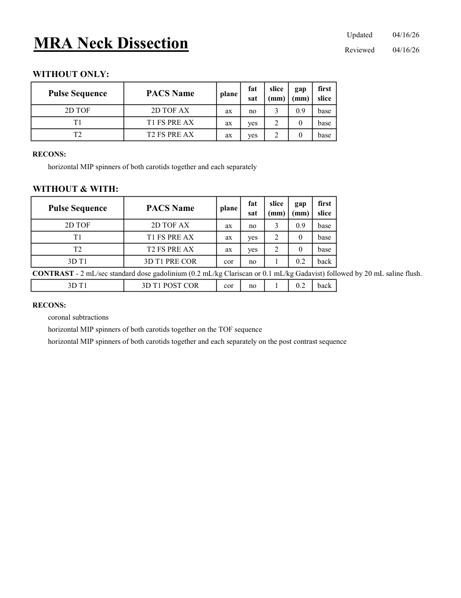

# IRM – Angio-IRM cervical pentru disecție (MCB)

[Catalog MCB](../mcb/index.md) · [Descarcă PDF-ul complet](../../assets/mcb-mri/irm-angio-irm-cervical-pentru-disectie-mcb/protocol.pdf) · [Sursa MCB](https://ref.mcbradiology.com/Protocols,%20Policies,%20Worksheets%20&%20Forms/MRI/Protocols/Neuro/7%20MRA%20Neck%20Dissection.pdf)

Documentul MCB este disponibil integral mai jos, inclusiv notele, condițiile de utilizare a contrastului și imaginile de planificare. Textul clinic al sursei este în **engleză**; titlul și etichetele parametrilor sunt în română.

## Protocolul original

### Pagina 1

{ loading=lazy }

??? abstract "Textul paginii (engleză)"

    
Updated
    04/16/26
    MRA Neck Dissection
    Reviewed
    04/16/26
    WITHOUT ONLY:
    slice                    
    gap                    
    Pulse Sequence
    PACS Name
    plane
    fat                   
    sat
    (mm)
    (mm)
    first                               
    slice
    2D TOF
    2D TOF AX
    ax
    no
    3
    0.9
    base
    T1
    T1 FS PRE AX
    ax
    yes
    2
    0
    base
    T2
    T2 FS PRE AX
    ax
    yes
    2
    0
    base
    RECONS:
    horizontal MIP spinners of both carotids together and each separately
    WITHOUT &amp; WITH:
    slice                    
    gap                    
    Pulse Sequence
    PACS Name
    plane
    fat                   
    sat
    (mm)
    (mm)
    first                               
    slice
    2D TOF
    2D TOF AX
    ax
    no
    3
    0.9
    base
    T1
    T1 FS PRE AX
    ax
    yes
    2
    0
    base
    T2
    T2 FS PRE AX
    ax
    yes
    2
    0
    base
    3D T1
    3D T1 PRE COR
    cor
    no
    1
    0.2
    back
    CONTRAST - 2 mL/sec standard dose gadolinium (0.2 mL/kg Clariscan or 0.1 mL/kg Gadavist) followed by 20 mL saline flush.
    3D T1
    3D T1 POST COR
    cor
    no
    1
    0.2
    back
    RECONS:
    coronal subtractions
    horizontal MIP spinners of both carotids together on the TOF sequence
    horizontal MIP spinners of both carotids together and each separately on the post contrast sequence
    

## Parametrii secvențelor

Tabele extrase din PDF. Variantele, secvențele condiționate și momentele administrării contrastului se citesc împreună cu notele de pe pagina originală indicată.

### Tabelul 1 — pagina 1

| Secvență | Denumire PACS | Plan | Supresie grăsime | Grosime (mm) | Interval (mm) | Prima secțiune |
|---|---|---|---|---|---|---|
| 2D TOF | 2D TOF AX | Axial | Nu | 3 | 0.9 | Bază |
| T1 | T1 FS PRE AX | Axial | Da | 2 | 0 | Bază |
| T2 | T2 FS PRE AX | Axial | Da | 2 | 0 | Bază |
| 2D TOF | 2D TOF AX | Axial | Nu | 3 | 0.9 | Bază |
| T1 | T1 FS PRE AX | Axial | Da | 2 | 0 | Bază |
| T2 | T2 FS PRE AX | Axial | Da | 2 | 0 | Bază |
| 3D T1 | 3D T1 PRE COR | Coronal | Nu | 1 | 0.2 | Posterior |
| 3D T1 | 3D T1 POST COR | Coronal | Nu | 1 | 0.2 | Posterior |

