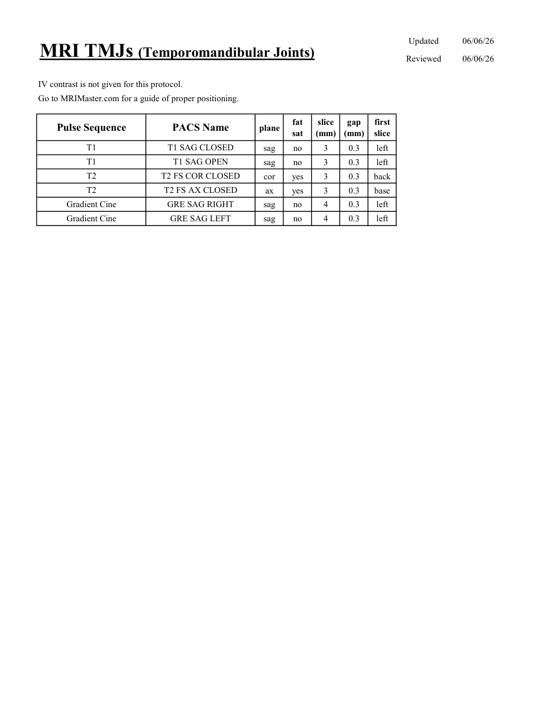

# IRM – Articulații temporomandibulare (ATM) (MCB)

[Catalog MCB](../mcb/index.md) · [Descarcă PDF-ul complet](../../assets/mcb-mri/irm-articulatii-temporomandibulare-atm-mcb/protocol.pdf) · [Sursa MCB](https://ref.mcbradiology.com/Protocols,%20Policies,%20Worksheets%20&%20Forms/MRI/Protocols/Neuro/21%20TMJs.pdf)

Documentul MCB este disponibil integral mai jos, inclusiv notele, condițiile de utilizare a contrastului și imaginile de planificare. Textul clinic al sursei este în **engleză**; titlul și etichetele parametrilor sunt în română.

## Protocolul original

### Pagina 1

{ loading=lazy }

??? abstract "Textul paginii (engleză)"

    
Updated
    06/06/26
    MRI TMJs (Temporomandibular Joints)
    Reviewed
    06/06/26
    IV contrast is not given for this protocol.
    Go to MRIMaster.com for a guide of proper positioning.
    slice                    
    gap                    
    Pulse Sequence
    PACS Name
    plane
    fat                   
    sat
    (mm)
    (mm)
    first                               
    slice
    T1
    T1 SAG CLOSED
    sag
    no
    3
    0.3
    left
    T1
    T1 SAG OPEN
    sag
    no
    3
    0.3
    left
    T2
    T2 FS COR CLOSED
    cor
    yes
    3
    0.3
    back
    T2
    T2 FS AX CLOSED
    ax
    yes
    3
    0.3
    base
    Gradient Cine
    GRE SAG RIGHT
    sag
    no
    4
    0.3
    left
    Gradient Cine
    GRE SAG LEFT
    sag
    no
    4
    0.3
    left
    

## Parametrii secvențelor

Tabele extrase din PDF. Variantele, secvențele condiționate și momentele administrării contrastului se citesc împreună cu notele de pe pagina originală indicată.

### Tabelul 1 — pagina 1

| Secvență | Denumire PACS | Plan | Supresie grăsime | Grosime (mm) | Interval (mm) | Prima secțiune |
|---|---|---|---|---|---|---|
| T1 | T1 SAG CLOSED | Sagital | Nu | 3 | 0.3 | Stânga |
| T1 | T1 SAG OPEN | Sagital | Nu | 3 | 0.3 | Stânga |
| T2 | T2 FS COR CLOSED | Coronal | Da | 3 | 0.3 | Posterior |
| T2 | T2 FS AX CLOSED | Axial | Da | 3 | 0.3 | Bază |
| Gradient Cine | GRE SAG RIGHT | Sagital | Nu | 4 | 0.3 | Stânga |
| Gradient Cine | GRE SAG LEFT | Sagital | Nu | 4 | 0.3 | Stânga |

