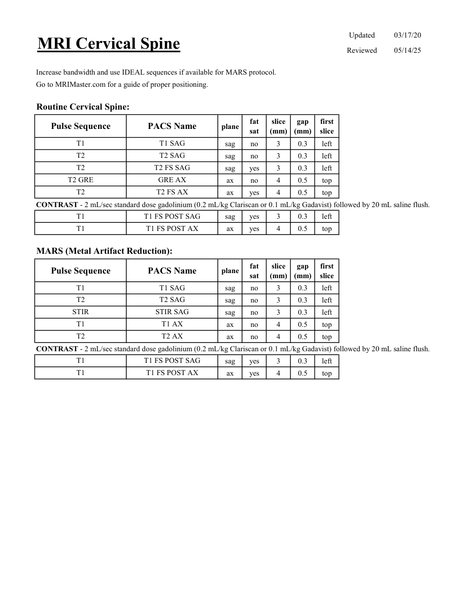

# IRM – Coloană cervicală (MCB)

[Catalog MCB](../mcb/index.md) · [Descarcă PDF-ul complet](../../assets/mcb-mri/irm-coloana-cervicala-mcb/protocol.pdf) · [Sursa MCB](https://ref.mcbradiology.com/Protocols,%20Policies,%20Worksheets%20&%20Forms/MRI/Protocols/Neuro/17%20Cervical%20Spine.pdf)

Documentul MCB este disponibil integral mai jos, inclusiv notele, condițiile de utilizare a contrastului și imaginile de planificare. Textul clinic al sursei este în **engleză**; titlul și etichetele parametrilor sunt în română.

## Protocolul original

### Pagina 1

{ loading=lazy }

??? abstract "Textul paginii (engleză)"

    
Updated
    03/17/20
    MRI Cervical Spine
    Reviewed
    05/14/25
    Increase bandwidth and use IDEAL sequences if available for MARS protocol.
    Go to MRIMaster.com for a guide of proper positioning.
    Routine Cervical Spine:
    slice                    
    gap                    
    Pulse Sequence
    PACS Name
    plane
    fat                   
    sat
    (mm)
    (mm)
    first                               
    slice
    T1
    T1 SAG
    sag
    no
    3
    0.3
    left
    T2
    T2 SAG
    sag
    no
    3
    0.3
    left
    T2
    T2 FS SAG
    sag
    yes
    3
    0.3
    left
    T2 GRE
    GRE AX
    ax
    no
    4
    0.5
    top
    T2
    T2 FS AX
    ax
    yes
    4
    0.5
    top
    CONTRAST - 2 mL/sec standard dose gadolinium (0.2 mL/kg Clariscan or 0.1 mL/kg Gadavist) followed by 20 mL saline flush.
    T1
    T1 FS POST SAG
    sag
    yes
    3
    0.3
    left
    T1
    T1 FS POST AX
    ax
    yes
    4
    0.5
    top
    MARS (Metal Artifact Reduction):
    slice                    
    gap                    
    Pulse Sequence
    PACS Name
    plane
    fat                   
    sat
    (mm)
    (mm)
    first                               
    slice
    T1
    T1 SAG
    sag
    no
    3
    0.3
    left
    T2
    T2 SAG
    sag
    no
    3
    0.3
    left
    STIR
    STIR SAG
    sag
    no
    3
    0.3
    left
    T1
    T1 AX
    ax
    no
    4
    0.5
    top
    T2
    T2 AX
    ax
    no
    4
    0.5
    top
    CONTRAST - 2 mL/sec standard dose gadolinium (0.2 mL/kg Clariscan or 0.1 mL/kg Gadavist) followed by 20 mL saline flush.
    T1
    T1 FS POST SAG
    sag
    yes
    3
    0.3
    left
    T1
    T1 FS POST AX
    ax
    yes
    4
    0.5
    top
    

## Parametrii secvențelor

Tabele extrase din PDF. Variantele, secvențele condiționate și momentele administrării contrastului se citesc împreună cu notele de pe pagina originală indicată.

### Tabelul 1 — pagina 1

| Secvență | Denumire PACS | Plan | Supresie grăsime | Grosime (mm) | Interval (mm) | Prima secțiune |
|---|---|---|---|---|---|---|
| T1 | T1 SAG | Sagital | Nu | 3 | 0.3 | Stânga |
| T2 | T2 SAG | Sagital | Nu | 3 | 0.3 | Stânga |
| T2 | T2 FS SAG | Sagital | Da | 3 | 0.3 | Stânga |
| T2 GRE | GRE AX | Axial | Nu | 4 | 0.5 | Superior |
| T2 | T2 FS AX | Axial | Da | 4 | 0.5 | Superior |
| T1 | T1 FS POST SAG | Sagital | Da | 3 | 0.3 | Stânga |
| T1 | T1 FS POST AX | Axial | Da | 4 | 0.5 | Superior |
| T1 | T1 SAG | Sagital | Nu | 3 | 0.3 | Stânga |
| T2 | T2 SAG | Sagital | Nu | 3 | 0.3 | Stânga |
| STIR | STIR SAG | Sagital | Nu | 3 | 0.3 | Stânga |
| T1 | T1 AX | Axial | Nu | 4 | 0.5 | Superior |
| T2 | T2 AX | Axial | Nu | 4 | 0.5 | Superior |
| T1 | T1 FS POST SAG | Sagital | Da | 3 | 0.3 | Stânga |
| T1 | T1 FS POST AX | Axial | Da | 4 | 0.5 | Superior |

