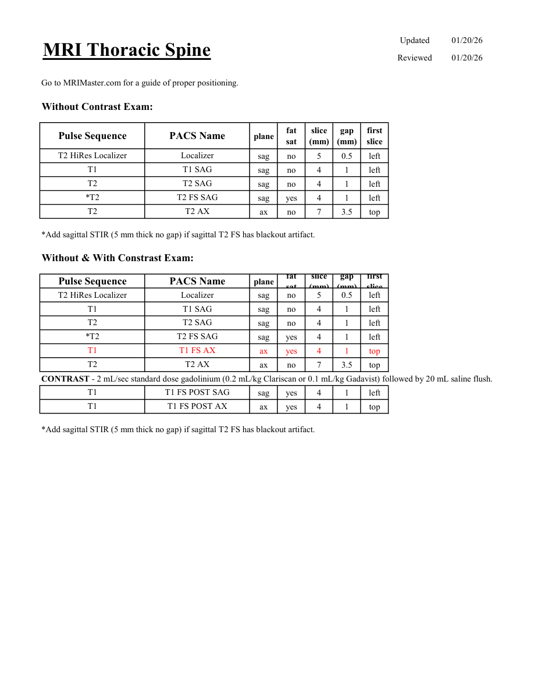

# IRM – Coloană toracică (MCB)

[Catalog MCB](../mcb/index.md) · [Descarcă PDF-ul complet](../../assets/mcb-mri/irm-coloana-toracica-mcb/protocol.pdf) · [Sursa MCB](https://ref.mcbradiology.com/Protocols,%20Policies,%20Worksheets%20&%20Forms/MRI/Protocols/Neuro/18%20Thoracic%20Spine.pdf)

Documentul MCB este disponibil integral mai jos, inclusiv notele, condițiile de utilizare a contrastului și imaginile de planificare. Textul clinic al sursei este în **engleză**; titlul și etichetele parametrilor sunt în română.

## Protocolul original

### Pagina 1

{ loading=lazy }

??? abstract "Textul paginii (engleză)"

    
Updated
    01/20/26
    MRI Thoracic Spine
    Reviewed
    01/20/26
    Go to MRIMaster.com for a guide of proper positioning.
    Without Contrast Exam:
    slice                    
    gap                    
    Pulse Sequence
    PACS Name
    plane
    fat                   
    sat
    (mm)
    (mm)
    first                               
    slice
    T2 HiRes Localizer
    Localizer
    sag
    no
    5
    0.5
    left
    T1
    T1 SAG
    sag
    no
    4
    1
    left
    T2
    T2 SAG
    sag
    no
    4
    1
    left
    *T2
    T2 FS SAG
    sag
    yes
    4
    1
    left
    T2
    T2 AX
    ax
    no
    7
    3.5
    top
    *Add sagittal STIR (5 mm thick no gap) if sagittal T2 FS has blackout artifact.
    Without &amp; With Constrast Exam:
    slice                    
    gap                    
    Pulse Sequence
    PACS Name
    plane
    fat                   
    sat
    (mm)
    (mm)
    first                               
    slice
    T2 HiRes Localizer
    Localizer
    sag
    no
    5
    0.5
    left
    T1
    T1 SAG
    sag
    no
    4
    1
    left
    T2
    T2 SAG
    sag
    no
    4
    1
    left
    *T2
    T2 FS SAG
    sag
    yes
    4
    1
    left
    T1
    T1 FS AX
    ax
    yes
    4
    1
    top
    T2
    T2 AX
    ax
    no
    7
    3.5
    top
    CONTRAST - 2 mL/sec standard dose gadolinium (0.2 mL/kg Clariscan or 0.1 mL/kg Gadavist) followed by 20 mL saline flush.
    T1
    T1 FS POST SAG
    sag
    yes
    4
    1
    left
    T1
    T1 FS POST AX
    ax
    yes
    4
    1
    top
    *Add sagittal STIR (5 mm thick no gap) if sagittal T2 FS has blackout artifact.
    

## Parametrii secvențelor

Tabele extrase din PDF. Variantele, secvențele condiționate și momentele administrării contrastului se citesc împreună cu notele de pe pagina originală indicată.

### Tabelul 1 — pagina 1

| Secvență | Denumire PACS | Plan | Supresie grăsime | Grosime (mm) | Interval (mm) | Prima secțiune |
|---|---|---|---|---|---|---|
| T2 HiRes Localizer | Localizer | Sagital | Nu | 5 | 0.5 | Stânga |
| T1 | T1 SAG | Sagital | Nu | 4 | 1 | Stânga |
| T2 | T2 SAG | Sagital | Nu | 4 | 1 | Stânga |
| *T2 | T2 FS SAG | Sagital | Da | 4 | 1 | Stânga |
| T2 | T2 AX | Axial | Nu | 7 | 3.5 | Superior |
| T2 HiRes Localizer | Localizer | Sagital | Nu | 5 | 0.5 | Stânga |
| T1 | T1 SAG | Sagital | Nu | 4 | 1 | Stânga |
| T2 | T2 SAG | Sagital | Nu | 4 | 1 | Stânga |
| *T2 | T2 FS SAG | Sagital | Da | 4 | 1 | Stânga |
| T1 | T1 FS AX | Axial | Da | 4 | 1 | Superior |
| T2 | T2 AX | Axial | Nu | 7 | 3.5 | Superior |
| T1 | T1 FS POST SAG | Sagital | Da | 4 | 1 | Stânga |
| T1 | T1 FS POST AX | Axial | Da | 4 | 1 | Superior |

