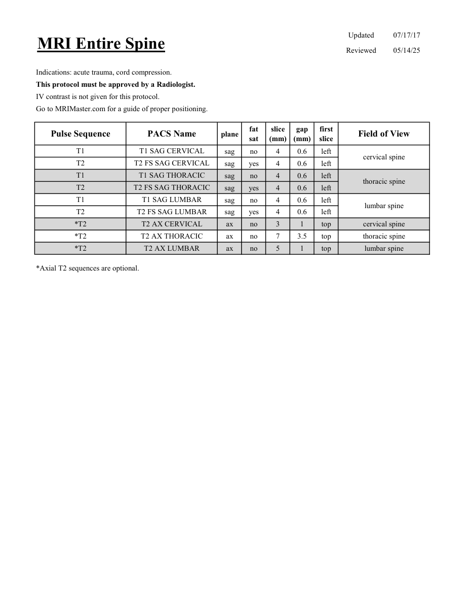

# IRM – Coloană vertebrală completă (MCB)

[Catalog MCB](../mcb/index.md) · [Descarcă PDF-ul complet](../../assets/mcb-mri/irm-coloana-vertebrala-completa-mcb/protocol.pdf) · [Sursa MCB](https://ref.mcbradiology.com/Protocols,%20Policies,%20Worksheets%20&%20Forms/MRI/Protocols/Neuro/20%20Entire%20Spine.pdf)

Documentul MCB este disponibil integral mai jos, inclusiv notele, condițiile de utilizare a contrastului și imaginile de planificare. Textul clinic al sursei este în **engleză**; titlul și etichetele parametrilor sunt în română.

## Protocolul original

### Pagina 1

{ loading=lazy }

??? abstract "Textul paginii (engleză)"

    
Updated
    07/17/17
    MRI Entire Spine
    Reviewed
    05/14/25
    Indications: acute trauma, cord compression.
    This protocol must be approved by a Radiologist.
    IV contrast is not given for this protocol.
    Go to MRIMaster.com for a guide of proper positioning.
    slice                    
    gap                    
    Pulse Sequence
    PACS Name
    Field of View
    plane
    fat                   
    sat
    (mm)
    (mm)
    first                               
    slice
    T1
    T1 SAG CERVICAL
    sag
    no
    4
    0.6
    left
    cervical spine
    T2
    T2 FS SAG CERVICAL
    sag
    yes
    4
    0.6
    left
    T1
    T1 SAG THORACIC
    sag
    no
    4
    0.6
    left
    thoracic spine
    T2
    T2 FS SAG THORACIC
    sag
    yes
    4
    0.6
    left
    T1
    T1 SAG LUMBAR
    sag
    no
    4
    0.6
    left
    lumbar spine
    T2
    T2 FS SAG LUMBAR
    sag
    yes
    4
    0.6
    left
    *T2
    T2 AX CERVICAL
    cervical spine
    ax
    no
    3
    1
    top
    *T2
    T2 AX THORACIC
    thoracic spine
    ax
    no
    7
    3.5
    top
    lumbar spine
    *T2
    T2 AX LUMBAR
    ax
    no
    5
    1
    top
    *Axial T2 sequences are optional.
    

## Parametrii secvențelor

Tabele extrase din PDF. Variantele, secvențele condiționate și momentele administrării contrastului se citesc împreună cu notele de pe pagina originală indicată.

### Tabelul 1 — pagina 1

| Secvență | Denumire PACS | Plan | Supresie grăsime | Grosime (mm) | Interval (mm) | Prima secțiune | FOV |
|---|---|---|---|---|---|---|---|
| T1 | T1 SAG CERVICAL | Sagital | Nu | 4 | 0.6 | Stânga | cervical spine |
| T2 | T2 FS SAG CERVICAL | Sagital | Da | 4 | 0.6 | Stânga |  |
| T1 | T1 SAG THORACIC | Sagital | Nu | 4 | 0.6 | Stânga | thoracic spine |
| T2 | T2 FS SAG THORACIC | Sagital | Da | 4 | 0.6 | Stânga |  |
| T1 | T1 SAG LUMBAR | Sagital | Nu | 4 | 0.6 | Stânga | lumbar spine |
| T2 | T2 FS SAG LUMBAR | Sagital | Da | 4 | 0.6 | Stânga |  |
| *T2 | T2 AX CERVICAL | Axial | Nu | 3 | 1 | Superior | cervical spine |
| *T2 | T2 AX THORACIC | Axial | Nu | 7 | 3.5 | Superior | thoracic spine |
| *T2 | T2 AX LUMBAR | Axial | Nu | 5 | 1 | Superior | lumbar spine |

