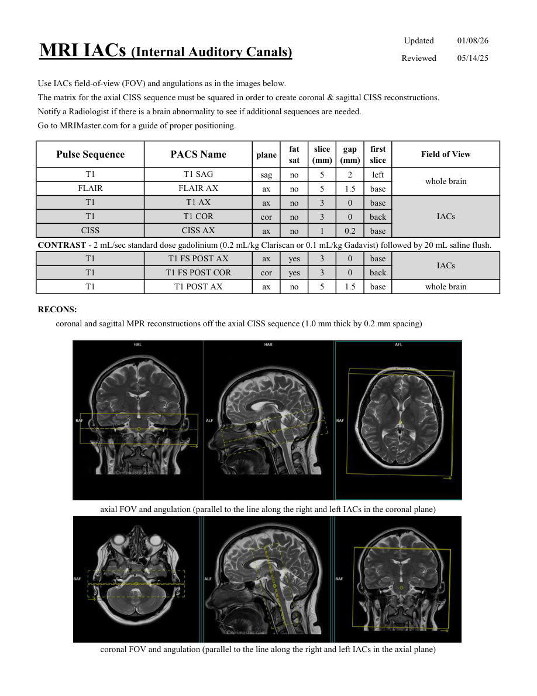

# IRM – Conducte auditive interne (IAC) (MCB)

[Catalog MCB](../mcb/index.md) · [Descarcă PDF-ul complet](../../assets/mcb-mri/irm-conducte-auditive-interne-iac-mcb/protocol.pdf) · [Sursa MCB](https://ref.mcbradiology.com/Protocols,%20Policies,%20Worksheets%20&%20Forms/MRI/Protocols/Neuro/11%20IACs.pdf)

Documentul MCB este disponibil integral mai jos, inclusiv notele, condițiile de utilizare a contrastului și imaginile de planificare. Textul clinic al sursei este în **engleză**; titlul și etichetele parametrilor sunt în română.

## Protocolul original

### Pagina 1

{ loading=lazy }

??? abstract "Textul paginii (engleză)"

    
Updated
    01/08/26
    MRI IACs (Internal Auditory Canals)
    Reviewed
    05/14/25
    Use IACs field-of-view (FOV) and angulations as in the images below.
    The matrix for the axial CISS sequence must be squared in order to create coronal &amp; sagittal CISS reconstructions.
    Notify a Radiologist if there is a brain abnormality to see if additional sequences are needed.
    Go to MRIMaster.com for a guide of proper positioning.
    slice                    
    gap                    
    Pulse Sequence
    PACS Name
    Field of View
    plane
    fat                   
    sat
    (mm)
    (mm)
    first                               
    slice
    T1
    T1 SAG
    sag
    no
    5
    2
    left
    whole brain
    FLAIR
    FLAIR AX
    ax
    no
    5
    1.5
    base
    T1
    T1 AX
    ax
    no
    3
    0
    base
    T1
    T1 COR
    IACs
    cor
    no
    3
    0
    back
    CISS
    CISS AX
    ax
    no
    1
    0.2
    base
    CONTRAST - 2 mL/sec standard dose gadolinium (0.2 mL/kg Clariscan or 0.1 mL/kg Gadavist) followed by 20 mL saline flush.
    T1
    T1 FS POST AX
    ax
    yes
    3
    0
    base
    IACs
    T1
    T1 FS POST COR
    cor
    yes
    3
    0
    back
    T1
    T1 POST AX
    whole brain
    ax
    no
    5
    1.5
    base
    RECONS:
    coronal and sagittal MPR reconstructions off the axial CISS sequence (1.0 mm thick by 0.2 mm spacing)
    axial FOV and angulation (parallel to the line along the right and left IACs in the coronal plane)
    coronal FOV and angulation (parallel to the line along the right and left IACs in the axial plane)
    

## Parametrii secvențelor

Tabele extrase din PDF. Variantele, secvențele condiționate și momentele administrării contrastului se citesc împreună cu notele de pe pagina originală indicată.

### Tabelul 1 — pagina 1

| Secvență | Denumire PACS | Plan | Supresie grăsime | Grosime (mm) | Interval (mm) | Prima secțiune | FOV |
|---|---|---|---|---|---|---|---|
| T1 | T1 SAG | Sagital | Nu | 5 | 2 | Stânga | whole brain |
| FLAIR | FLAIR AX | Axial | Nu | 5 | 1.5 | Bază |  |
| T1 | T1 AX | Axial | Nu | 3 | 0 | Bază | IACs |
| T1 | T1 COR | Coronal | Nu | 3 | 0 | Posterior |  |
| CISS | CISS AX | Axial | Nu | 1 | 0.2 | Bază |  |
| T1 | T1 FS POST AX | Axial | Da | 3 | 0 | Bază | IACs |
| T1 | T1 FS POST COR | Coronal | Da | 3 | 0 | Posterior |  |
| T1 | T1 POST AX | Axial | Nu | 5 | 1.5 | Bază | whole brain |

