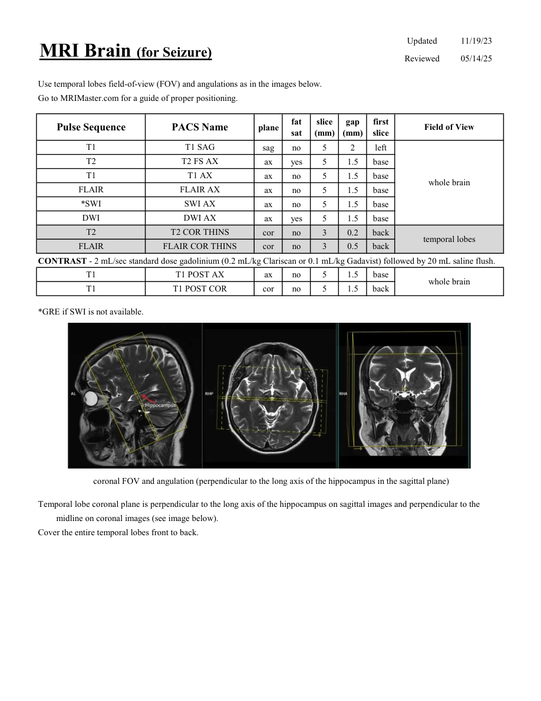

# IRM – Epilepsie și convulsii (MCB)

[Catalog MCB](../mcb/index.md) · [Descarcă PDF-ul complet](../../assets/mcb-mri/irm-epilepsie-si-convulsii-mcb/protocol.pdf) · [Sursa MCB](https://ref.mcbradiology.com/Protocols,%20Policies,%20Worksheets%20&%20Forms/MRI/Protocols/Neuro/3%20Seizure.pdf)

Documentul MCB este disponibil integral mai jos, inclusiv notele, condițiile de utilizare a contrastului și imaginile de planificare. Textul clinic al sursei este în **engleză**; titlul și etichetele parametrilor sunt în română.

## Protocolul original

### Pagina 1

{ loading=lazy }

??? abstract "Textul paginii (engleză)"

    
Updated
    11/19/23
    MRI Brain (for Seizure)
    Reviewed
    05/14/25
    Use temporal lobes field-of-view (FOV) and angulations as in the images below.
    Go to MRIMaster.com for a guide of proper positioning.
    slice                    
    gap                    
    Pulse Sequence
    PACS Name
    Field of View
    plane
    fat                   
    sat
    (mm)
    (mm)
    first                               
    slice
    T1
    T1 SAG
    sag
    no
    5
    2
    left
    T2
    T2 FS AX
    ax
    yes
    5
    1.5
    base
    T1
    T1 AX
    ax
    no
    5
    1.5
    base
    whole brain
    FLAIR
    FLAIR AX
    ax
    no
    5
    1.5
    base
    *SWI
    SWI AX
    ax
    no
    5
    1.5
    base
    DWI
    DWI AX
    ax
    yes
    5
    1.5
    base
    T2
    T2 COR THINS
    cor
    no
    3
    0.2
    back
    temporal lobes
    FLAIR
    FLAIR COR THINS
    cor
    no
    3
    0.5
    back
    CONTRAST - 2 mL/sec standard dose gadolinium (0.2 mL/kg Clariscan or 0.1 mL/kg Gadavist) followed by 20 mL saline flush.
    T1
    T1 POST AX
    ax
    no
    5
    1.5
    base
    whole brain
    T1
    T1 POST COR
    cor
    no
    5
    1.5
    back
    *GRE if SWI is not available.
     coronal FOV and angulation (perpendicular to the long axis of the hippocampus in the sagittal plane)
    Temporal lobe coronal plane is perpendicular to the long axis of the hippocampus on sagittal images and perpendicular to the 
    midline on coronal images (see image below).
    Cover the entire temporal lobes front to back.
    

## Parametrii secvențelor

Tabele extrase din PDF. Variantele, secvențele condiționate și momentele administrării contrastului se citesc împreună cu notele de pe pagina originală indicată.

### Tabelul 1 — pagina 1

| Secvență | Denumire PACS | Plan | Supresie grăsime | Grosime (mm) | Interval (mm) | Prima secțiune | FOV |
|---|---|---|---|---|---|---|---|
| T1 | T1 SAG | Sagital | Nu | 5 | 2 | Stânga | whole brain |
| T2 | T2 FS AX | Axial | Da | 5 | 1.5 | Bază |  |
| T1 | T1 AX | Axial | Nu | 5 | 1.5 | Bază |  |
| FLAIR | FLAIR AX | Axial | Nu | 5 | 1.5 | Bază |  |
| *SWI | SWI AX | Axial | Nu | 5 | 1.5 | Bază |  |
| DWI | DWI AX | Axial | Da | 5 | 1.5 | Bază |  |
| T2 | T2 COR THINS | Coronal | Nu | 3 | 0.2 | Posterior | temporal lobes |
| FLAIR | FLAIR COR THINS | Coronal | Nu | 3 | 0.5 | Posterior |  |
| T1 | T1 POST AX | Axial | Nu | 5 | 1.5 | Bază | whole brain |
| T1 | T1 POST COR | Coronal | Nu | 5 | 1.5 | Posterior |  |

