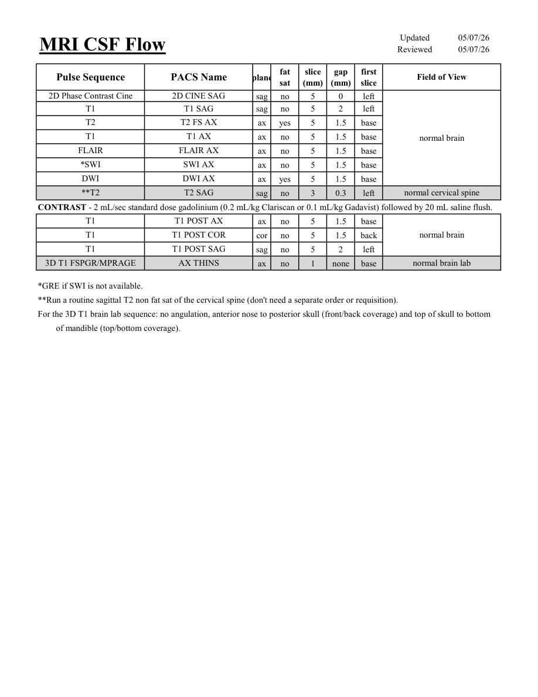

# IRM – Fluxul lichidului cefalorahidian (LCR) (MCB)

[Catalog MCB](../mcb/index.md) · [Descarcă PDF-ul complet](../../assets/mcb-mri/irm-fluxul-lichidului-cefalorahidian-lcr-mcb/protocol.pdf) · [Sursa MCB](https://ref.mcbradiology.com/Protocols,%20Policies,%20Worksheets%20&%20Forms/MRI/Protocols/Neuro/14%20CSF%20Flow.pdf)

Documentul MCB este disponibil integral mai jos, inclusiv notele, condițiile de utilizare a contrastului și imaginile de planificare. Textul clinic al sursei este în **engleză**; titlul și etichetele parametrilor sunt în română.

## Protocolul original

### Pagina 1

{ loading=lazy }

??? abstract "Textul paginii (engleză)"

    
Updated
    05/07/26
    Reviewed
    05/07/26
    MRI CSF Flow
    slice                    
    gap                    
    Field of View
    Pulse Sequence
    PACS Name
    plane
    fat                   
    sat
    (mm)
    (mm)
    first                               
    slice
    2D Phase Contrast Cine
    2D CINE SAG
    sag
    no
    5
    0
    left
    T1
    T1 SAG
    sag
    no
    5
    2
    left
    T2 FS AX
    T2
    ax
    yes
    5
    1.5
    base
    T1 AX
    T1
    ax
    no
    5
    1.5
    base
    normal brain
    FLAIR
    FLAIR AX
    ax
    no
    5
    1.5
    base
    *SWI
    SWI AX
    ax
    no
    5
    1.5
    base
    DWI
    DWI AX
    ax
    yes
    5
    1.5
    base
    **T2
    T2 SAG
    normal cervical spine
    sag
    no
    3
    0.3
    left
    CONTRAST - 2 mL/sec standard dose gadolinium (0.2 mL/kg Clariscan or 0.1 mL/kg Gadavist) followed by 20 mL saline flush.
    T1
    T1 POST AX
    ax
    no
    5
    1.5
    base
    T1
    T1 POST COR
    normal brain
    cor
    no
    5
    1.5
    back
    T1
    T1 POST SAG
    sag
    no
    5
    2
    left
    3D T1 FSPGR/MPRAGE
    AX THINS
    normal brain lab
    ax
    no
    1
    none
    base
    *GRE if SWI is not available.
    **Run a routine sagittal T2 non fat sat of the cervical spine (don&#x27;t need a separate order or requisition).
    For the 3D T1 brain lab sequence: no angulation, anterior nose to posterior skull (front/back coverage) and top of skull to bottom
    of mandible (top/bottom coverage).
    

## Parametrii secvențelor

Tabele extrase din PDF. Variantele, secvențele condiționate și momentele administrării contrastului se citesc împreună cu notele de pe pagina originală indicată.

### Tabelul 1 — pagina 1

| Secvență | Denumire PACS | Plan | Supresie grăsime | Grosime (mm) | Interval (mm) | Prima secțiune | FOV |
|---|---|---|---|---|---|---|---|
| 2D Phase Contrast Cine | 2D CINE SAG | Sagital | Nu | 5 | 0 | Stânga | normal brain |
| T1 | T1 SAG | Sagital | Nu | 5 | 2 | Stânga |  |
| T2 | T2 FS AX | Axial | Da | 5 | 1.5 | Bază |  |
| T1 | T1 AX | Axial | Nu | 5 | 1.5 | Bază |  |
| FLAIR | FLAIR AX | Axial | Nu | 5 | 1.5 | Bază |  |
| *SWI | SWI AX | Axial | Nu | 5 | 1.5 | Bază |  |
| DWI | DWI AX | Axial | Da | 5 | 1.5 | Bază |  |
| **T2 | T2 SAG | Sagital | Nu | 3 | 0.3 | Stânga | normal cervical spine |
| T1 | T1 POST AX | Axial | Nu | 5 | 1.5 | Bază | normal brain |
| T1 | T1 POST COR | Coronal | Nu | 5 | 1.5 | Posterior |  |
| T1 | T1 POST SAG | Sagital | Nu | 5 | 2 | Stânga |  |
| 3D T1 FSPGR/MPRAGE | AX THINS | Axial | Nu | 1 | none | Bază | normal brain lab |

