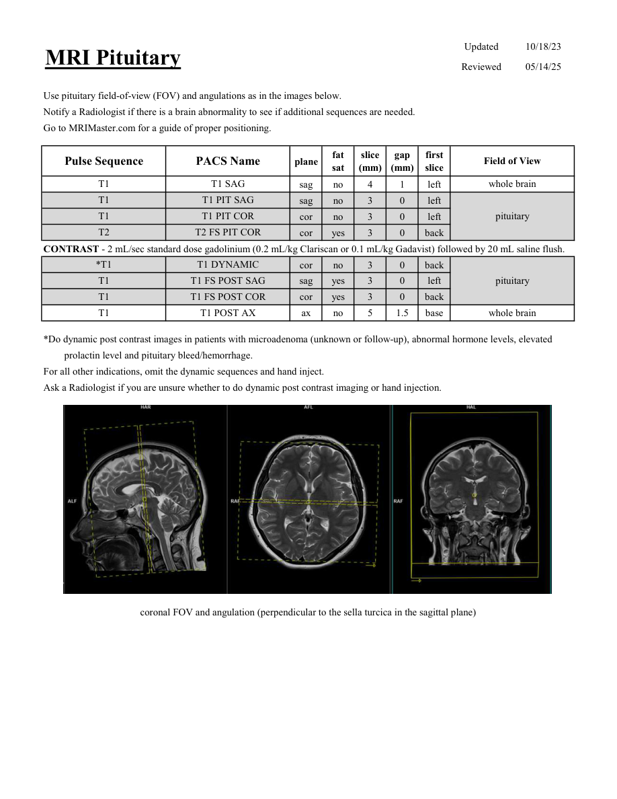
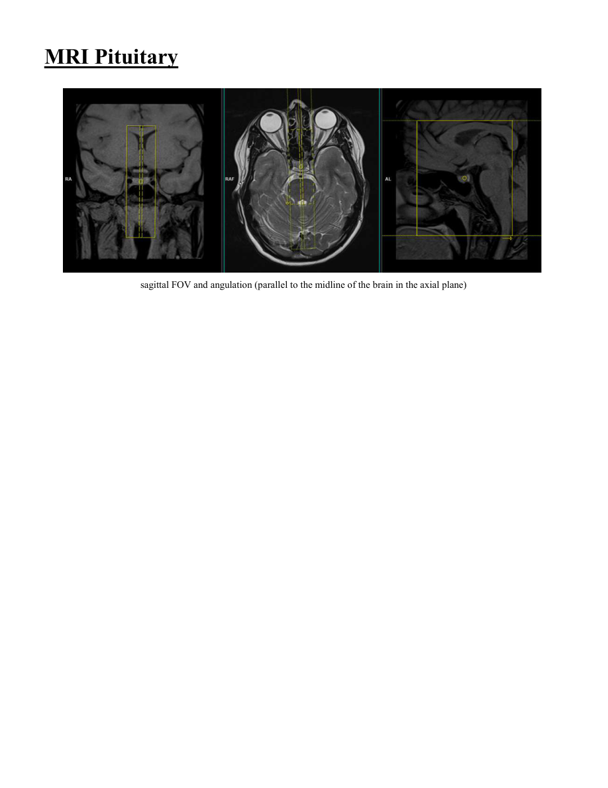

# IRM – Hipofiză (MCB)

[Catalog MCB](../mcb/index.md) · [Descarcă PDF-ul complet](../../assets/mcb-mri/irm-hipofiza-mcb/protocol.pdf) · [Sursa MCB](https://ref.mcbradiology.com/Protocols,%20Policies,%20Worksheets%20&%20Forms/MRI/Protocols/Neuro/9%20Pituitary.pdf)

Documentul MCB este disponibil integral mai jos, inclusiv notele, condițiile de utilizare a contrastului și imaginile de planificare. Textul clinic al sursei este în **engleză**; titlul și etichetele parametrilor sunt în română.

## Protocolul original

### Pagina 1

{ loading=lazy }

??? abstract "Textul paginii (engleză)"

    
Updated
    10/18/23
    MRI Pituitary
    Reviewed
    05/14/25
    Use pituitary field-of-view (FOV) and angulations as in the images below.
    Notify a Radiologist if there is a brain abnormality to see if additional sequences are needed.
    Go to MRIMaster.com for a guide of proper positioning.
    slice                    
    gap                    
    Field of View
    Pulse Sequence
    PACS Name
    plane
    fat                   
    sat
    (mm)
    (mm)
    first                               
    slice
    T1
    T1 SAG
    whole brain
    sag
    no
    4
    1
    left
    T1
    T1 PIT SAG
    sag
    no
    3
    0
    left
    T1
    T1 PIT COR
    pituitary
    cor
    no
    3
    0
    left
    T2
    T2 FS PIT COR
    cor
    yes
    3
    0
    back
    CONTRAST - 2 mL/sec standard dose gadolinium (0.2 mL/kg Clariscan or 0.1 mL/kg Gadavist) followed by 20 mL saline flush.
    *T1
    T1 DYNAMIC
    cor
    no
    3
    0
    back
    T1
    T1 FS POST SAG
    pituitary
    sag
    yes
    3
    0
    left
    T1
    T1 FS POST COR
    cor
    yes
    3
    0
    back
    whole brain
    T1
    T1 POST AX
    ax
    no
    5
    1.5
    base
    *Do dynamic post contrast images in patients with microadenoma (unknown or follow-up), abnormal hormone levels, elevated 
    prolactin level and pituitary bleed/hemorrhage.
    For all other indications, omit the dynamic sequences and hand inject. 
    Ask a Radiologist if you are unsure whether to do dynamic post contrast imaging or hand injection.
    coronal FOV and angulation (perpendicular to the sella turcica in the sagittal plane)
    

### Pagina 2

{ loading=lazy }

??? abstract "Textul paginii (engleză)"

    
MRI Pituitary
    sagittal FOV and angulation (parallel to the midline of the brain in the axial plane)
    

## Parametrii secvențelor

Tabele extrase din PDF. Variantele, secvențele condiționate și momentele administrării contrastului se citesc împreună cu notele de pe pagina originală indicată.

### Tabelul 1 — pagina 1

| Secvență | Denumire PACS | Plan | Supresie grăsime | Grosime (mm) | Interval (mm) | Prima secțiune | FOV |
|---|---|---|---|---|---|---|---|
| T1 | T1 SAG | Sagital | Nu | 4 | 1 | Stânga | whole brain |
| T1 | T1 PIT SAG | Sagital | Nu | 3 | 0 | Stânga | pituitary |
| T1 | T1 PIT COR | Coronal | Nu | 3 | 0 | Stânga |  |
| T2 | T2 FS PIT COR | Coronal | Da | 3 | 0 | Posterior |  |
| *T1 | T1 DYNAMIC | Coronal | Nu | 3 | 0 | Posterior | pituitary |
| T1 | T1 FS POST SAG | Sagital | Da | 3 | 0 | Stânga |  |
| T1 | T1 FS POST COR | Coronal | Da | 3 | 0 | Posterior |  |
| T1 | T1 POST AX | Axial | Nu | 5 | 1.5 | Bază | whole brain |

