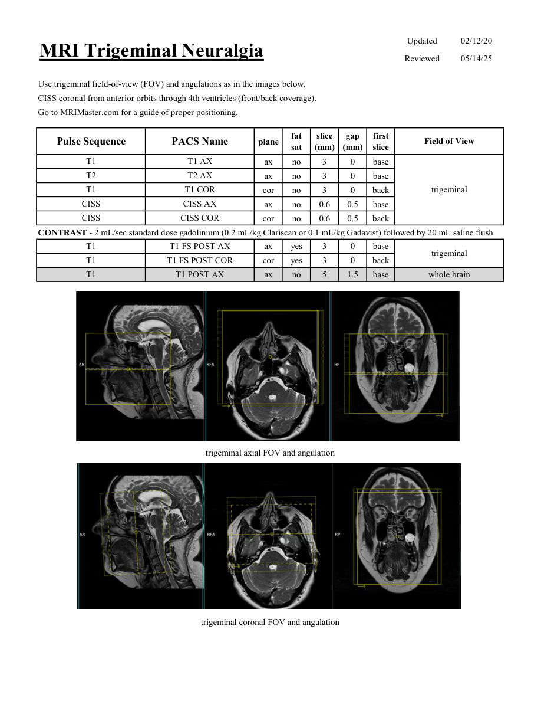

# IRM – Nevralgie de trigemen (MCB)

[Catalog MCB](../mcb/index.md) · [Descarcă PDF-ul complet](../../assets/mcb-mri/irm-nevralgie-de-trigemen-mcb/protocol.pdf) · [Sursa MCB](https://ref.mcbradiology.com/Protocols,%20Policies,%20Worksheets%20&%20Forms/MRI/Protocols/Neuro/12%20Trigeminal%20Neuralgia.pdf)

Documentul MCB este disponibil integral mai jos, inclusiv notele, condițiile de utilizare a contrastului și imaginile de planificare. Textul clinic al sursei este în **engleză**; titlul și etichetele parametrilor sunt în română.

## Protocolul original

### Pagina 1

{ loading=lazy }

??? abstract "Textul paginii (engleză)"

    
Updated
    02/12/20
    MRI Trigeminal Neuralgia
    Reviewed
    05/14/25
    Use trigeminal field-of-view (FOV) and angulations as in the images below.
    CISS coronal from anterior orbits through 4th ventricles (front/back coverage).
    Go to MRIMaster.com for a guide of proper positioning.
    slice                    
    gap                    
    Pulse Sequence
    PACS Name
    Field of View
    plane
    fat                   
    sat
    (mm)
    (mm)
    first                               
    slice
    T1
    T1 AX
    ax
    no
    3
    0
    base
    T2
    T2 AX
    ax
    no
    3
    0
    base
    T1
    T1 COR
    trigeminal
    cor
    no
    3
    0
    back
    CISS
    CISS AX
    ax
    no
    0.6
    0.5
    base
    CISS
    CISS COR
    cor
    no
    0.6
    0.5
    back
    CONTRAST - 2 mL/sec standard dose gadolinium (0.2 mL/kg Clariscan or 0.1 mL/kg Gadavist) followed by 20 mL saline flush.
    T1
    T1 FS POST AX
    ax
    yes
    3
    0
    base
    trigeminal
    T1
    T1 FS POST COR
    cor
    yes
    3
    0
    back
    T1
    T1 POST AX
    whole brain
    ax
    no
    5
    1.5
    base
    trigeminal axial FOV and angulation
    trigeminal coronal FOV and angulation
    

## Parametrii secvențelor

Tabele extrase din PDF. Variantele, secvențele condiționate și momentele administrării contrastului se citesc împreună cu notele de pe pagina originală indicată.

### Tabelul 1 — pagina 1

| Secvență | Denumire PACS | Plan | Supresie grăsime | Grosime (mm) | Interval (mm) | Prima secțiune | FOV |
|---|---|---|---|---|---|---|---|
| T1 | T1 AX | Axial | Nu | 3 | 0 | Bază | trigeminal |
| T2 | T2 AX | Axial | Nu | 3 | 0 | Bază |  |
| T1 | T1 COR | Coronal | Nu | 3 | 0 | Posterior |  |
| CISS | CISS AX | Axial | Nu | 0.6 | 0.5 | Bază |  |
| CISS | CISS COR | Coronal | Nu | 0.6 | 0.5 | Posterior |  |
| T1 | T1 FS POST AX | Axial | Da | 3 | 0 | Bază | trigeminal |
| T1 | T1 FS POST COR | Coronal | Da | 3 | 0 | Posterior |  |
| T1 | T1 POST AX | Axial | Nu | 5 | 1.5 | Bază | whole brain |

