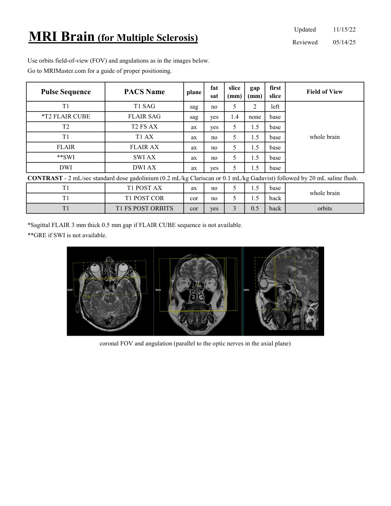

# IRM – Scleroză multiplă (MCB)

[Catalog MCB](../mcb/index.md) · [Descarcă PDF-ul complet](../../assets/mcb-mri/irm-scleroza-multipla-mcb/protocol.pdf) · [Sursa MCB](https://ref.mcbradiology.com/Protocols,%20Policies,%20Worksheets%20&%20Forms/MRI/Protocols/Neuro/4%20Multiple%20Sclerosis.pdf)

Documentul MCB este disponibil integral mai jos, inclusiv notele, condițiile de utilizare a contrastului și imaginile de planificare. Textul clinic al sursei este în **engleză**; titlul și etichetele parametrilor sunt în română.

## Protocolul original

### Pagina 1

{ loading=lazy }

??? abstract "Textul paginii (engleză)"

    
Updated
    11/15/22
    MRI Brain (for Multiple Sclerosis)
    Reviewed
    05/14/25
    Use orbits field-of-view (FOV) and angulations as in the images below.
    Go to MRIMaster.com for a guide of proper positioning.
    slice                    
    gap                    
    Field of View
    Pulse Sequence
    PACS Name
    plane
    fat                   
    sat
    (mm)
    (mm)
    first                               
    slice
    T1
    T1 SAG
    sag
    no
    5
    2
    left
    *T2 FLAIR CUBE
    FLAIR SAG
    sag
    yes
    1.4
    none
    base
    T2
    T2 FS AX
    ax
    yes
    5
    1.5
    base
    T1
    T1 AX
    whole brain
    ax
    no
    5
    1.5
    base
    FLAIR
    FLAIR AX
    ax
    no
    5
    1.5
    base
    **SWI
    SWI AX
    ax
    no
    5
    1.5
    base
    DWI
    DWI AX
    ax
    yes
    5
    1.5
    base
    CONTRAST - 2 mL/sec standard dose gadolinium (0.2 mL/kg Clariscan or 0.1 mL/kg Gadavist) followed by 20 mL saline flush.
    T1
    T1 POST AX
    ax
    no
    5
    1.5
    base
    whole brain
    T1
    T1 POST COR
    cor
    no
    5
    1.5
    back
    T1
    T1 FS POST ORBITS
    orbits
    cor
    yes
    3
    0.5
    back
    *Sagittal FLAIR 3 mm thick 0.5 mm gap if FLAIR CUBE sequence is not available.
    **GRE if SWI is not available.
    coronal FOV and angulation (parallel to the optic nerves in the axial plane)
    

## Parametrii secvențelor

Tabele extrase din PDF. Variantele, secvențele condiționate și momentele administrării contrastului se citesc împreună cu notele de pe pagina originală indicată.

### Tabelul 1 — pagina 1

| Secvență | Denumire PACS | Plan | Supresie grăsime | Grosime (mm) | Interval (mm) | Prima secțiune | FOV |
|---|---|---|---|---|---|---|---|
| T1 | T1 SAG | Sagital | Nu | 5 | 2 | Stânga | whole brain |
| *T2 FLAIR CUBE | FLAIR SAG | Sagital | Da | 1.4 | none | Bază |  |
| T2 | T2 FS AX | Axial | Da | 5 | 1.5 | Bază |  |
| T1 | T1 AX | Axial | Nu | 5 | 1.5 | Bază |  |
| FLAIR | FLAIR AX | Axial | Nu | 5 | 1.5 | Bază |  |
| **SWI | SWI AX | Axial | Nu | 5 | 1.5 | Bază |  |
| DWI | DWI AX | Axial | Da | 5 | 1.5 | Bază |  |
| T1 | T1 POST AX | Axial | Nu | 5 | 1.5 | Bază | whole brain |
| T1 | T1 POST COR | Coronal | Nu | 5 | 1.5 | Posterior |  |
| T1 | T1 FS POST ORBITS | Coronal | Da | 3 | 0.5 | Posterior | orbits |

