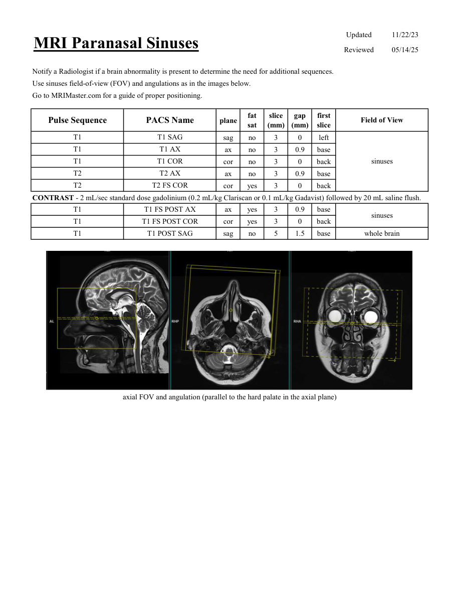
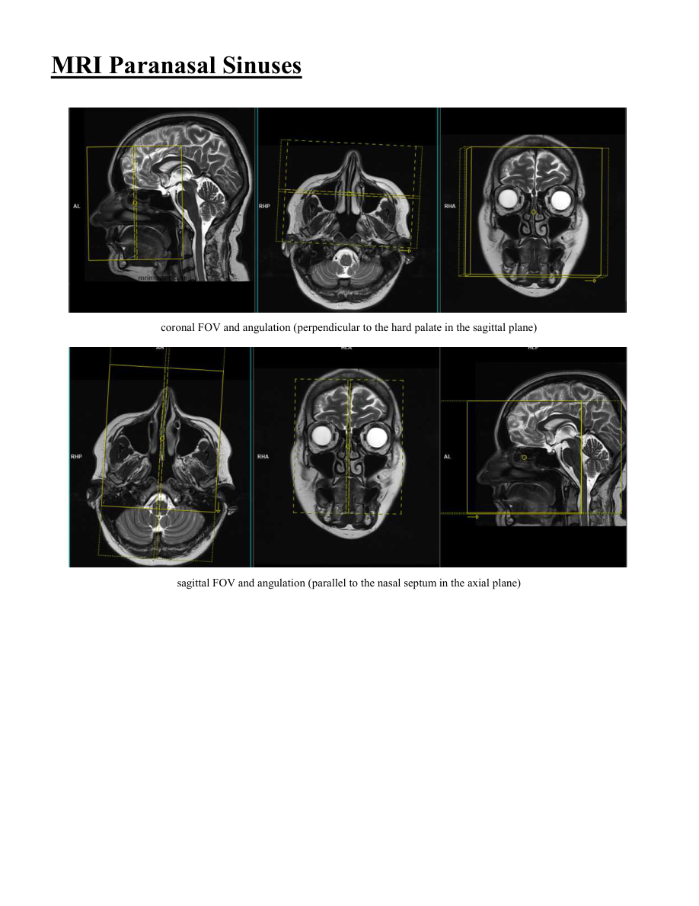

# IRM – Sinusuri paranazale (MCB)

[Catalog MCB](../mcb/index.md) · [Descarcă PDF-ul complet](../../assets/mcb-mri/irm-sinusuri-paranazale-mcb/protocol.pdf) · [Sursa MCB](https://ref.mcbradiology.com/Protocols,%20Policies,%20Worksheets%20&%20Forms/MRI/Protocols/Neuro/10%20Sinuses.pdf)

Documentul MCB este disponibil integral mai jos, inclusiv notele, condițiile de utilizare a contrastului și imaginile de planificare. Textul clinic al sursei este în **engleză**; titlul și etichetele parametrilor sunt în română.

## Protocolul original

### Pagina 1

{ loading=lazy }

??? abstract "Textul paginii (engleză)"

    
Updated
    11/22/23
    MRI Paranasal Sinuses
    Reviewed
    05/14/25
    Notify a Radiologist if a brain abnormality is present to determine the need for additional sequences.
    Use sinuses field-of-view (FOV) and angulations as in the images below.
    Go to MRIMaster.com for a guide of proper positioning.
    slice                    
    gap                    
    Pulse Sequence
    PACS Name
    Field of View
    plane
    fat                   
    sat
    (mm)
    (mm)
    first                               
    slice
    T1
    T1 SAG
    sag
    no
    3
    0
    left
    T1
    T1 AX
    ax
    no
    3
    0.9
    base
    T1
    T1 COR
    sinuses
    cor
    no
    3
    0
    back
    T2
    T2 AX
    ax
    no
    3
    0.9
    base
    T2
    T2 FS COR
    cor
    yes
    3
    0
    back
    CONTRAST - 2 mL/sec standard dose gadolinium (0.2 mL/kg Clariscan or 0.1 mL/kg Gadavist) followed by 20 mL saline flush.
    T1
    T1 FS POST AX
    ax
    yes
    3
    0.9
    base
    sinuses
    T1
    T1 FS POST COR
    cor
    yes
    3
    0
    back
    T1
    T1 POST SAG
    whole brain
    sag
    no
    5
    1.5
    base
    axial FOV and angulation (parallel to the hard palate in the axial plane)
    

### Pagina 2

{ loading=lazy }

??? abstract "Textul paginii (engleză)"

    
MRI Paranasal Sinuses
    coronal FOV and angulation (perpendicular to the hard palate in the sagittal plane)
    sagittal FOV and angulation (parallel to the nasal septum in the axial plane)
    

## Parametrii secvențelor

Tabele extrase din PDF. Variantele, secvențele condiționate și momentele administrării contrastului se citesc împreună cu notele de pe pagina originală indicată.

### Tabelul 1 — pagina 1

| Secvență | Denumire PACS | Plan | Supresie grăsime | Grosime (mm) | Interval (mm) | Prima secțiune | FOV |
|---|---|---|---|---|---|---|---|
| T1 | T1 SAG | Sagital | Nu | 3 | 0 | Stânga | sinuses |
| T1 | T1 AX | Axial | Nu | 3 | 0.9 | Bază |  |
| T1 | T1 COR | Coronal | Nu | 3 | 0 | Posterior |  |
| T2 | T2 AX | Axial | Nu | 3 | 0.9 | Bază |  |
| T2 | T2 FS COR | Coronal | Da | 3 | 0 | Posterior |  |
| T1 | T1 FS POST AX | Axial | Da | 3 | 0.9 | Bază | sinuses |
| T1 | T1 FS POST COR | Coronal | Da | 3 | 0 | Posterior |  |
| T1 | T1 POST SAG | Sagital | Nu | 5 | 1.5 | Bază | whole brain |

