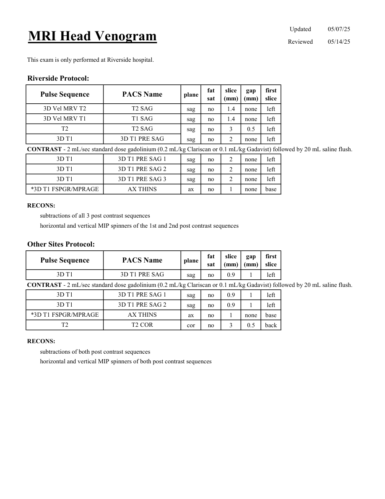

# IRM – Venografie IRM cerebrală (MCB)

[Catalog MCB](../mcb/index.md) · [Descarcă PDF-ul complet](../../assets/mcb-mri/irm-venografie-irm-cerebrala-mcb/protocol.pdf) · [Sursa MCB](https://ref.mcbradiology.com/Protocols,%20Policies,%20Worksheets%20&%20Forms/MRI/Protocols/Neuro/8%20MRV%20Head.pdf)

Documentul MCB este disponibil integral mai jos, inclusiv notele, condițiile de utilizare a contrastului și imaginile de planificare. Textul clinic al sursei este în **engleză**; titlul și etichetele parametrilor sunt în română.

## Protocolul original

### Pagina 1

{ loading=lazy }

??? abstract "Textul paginii (engleză)"

    
Updated
    05/07/25
    MRI Head Venogram
    Reviewed
    05/14/25
    This exam is only performed at Riverside hospital.
    Riverside Protocol:
    slice                    
    gap                    
    Pulse Sequence
    PACS Name
    plane
    fat                   
    sat
    (mm)
    (mm)
    first                               
    slice
    3D Vel MRV T2 
    T2 SAG
    sag
    no
    1.4
    none
    left
    3D Vel MRV T1
    T1 SAG
    sag
    no
    1.4
    none
    left
    T2
    T2 SAG
    sag
    no
    3
    0.5
    left
    3D T1
    3D T1 PRE SAG
    sag
    no
    2
    none
    left
    CONTRAST - 2 mL/sec standard dose gadolinium (0.2 mL/kg Clariscan or 0.1 mL/kg Gadavist) followed by 20 mL saline flush.
    3D T1
    3D T1 PRE SAG 1
    sag
    no
    2
    none
    left
    3D T1
    3D T1 PRE SAG 2
    sag
    no
    2
    none
    left
    3D T1
    3D T1 PRE SAG 3
    sag
    no
    2
    none
    left
    *3D T1 FSPGR/MPRAGE
    AX THINS
    ax
    no
    1
    none
    base
    RECONS:
    subtractions of all 3 post contrast sequences
    horizontal and vertical MIP spinners of the 1st and 2nd post contrast sequences
    Other Sites Protocol:
    slice                    
    gap                    
    Pulse Sequence
    PACS Name
    plane
    fat                   
    sat
    (mm)
    (mm)
    first                               
    slice
    3D T1
    3D T1 PRE SAG
    sag
    no
    0.9
    1
    left
    CONTRAST - 2 mL/sec standard dose gadolinium (0.2 mL/kg Clariscan or 0.1 mL/kg Gadavist) followed by 20 mL saline flush.
    3D T1
    3D T1 PRE SAG 1
    sag
    no
    0.9
    1
    left
    3D T1
    3D T1 PRE SAG 2
    sag
    no
    0.9
    1
    left
    *3D T1 FSPGR/MPRAGE
    AX THINS
    ax
    no
    1
    none
    base
    T2
    T2 COR
    cor
    no
    3
    0.5
    back
    RECONS:
    subtractions of both post contrast sequences
    horizontal and vertical MIP spinners of both post contrast sequences
    

## Parametrii secvențelor

Tabele extrase din PDF. Variantele, secvențele condiționate și momentele administrării contrastului se citesc împreună cu notele de pe pagina originală indicată.

### Tabelul 1 — pagina 1

| Secvență | Denumire PACS | Plan | Supresie grăsime | Grosime (mm) | Interval (mm) | Prima secțiune |
|---|---|---|---|---|---|---|
| 3D Vel MRV T2 | T2 SAG | Sagital | Nu | 1.4 | none | Stânga |
| 3D Vel MRV T1 | T1 SAG | Sagital | Nu | 1.4 | none | Stânga |
| T2 | T2 SAG | sag sag | Nu | 3 | 0.5 | Stânga |
| 3D T1 | 3D T1 PRE SAG 1 | Sagital | Nu | 2 | none | Stânga |
| 3D T1 | 3D T1 PRE SAG 2 | Sagital | Nu | 2 | none | Stânga |
| 3D T1 | 3D T1 PRE SAG 3 | Sagital | Nu | 2 | none | Stânga |
| *3D T1 FSPGR/MPRAGE | AX THINS | Axial | Nu | 1 | none | Bază |
| 3D T1 | 3D T1 PRE SAG | Sagital | Nu | 0.9 | 1 | Stânga |
| 3D T1 | 3D T1 PRE SAG 1 | Sagital | Nu | 0.9 | 1 | Stânga |
| 3D T1 | 3D T1 PRE SAG 2 | Sagital | Nu | 0.9 | 1 | Stânga |
| *3D T1 FSPGR/MPRAGE | AX THINS | Axial | Nu | 1 | none | Bază |
| T2 | T2 COR | Coronal | Nu | 3 | 0.5 | Posterior |

