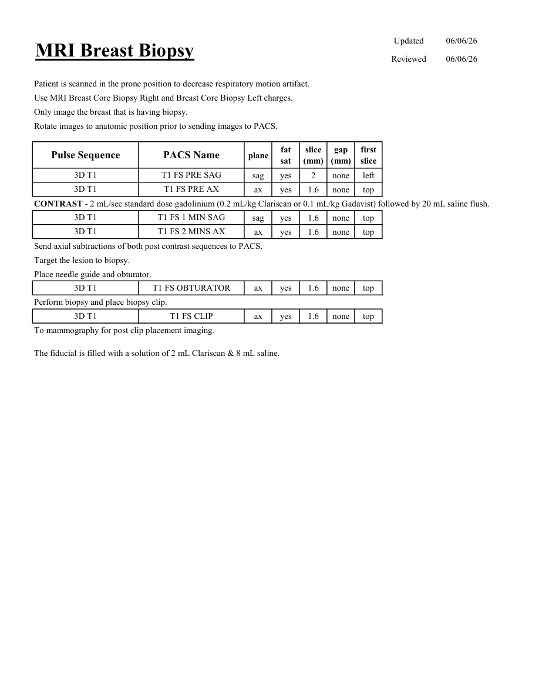

# IRM – Biopsie mamară ghidată IRM (MCB)

[Catalog MCB](../mcb/index.md) · [Descarcă PDF-ul complet](../../assets/mcb-mri/irm-biopsie-mamara-ghidata-irm-mcb/protocol.pdf) · [Sursa MCB](https://ref.mcbradiology.com/Protocols,%20Policies,%20Worksheets%20&%20Forms/MRI/Protocols/Breast/4%20Breast%20Biopsy.pdf)

Documentul MCB este disponibil integral mai jos, inclusiv notele, condițiile de utilizare a contrastului și imaginile de planificare. Textul clinic al sursei este în **engleză**; titlul și etichetele parametrilor sunt în română.

## Protocolul original

### Pagina 1

{ loading=lazy }

??? abstract "Textul paginii (engleză)"

    
Updated
    06/06/26
    MRI Breast Biopsy
    Reviewed
    06/06/26
    Patient is scanned in the prone position to decrease respiratory motion artifact.
    Use MRI Breast Core Biopsy Right and Breast Core Biopsy Left charges.
    Only image the breast that is having biopsy.
    Rotate images to anatomic position prior to sending images to PACS.
    slice                    
    gap                    
    Pulse Sequence
    PACS Name
    plane
    fat                   
    sat
    (mm)
    (mm)
    first                               
    slice
    3D T1
    T1 FS PRE SAG
    sag
    yes
    2
    none
    left
    3D T1
    T1 FS PRE AX
    ax
    yes
    1.6
    none
    top
    CONTRAST - 2 mL/sec standard dose gadolinium (0.2 mL/kg Clariscan or 0.1 mL/kg Gadavist) followed by 20 mL saline flush.
    3D T1
    T1 FS 1 MIN SAG
    sag
    yes
    1.6
    none
    top
    3D T1
    T1 FS 2 MINS AX
    ax
    yes
    1.6
    none
    top
    Send axial subtractions of both post contrast sequences to PACS.
    Target the lesion to biopsy.
    Place needle guide and obturator.
    3D T1
    T1 FS OBTURATOR
    ax
    yes
    1.6
    none
    top
    Perform biopsy and place biopsy clip.
    3D T1
    T1 FS CLIP
    ax
    yes
    1.6
    none
    top
    To mammography for post clip placement imaging.
    The fiducial is filled with a solution of 2 mL Clariscan &amp; 8 mL saline.
    

## Parametrii secvențelor

Tabele extrase din PDF. Variantele, secvențele condiționate și momentele administrării contrastului se citesc împreună cu notele de pe pagina originală indicată.

### Tabelul 1 — pagina 1

| Secvență | Denumire PACS | Plan | Supresie grăsime | Grosime (mm) | Interval (mm) | Prima secțiune |
|---|---|---|---|---|---|---|
| 3D T1 | T1 FS PRE SAG | Sagital | Da | 2 | none | Stânga |
| 3D T1 | T1 FS PRE AX | Axial | Da | 1.6 | none | Superior |
| 3D T1 | T1 FS 1 MIN SAG | Sagital | Da | 1.6 | none | Superior |
| 3D T1 | T1 FS 2 MINS AX | Axial | Da | 1.6 | none | Superior |
| 3D T1 | T1 FS OBTURATOR | Axial | Da | 1.6 | none | Superior |
| 3D T1 | T1 FS CLIP | Axial | Da | 1.6 | none | Superior |

