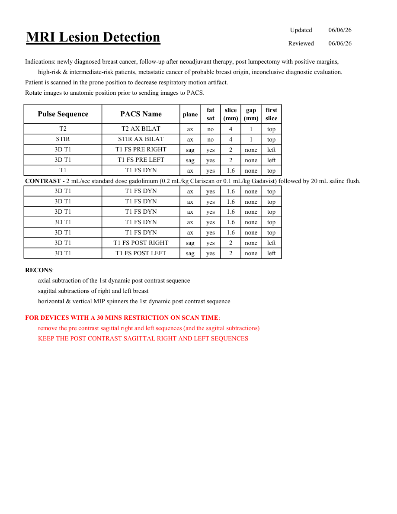

# IRM – Sân: detecția leziunilor (MCB)

[Catalog MCB](../mcb/index.md) · [Descarcă PDF-ul complet](../../assets/mcb-mri/irm-san-detectia-leziunilor-mcb/protocol.pdf) · [Sursa MCB](https://ref.mcbradiology.com/Protocols,%20Policies,%20Worksheets%20&%20Forms/MRI/Protocols/Breast/1%20Lesion%20Detection.pdf)

Documentul MCB este disponibil integral mai jos, inclusiv notele, condițiile de utilizare a contrastului și imaginile de planificare. Textul clinic al sursei este în **engleză**; titlul și etichetele parametrilor sunt în română.

## Protocolul original

### Pagina 1

{ loading=lazy }

??? abstract "Textul paginii (engleză)"

    
Updated
    06/06/26
    MRI Lesion Detection
    Reviewed
    06/06/26
    Indications: newly diagnosed breast cancer, follow-up after neoadjuvant therapy, post lumpectomy with positive margins, 
    high-risk &amp; intermediate-risk patients, metastatic cancer of probable breast origin, inconclusive diagnostic evaluation.
    Patient is scanned in the prone position to decrease respiratory motion artifact.
    Rotate images to anatomic position prior to sending images to PACS.
    slice                    
    gap                    
    Pulse Sequence
    PACS Name
    plane
    fat                   
    sat
    (mm)
    (mm)
    first                               
    slice
    T2
    T2 AX BILAT
    ax
    no
    4
    1
    top
    STIR
    STIR AX BILAT
    ax
    no
    4
    1
    top
    3D T1
    T1 FS PRE RIGHT
    sag
    yes
    2
    none
    left
    3D T1
    T1 FS PRE LEFT
    sag
    yes
    2
    none
    left
    T1
    T1 FS DYN
    ax
    yes
    1.6
    none
    top
    CONTRAST - 2 mL/sec standard dose gadolinium (0.2 mL/kg Clariscan or 0.1 mL/kg Gadavist) followed by 20 mL saline flush.
    3D T1
    T1 FS DYN
    ax
    yes
    1.6
    none
    top
    3D T1
    T1 FS DYN
    ax
    yes
    1.6
    none
    top
    3D T1
    T1 FS DYN
    ax
    yes
    1.6
    none
    top
    3D T1
    T1 FS DYN
    ax
    yes
    1.6
    none
    top
    3D T1
    T1 FS DYN
    ax
    yes
    1.6
    none
    top
    3D T1
    T1 FS POST RIGHT
    sag
    yes
    2
    none
    left
    3D T1
    T1 FS POST LEFT
    sag
    yes
    2
    none
    left
    RECONS:
    axial subtraction of the 1st dynamic post contrast sequence
    sagittal subtractions of right and left breast
    horizontal &amp; vertical MIP spinners the 1st dynamic post contrast sequence
    FOR DEVICES WITH A 30 MINS RESTRICTION ON SCAN TIME:
    remove the pre contrast sagittal right and left sequences (and the sagittal subtractions)
    KEEP THE POST CONTRAST SAGITTAL RIGHT AND LEFT SEQUENCES
    

## Parametrii secvențelor

Tabele extrase din PDF. Variantele, secvențele condiționate și momentele administrării contrastului se citesc împreună cu notele de pe pagina originală indicată.

### Tabelul 1 — pagina 1

| Secvență | Denumire PACS | Plan | Supresie grăsime | Grosime (mm) | Interval (mm) | Prima secțiune |
|---|---|---|---|---|---|---|
| T2 | T2 AX BILAT | Axial | Nu | 4 | 1 | Superior |
| STIR | STIR AX BILAT | Axial | Nu | 4 | 1 | Superior |
| 3D T1 | T1 FS PRE RIGHT | Sagital | Da | 2 | none | Stânga |
| 3D T1 | T1 FS PRE LEFT | Sagital | Da | 2 | none | Stânga |
| T1 | T1 FS DYN | Axial | Da | 1.6 | none | Superior |
| 3D T1 | T1 FS DYN | Axial | Da | 1.6 | none | Superior |
| 3D T1 | T1 FS DYN | Axial | Da | 1.6 | none | Superior |
| 3D T1 | T1 FS DYN | Axial | Da | 1.6 | none | Superior |
| 3D T1 | T1 FS DYN | Axial | Da | 1.6 | none | Superior |
| 3D T1 | T1 FS DYN | Axial | Da | 1.6 | none | Superior |
| 3D T1 | T1 FS POST RIGHT | Sagital | Da | 2 | none | Stânga |
| 3D T1 | T1 FS POST LEFT | Sagital | Da | 2 | none | Stânga |

