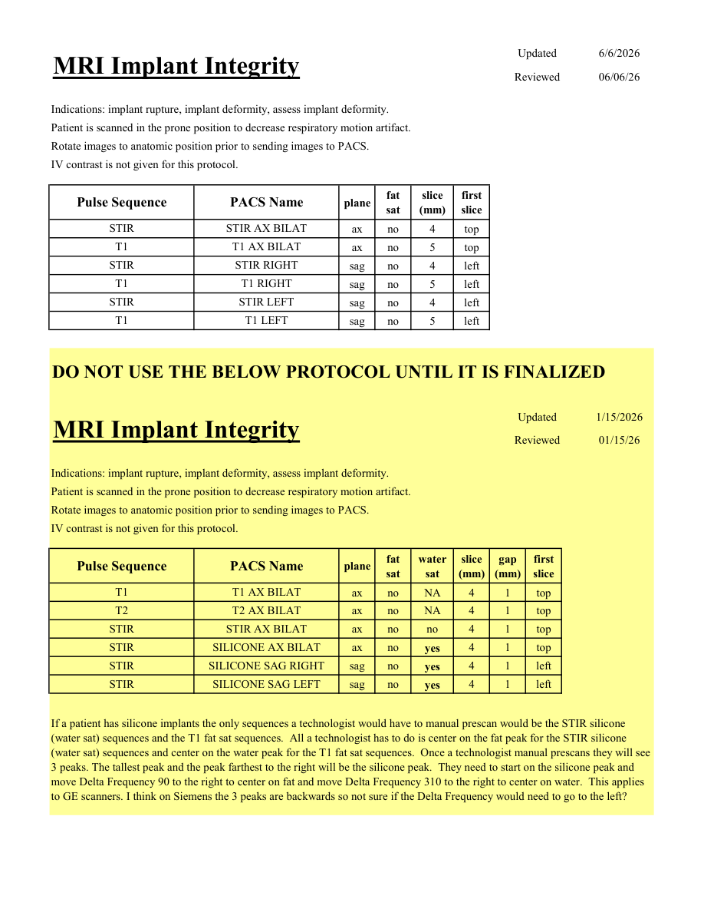

# IRM – Sân: integritatea implanturilor (MCB)

[Catalog MCB](../mcb/index.md) · [Descarcă PDF-ul complet](../../assets/mcb-mri/irm-san-integritatea-implanturilor-mcb/protocol.pdf) · [Sursa MCB](https://ref.mcbradiology.com/Protocols,%20Policies,%20Worksheets%20&%20Forms/MRI/Protocols/Breast/2%20Implant%20Integrity.pdf)

Documentul MCB este disponibil integral mai jos, inclusiv notele, condițiile de utilizare a contrastului și imaginile de planificare. Textul clinic al sursei este în **engleză**; titlul și etichetele parametrilor sunt în română.

## Protocolul original

### Pagina 1

{ loading=lazy }

??? abstract "Textul paginii (engleză)"

    
Updated
    6/6/2026
    MRI Implant Integrity
    Reviewed
    06/06/26
    Indications: implant rupture, implant deformity, assess implant deformity.
    Patient is scanned in the prone position to decrease respiratory motion artifact.
    Rotate images to anatomic position prior to sending images to PACS.
    IV contrast is not given for this protocol.
    slice                    
    Pulse Sequence
    PACS Name
    plane
    fat                   
    sat
    (mm)
    first                               
    slice
    STIR
    STIR AX BILAT
    ax
    no
    4
    top
    T1
    T1 AX BILAT
    ax
    no
    5
    top
    STIR
    STIR RIGHT
    sag
    no
    4
    left
    T1
    T1 RIGHT
    sag
    no
    5
    left
    STIR
    STIR LEFT
    sag
    no
    4
    left
    T1
    T1 LEFT
    sag
    no
    5
    left
    DO NOT USE THE BELOW PROTOCOL UNTIL IT IS FINALIZED
    Updated
    1/15/2026
    MRI Implant Integrity
    Reviewed
    01/15/26
    Indications: implant rupture, implant deformity, assess implant deformity.
    Patient is scanned in the prone position to decrease respiratory motion artifact.
    Rotate images to anatomic position prior to sending images to PACS.
    IV contrast is not given for this protocol.
    water                           
    slice                    
    gap                    
    Pulse Sequence
    PACS Name
    plane
    fat                   
    sat
    sat
    (mm)
    (mm)
    first                               
    slice
    T1
    T1 AX BILAT
    ax
    no
    NA
    4
    1
    top
    T2
    T2 AX BILAT
    ax
    no
    NA
    4
    1
    top
    STIR
    STIR AX BILAT
    ax
    no
    no
    4
    1
    top
    STIR
    SILICONE AX BILAT
    ax
    no
    yes
    4
    1
    top
    STIR
    SILICONE SAG RIGHT 
    sag
    no
    yes
    4
    1
    left
    STIR
    SILICONE SAG LEFT 
    sag
    no
    yes
    4
    1
    left
    If a patient has silicone implants the only sequences a technologist would have to manual prescan would be the STIR silicone 
    (water sat) sequences and the T1 fat sat sequences.  All a technologist has to do is center on the fat peak for the STIR silicone 
    (water sat) sequences and center on the water peak for the T1 fat sat sequences.  Once a technologist manual prescans they will see 
    3 peaks. The tallest peak and the peak farthest to the right will be the silicone peak.  They need to start on the silicone peak and 
    move Delta Frequency 90 to the right to center on fat and move Delta Frequency 310 to the right to center on water.  This applies 
    to GE scanners. I think on Siemens the 3 peaks are backwards so not sure if the Delta Frequency would need to go to the left? 
    

## Parametrii secvențelor

Tabele extrase din PDF. Variantele, secvențele condiționate și momentele administrării contrastului se citesc împreună cu notele de pe pagina originală indicată.

### Tabelul 1 — pagina 1

| Secvență | Denumire PACS | Plan | Supresie grăsime | Grosime (mm) | Prima secțiune |
|---|---|---|---|---|---|
| STIR | STIR AX BILAT | Axial | Nu | 4 | Superior |
| T1 | T1 AX BILAT | Axial | Nu | 5 | Superior |
| STIR | STIR RIGHT | Sagital | Nu | 4 | Stânga |
| T1 | T1 RIGHT | Sagital | Nu | 5 | Stânga |
| STIR | STIR LEFT | Sagital | Nu | 4 | Stânga |
| T1 | T1 LEFT | Sagital | Nu | 5 | Stânga |

### Tabelul 2 — pagina 1

| Secvență | Denumire PACS | Plan | Supresie grăsime | Supresie apă | Grosime (mm) | Interval (mm) | Prima secțiune |
|---|---|---|---|---|---|---|---|
| T1 | T1 AX BILAT | Axial | Nu | NA | 4 | 1 | Superior |
| T2 | T2 AX BILAT | Axial | Nu | NA | 4 | 1 | Superior |
| STIR | STIR AX BILAT | Axial | Nu | Nu | 4 | 1 | Superior |
| STIR | SILICONE AX BILAT | Axial | Nu | Da | 4 | 1 | Superior |
| STIR | SILICONE SAG RIGHT | Sagital | Nu | Da | 4 | 1 | Stânga |
| STIR | SILICONE SAG LEFT | Sagital | Nu | Da | 4 | 1 | Stânga |

