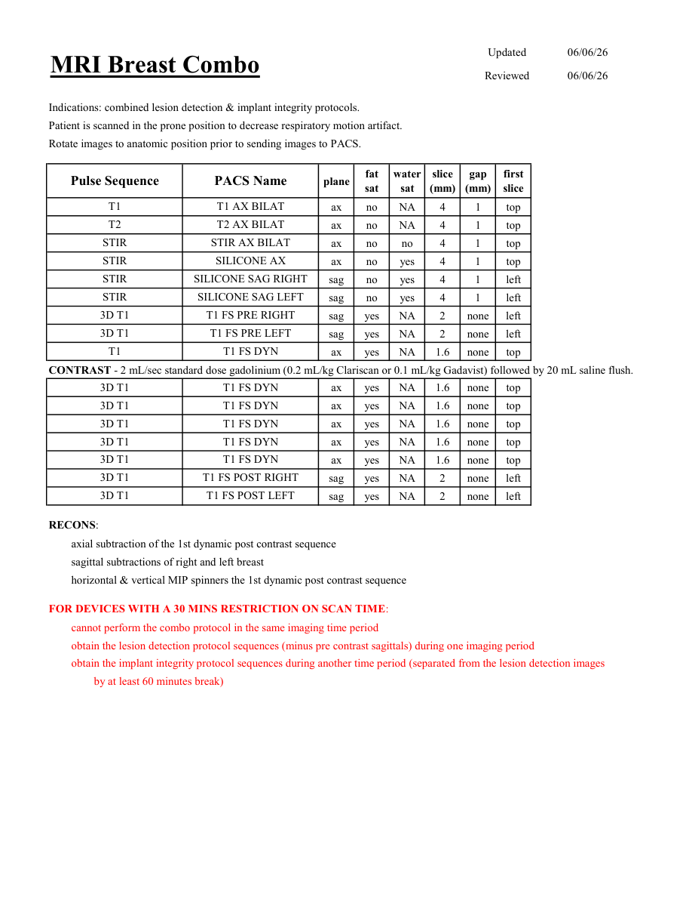

# IRM – Sân: leziuni și implanturi (combinat) (MCB)

[Catalog MCB](../mcb/index.md) · [Descarcă PDF-ul complet](../../assets/mcb-mri/irm-san-leziuni-si-implanturi-combinat-mcb/protocol.pdf) · [Sursa MCB](https://ref.mcbradiology.com/Protocols,%20Policies,%20Worksheets%20&%20Forms/MRI/Protocols/Breast/3%20Breast%20Combo.pdf)

Documentul MCB este disponibil integral mai jos, inclusiv notele, condițiile de utilizare a contrastului și imaginile de planificare. Textul clinic al sursei este în **engleză**; titlul și etichetele parametrilor sunt în română.

## Protocolul original

### Pagina 1

{ loading=lazy }

??? abstract "Textul paginii (engleză)"

    
Updated
    06/06/26
    Reviewed
    06/06/26
    MRI Breast Combo
    Indications: combined lesion detection &amp; implant integrity protocols.
    Patient is scanned in the prone position to decrease respiratory motion artifact.
    Rotate images to anatomic position prior to sending images to PACS.
    water                           
    slice                    
    gap                    
    Pulse Sequence
    PACS Name
    plane
    fat                   
    sat
    sat
    (mm)
    (mm)
    first                               
    slice
    T1
    T1 AX BILAT
    ax
    no
    NA
    4
    1
    top
    T2
    T2 AX BILAT
    ax
    no
    NA
    4
    1
    top
    STIR
    STIR AX BILAT
    ax
    no
    no
    4
    1
    top
    STIR
    SILICONE AX
    ax
    no
    yes
    4
    1
    top
    STIR
    SILICONE SAG RIGHT
    sag
    no
    yes
    4
    1
    left
    STIR
    SILICONE SAG LEFT
    sag
    no
    yes
    4
    1
    left
    3D T1
    T1 FS PRE RIGHT
    sag
    yes
    NA
    2
    none
    left
    3D T1
    T1 FS PRE LEFT
    sag
    yes
    NA
    2
    none
    left
    T1
    T1 FS DYN
    ax
    yes
    NA
    1.6
    none
    top
    CONTRAST - 2 mL/sec standard dose gadolinium (0.2 mL/kg Clariscan or 0.1 mL/kg Gadavist) followed by 20 mL saline flush.
    3D T1
    T1 FS DYN
    ax
    yes
    NA
    1.6
    none
    top
    3D T1
    T1 FS DYN
    ax
    yes
    NA
    1.6
    none
    top
    3D T1
    T1 FS DYN
    ax
    yes
    NA
    1.6
    none
    top
    3D T1
    T1 FS DYN
    ax
    yes
    NA
    1.6
    none
    top
    3D T1
    T1 FS DYN
    ax
    yes
    NA
    1.6
    none
    top
    3D T1
    T1 FS POST RIGHT
    sag
    yes
    NA
    2
    none
    left
    3D T1
    T1 FS POST LEFT
    sag
    yes
    NA
    2
    none
    left
    RECONS:
    axial subtraction of the 1st dynamic post contrast sequence
    sagittal subtractions of right and left breast
    horizontal &amp; vertical MIP spinners the 1st dynamic post contrast sequence
    FOR DEVICES WITH A 30 MINS RESTRICTION ON SCAN TIME:
    cannot perform the combo protocol in the same imaging time period
    obtain the lesion detection protocol sequences (minus pre contrast sagittals) during one imaging period
    obtain the implant integrity protocol sequences during another time period (separated from the lesion detection images
    by at least 60 minutes break) 
    

## Parametrii secvențelor

Tabele extrase din PDF. Variantele, secvențele condiționate și momentele administrării contrastului se citesc împreună cu notele de pe pagina originală indicată.

### Tabelul 1 — pagina 1

| Secvență | Denumire PACS | Plan | Supresie grăsime | Supresie apă | Grosime (mm) | Interval (mm) | Prima secțiune |
|---|---|---|---|---|---|---|---|
| T1 | T1 AX BILAT | Axial | Nu | NA | 4 | 1 | Superior |
| T2 | T2 AX BILAT | Axial | Nu | NA | 4 | 1 | Superior |
| STIR | STIR AX BILAT | Axial | Nu | Nu | 4 | 1 | Superior |
| STIR | SILICONE AX | Axial | Nu | Da | 4 | 1 | Superior |
| STIR | SILICONE SAG RIGHT | Sagital | Nu | Da | 4 | 1 | Stânga |
| STIR | SILICONE SAG LEFT | Sagital | Nu | Da | 4 | 1 | Stânga |
| 3D T1 | T1 FS PRE RIGHT | Sagital | Da | NA | 2 | none | Stânga |
| 3D T1 | T1 FS PRE LEFT | Sagital | Da | NA | 2 | none | Stânga |
| T1 | T1 FS DYN | Axial | Da | NA | 1.6 | none | Superior |

### Tabelul 2 — pagina 1

| Secvență | Denumire PACS | Plan | Supresie grăsime | Supresie apă | Grosime (mm) | Interval (mm) | Prima secțiune |
|---|---|---|---|---|---|---|---|
| 3D T1 | T1 FS DYN | Axial | Da | NA | 1.6 | none | Superior |
| 3D T1 | T1 FS DYN | Axial | Da | NA | 1.6 | none | Superior |
| 3D T1 | T1 FS DYN | Axial | Da | NA | 1.6 | none | Superior |
| 3D T1 | T1 FS DYN | Axial | Da | NA | 1.6 | none | Superior |
| 3D T1 | T1 FS DYN | Axial | Da | NA | 1.6 | none | Superior |
| 3D T1 | T1 FS POST RIGHT | Sagital | Da | NA | 2 | none | Stânga |
| 3D T1 | T1 FS POST LEFT | Sagital | Da | NA | 2 | none | Stânga |

