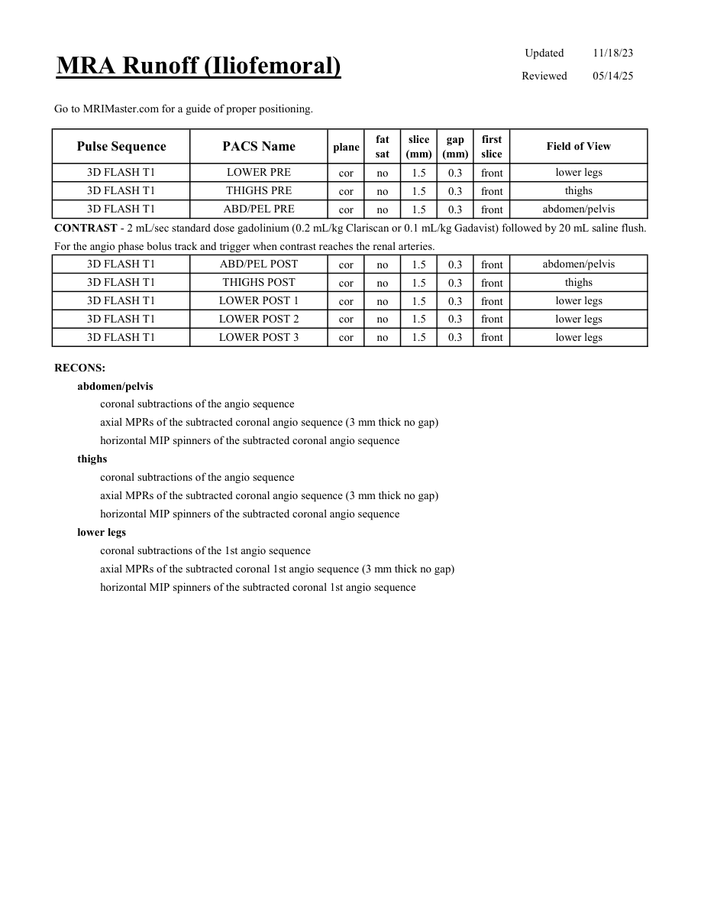

# IRM – Angio-IRM iliofemural (runoff) (MCB)

[Catalog MCB](../mcb/index.md) · [Descarcă PDF-ul complet](../../assets/mcb-mri/irm-angio-irm-iliofemural-runoff-mcb/protocol.pdf) · [Sursa MCB](https://ref.mcbradiology.com/Protocols,%20Policies,%20Worksheets%20&%20Forms/MRI/Protocols/Vascular%20&%20IR/5%20MRA%20Runoff.pdf)

Documentul MCB este disponibil integral mai jos, inclusiv notele, condițiile de utilizare a contrastului și imaginile de planificare. Textul clinic al sursei este în **engleză**; titlul și etichetele parametrilor sunt în română.

## Protocolul original

### Pagina 1

{ loading=lazy }

??? abstract "Textul paginii (engleză)"

    
Updated
    11/18/23
    MRA Runoff (Iliofemoral)
    Reviewed
    05/14/25
    Go to MRIMaster.com for a guide of proper positioning.
    slice                    
    gap                    
    Field of View
    Pulse Sequence
    PACS Name
    plane
    fat                   
    sat
    (mm)
    (mm)
    first                               
    slice
    3D FLASH T1
    LOWER PRE
    lower legs
    cor
    no
    1.5
    0.3
    front
    3D FLASH T1
    THIGHS PRE
    thighs
    cor
    no
    1.5
    0.3
    front
    3D FLASH T1
    ABD/PEL PRE
    abdomen/pelvis
    cor
    no
    1.5
    0.3
    front
    CONTRAST - 2 mL/sec standard dose gadolinium (0.2 mL/kg Clariscan or 0.1 mL/kg Gadavist) followed by 20 mL saline flush.
    For the angio phase bolus track and trigger when contrast reaches the renal arteries.
    3D FLASH T1
    ABD/PEL POST
    abdomen/pelvis
    cor
    no
    1.5
    0.3
    front
    3D FLASH T1
    THIGHS POST
    thighs
    cor
    no
    1.5
    0.3
    front
    3D FLASH T1
    LOWER POST 1
    lower legs
    cor
    no
    1.5
    0.3
    front
    3D FLASH T1
    LOWER POST 2
    lower legs
    cor
    no
    1.5
    0.3
    front
    3D FLASH T1
    LOWER POST 3
    lower legs
    cor
    no
    1.5
    0.3
    front
    RECONS:
    abdomen/pelvis
    coronal subtractions of the angio sequence
    axial MPRs of the subtracted coronal angio sequence (3 mm thick no gap)
    horizontal MIP spinners of the subtracted coronal angio sequence
    thighs
    coronal subtractions of the angio sequence
    axial MPRs of the subtracted coronal angio sequence (3 mm thick no gap)
    horizontal MIP spinners of the subtracted coronal angio sequence
    lower legs
    coronal subtractions of the 1st angio sequence
    axial MPRs of the subtracted coronal 1st angio sequence (3 mm thick no gap)
    horizontal MIP spinners of the subtracted coronal 1st angio sequence
    

## Parametrii secvențelor

Tabele extrase din PDF. Variantele, secvențele condiționate și momentele administrării contrastului se citesc împreună cu notele de pe pagina originală indicată.

### Tabelul 1 — pagina 1

| Secvență | Denumire PACS | Plan | Supresie grăsime | Grosime (mm) | Interval (mm) | Prima secțiune | FOV |
|---|---|---|---|---|---|---|---|
| 3D FLASH T1 | LOWER PRE | Coronal | Nu | 1.5 | 0.3 | Anterior | lower legs |
| 3D FLASH T1 | THIGHS PRE | Coronal | Nu | 1.5 | 0.3 | Anterior | thighs |
| 3D FLASH T1 | ABD/PEL PRE | Coronal | Nu | 1.5 | 0.3 | Anterior | abdomen/pelvis |
| 3D FLASH T1 | ABD/PEL POST | Coronal | Nu | 1.5 | 0.3 | Anterior | abdomen/pelvis |
| 3D FLASH T1 | THIGHS POST | Coronal | Nu | 1.5 | 0.3 | Anterior | thighs |
| 3D FLASH T1 | LOWER POST 1 | Coronal | Nu | 1.5 | 0.3 | Anterior | lower legs |
| 3D FLASH T1 | LOWER POST 2 | Coronal | Nu | 1.5 | 0.3 | Anterior | lower legs |
| 3D FLASH T1 | LOWER POST 3 | Coronal | Nu | 1.5 | 0.3 | Anterior | lower legs |

