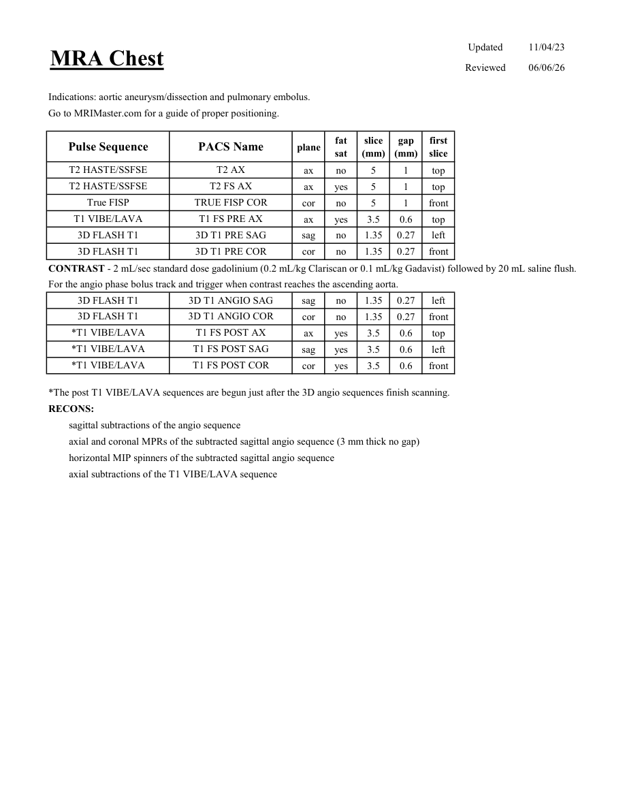

# IRM – Angio-IRM toracic (MCB)

[Catalog MCB](../mcb/index.md) · [Descarcă PDF-ul complet](../../assets/mcb-mri/irm-angio-irm-toracic-mcb/protocol.pdf) · [Sursa MCB](https://ref.mcbradiology.com/Protocols,%20Policies,%20Worksheets%20&%20Forms/MRI/Protocols/Vascular%20&%20IR/1%20MRA%20Chest.pdf)

Documentul MCB este disponibil integral mai jos, inclusiv notele, condițiile de utilizare a contrastului și imaginile de planificare. Textul clinic al sursei este în **engleză**; titlul și etichetele parametrilor sunt în română.

## Protocolul original

### Pagina 1

{ loading=lazy }

??? abstract "Textul paginii (engleză)"

    
Updated
    11/04/23
    MRA Chest
    Reviewed
    06/06/26
    Indications: aortic aneurysm/dissection and pulmonary embolus.
    Go to MRIMaster.com for a guide of proper positioning.
    slice                    
    gap                    
    Pulse Sequence
    PACS Name
    plane
    fat                   
    sat
    (mm)
    (mm)
    first                               
    slice
    T2 HASTE/SSFSE
    T2 AX
    ax
    no
    5
    1
    top
    T2 HASTE/SSFSE
    T2 FS AX
    ax
    yes
    5
    1
    top
    True FISP
    TRUE FISP COR
    cor
    no
    5
    1
    front
    T1 VIBE/LAVA
    T1 FS PRE AX
    ax
    yes
    3.5
    0.6
    top
    3D FLASH T1
    3D T1 PRE SAG
    sag
    no
    1.35
    0.27
    left
    3D FLASH T1
    3D T1 PRE COR
    cor
    no
    1.35
    0.27
    front
    CONTRAST - 2 mL/sec standard dose gadolinium (0.2 mL/kg Clariscan or 0.1 mL/kg Gadavist) followed by 20 mL saline flush.
    For the angio phase bolus track and trigger when contrast reaches the ascending aorta.
    3D FLASH T1
    3D T1 ANGIO SAG
    sag
    no
    1.35
    0.27
    left
    3D FLASH T1
    3D T1 ANGIO COR
    cor
    no
    1.35
    0.27
    front
    *T1 VIBE/LAVA
    T1 FS POST AX
    ax
    yes
    3.5
    0.6
    top
    *T1 VIBE/LAVA
    T1 FS POST SAG
    sag
    yes
    3.5
    0.6
    left
    *T1 VIBE/LAVA
    T1 FS POST COR
    cor
    yes
    3.5
    0.6
    front
    *The post T1 VIBE/LAVA sequences are begun just after the 3D angio sequences finish scanning.
    RECONS:
    sagittal subtractions of the angio sequence
    axial and coronal MPRs of the subtracted sagittal angio sequence (3 mm thick no gap)
    horizontal MIP spinners of the subtracted sagittal angio sequence
    axial subtractions of the T1 VIBE/LAVA sequence
    

## Parametrii secvențelor

Tabele extrase din PDF. Variantele, secvențele condiționate și momentele administrării contrastului se citesc împreună cu notele de pe pagina originală indicată.

### Tabelul 1 — pagina 1

| Secvență | Denumire PACS | Plan | Supresie grăsime | Grosime (mm) | Interval (mm) | Prima secțiune |
|---|---|---|---|---|---|---|
| T2 HASTE/SSFSE | T2 AX | Axial | Nu | 5 | 1 | Superior |
| T2 HASTE/SSFSE | T2 FS AX | Axial | Da | 5 | 1 | Superior |
| True FISP | TRUE FISP COR | Coronal | Nu | 5 | 1 | Anterior |
| T1 VIBE/LAVA | T1 FS PRE AX | Axial | Da | 3.5 | 0.6 | Superior |
| 3D FLASH T1 | 3D T1 PRE SAG | Sagital | Nu | 1.35 | 0.27 | Stânga |
| 3D FLASH T1 | 3D T1 PRE COR | Coronal | Nu | 1.35 | 0.27 | Anterior |
| 3D FLASH T1 | 3D T1 ANGIO SAG | Sagital | Nu | 1.35 | 0.27 | Stânga |
| 3D FLASH T1 | 3D T1 ANGIO COR | Coronal | Nu | 1.35 | 0.27 | Anterior |
| *T1 VIBE/LAVA | T1 FS POST AX | Axial | Da | 3.5 | 0.6 | Superior |
| *T1 VIBE/LAVA | T1 FS POST SAG | Sagital | Da | 3.5 | 0.6 | Stânga |
| *T1 VIBE/LAVA | T1 FS POST COR | Coronal | Da | 3.5 | 0.6 | Anterior |

